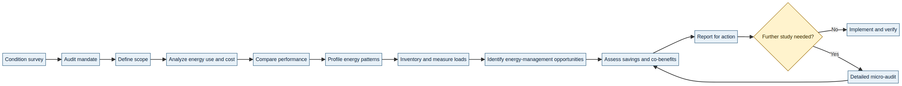
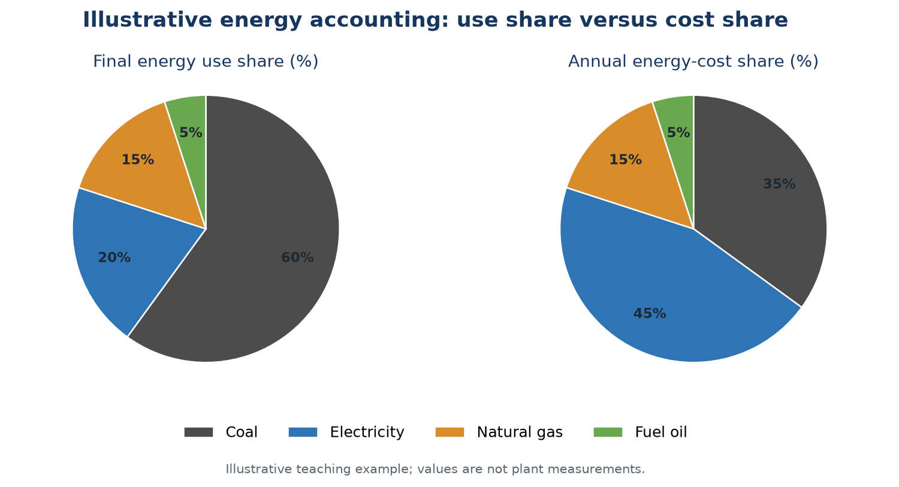
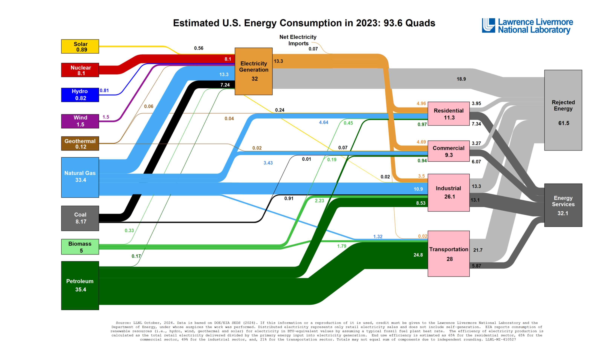
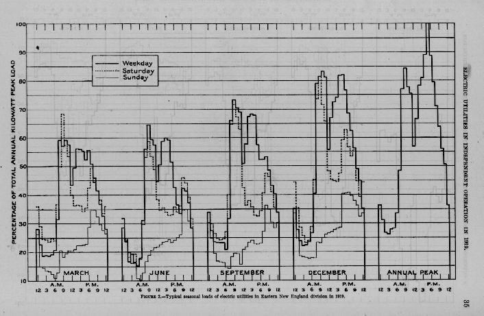

# EEOE4001 — Energy Conservation & Auditing
## Module I: Basic Principles of Energy Audit

**Lecture duration:** 06 hours  
**Prepared for:** Undergraduate Electrical / Energy Engineering students  
**Prepared by:** Manus AI  
**Scope:** Definitions and concept of energy audit; audit types; energy index; cost index; pie charts; Sankey diagrams; load profiles; energy-conservation schemes; industrial, process-industry, thermal-power-station, and building energy audits.

> **Central idea:** An energy audit is not merely a list of equipment or a collection of utility bills. It is a systematic investigation of **where, when, why, and how energy is used**, followed by technically justified and economically actionable recommendations.

---

## 1. Learning outcomes

After completing this module, a student should be able to:

1. Define an energy audit and explain its purpose, scope, and relationship with energy conservation and energy management.
2. Distinguish between preliminary/walk-through, detailed/diagnostic, macro, and micro audits.
3. Calculate and interpret energy indices and cost indices such as kWh/t, GJ/t, and ₹/t.
4. Use energy-use pie charts, Sankey diagrams, load profiles, and load-duration diagrams to interpret consumption patterns.
5. Identify no-cost, low-cost, operational, maintenance, and investment-based energy-conservation measures.
6. Develop a suitable audit approach for a general industry, process plant, thermal power station, or building.
7. Prepare a concise audit finding that links an observed inefficiency to its likely cause, recommended action, expected benefit, and verification method.

### Module map

| Section | Topic | Approximate teaching emphasis |
|---|---|---:|
| 2 | Energy audit: definition, concept, objectives, and boundaries | 1.0 h |
| 3 | Types and levels of audit | 0.75 h |
| 4 | Energy index and cost index | 0.75 h |
| 5 | Pie charts, Sankey diagrams, and energy balance | 1.0 h |
| 6 | Load profiles and load-duration diagrams | 0.75 h |
| 7 | Energy-conservation schemes and energy-saving potential | 0.75 h |
| 8 | Audit approaches for industries, process plants, thermal stations, and buildings | 1.0 h |

---

## 2. Energy audit: definition and concept

### 2.1 Meaning of energy auditing

Natural Resources Canada describes the audit as a process involving data collection and review, plant surveys and system measurements, observation of operating practices, and data analysis. The purpose is to determine where, when, why, and how energy is used, and then identify opportunities to improve efficiency, reduce cost, and lower associated emissions.[1] The Industrial Energy Audit Guidebook also records the Indian Energy Conservation Act formulation: an energy audit involves verification, monitoring, and analysis of energy use, followed by a technical report containing recommendations, cost-benefit analysis, and an action plan.[2]

In engineering terms, an **energy audit** is a structured energy-accounting and performance-assessment exercise. It begins at a defined energy-input boundary, follows energy through equipment and processes, identifies useful outputs and losses, and ends with a prioritized set of energy-management opportunities.

> **Working definition for this course:** An energy audit is a systematic, documented investigation of energy inputs, energy-consuming systems, operating practices, energy performance, losses, and improvement opportunities, supported by measurements and an action-oriented report.

The word **systematic** means that the auditor follows a planned procedure rather than relying on isolated observations. The word **documented** means that bills, meter readings, equipment ratings, operating schedules, assumptions, calculations, and recommendations are traceable. The word **action-oriented** means that the final report should help management decide what to implement, when to implement it, and how to verify the result.

### 2.2 Energy conservation, energy efficiency, and energy audit

These three terms are related but should not be used interchangeably.

| Term | Meaning | Typical example |
|---|---|---|
| **Energy conservation** | Avoiding unnecessary energy use while maintaining the required service, output, safety, and quality. | Switching off idle equipment, reducing unnecessary lighting, eliminating compressed-air leaks. |
| **Energy efficiency** | Providing the same useful service or production output with less energy input. | Replacing an inefficient motor, improving boiler combustion, using a variable-speed drive where appropriate. |
| **Energy audit** | Measuring and analysing energy use to determine losses, performance, and improvement opportunities. | Comparing actual kWh/t with a baseline, measuring motor loading, and recommending corrective action. |
| **Energy management** | The continuing organizational process of planning, implementing, monitoring, and improving energy performance. | Maintaining an energy policy, assigning responsibility, tracking indicators, and reviewing projects. |

An audit is therefore a **diagnostic and decision-support activity**. It does not itself save energy. Savings occur when suitable recommendations are implemented, operated correctly, maintained, and verified. This distinction is also emphasized in building-audit guidance: conducting an audit alone does not reduce consumption unless recommended actions are put into practice.[4]

### 2.3 Main objectives of an energy audit

An audit may have one or several objectives depending on the organization. The most common objectives are to establish a reliable energy baseline; identify major energy-consuming systems; determine avoidable losses; compare present performance with past performance, design values, or benchmarks; identify operational and technological measures; estimate energy, cost, and environmental benefits; and establish a plan for implementation and measurement of results.

A useful audit question is not simply, “How much energy is being consumed?” It is, “How much energy is being consumed **for the useful service delivered**, and what explains the variation?” For a manufacturing plant, the useful service may be tonnes of product, batches, or machine-hours. For a building, it may be conditioned floor area, occupancy-hours, or indoor comfort. For a power station, it may be net electrical energy exported to the grid.

### 2.4 Audit boundary and energy accounting

Before measurements are made, the auditor must define the **audit boundary**. The boundary may enclose an entire facility, one department, a production line, a utility plant, a building, or an individual item such as a boiler, pump, compressor, or motor.

At the boundary, the auditor identifies:

- energy entering the system, such as electricity, coal, fuel oil, natural gas, steam, or purchased hot water;
- energy conversion and distribution systems, such as transformers, boilers, furnaces, generators, steam networks, compressed-air systems, and chilled-water loops;
- useful energy services, such as shaft power, process heat, lighting, space conditioning, pumping, or product heating; and
- rejected or lost energy, such as stack losses, radiation, leakage, friction, throttling, electrical losses, exhaust heat, and equipment operating during idle periods.

A simplified balance is:

\[
\text{Total energy input} = \text{Useful energy output} + \text{Energy losses} + \text{Unaccounted energy}
\]

The term **unaccounted energy** is a warning signal. It can indicate missing meters, inconsistent time periods, inaccurate fuel inventories, unmeasured auxiliary loads, conversion errors, or an incorrectly defined system boundary.

### 2.5 Audit versus inspection

An inspection is usually a limited visual or compliance-oriented examination. An audit goes further by combining inspection with utility-data analysis, measurements, performance calculations, comparison, opportunity identification, and economic or operational assessment. A good audit may include inspection, but an inspection alone is not necessarily an audit.

---

## 3. Energy-audit procedure

A practical audit can be organized into three broad stages: **preparation, execution, and reporting**. NRCan presents a ten-step sequence that begins with a condition survey and ends with reporting for action.[1]

*Figure 1. Audit workflow adapted from the ten-step sequence in the NRCan Energy Savings Toolbox.[1] The diagram is a deterministic instructional rendering prepared for these notes.*

### 3.1 Preparation stage

The audit begins with a condition survey and an agreement on the audit mandate. The condition survey records the general state of repair, housekeeping, maintenance, operating practices, obvious leaks, excessive temperatures, damaged insulation, unusual noise or vibration, and equipment that appears to run unnecessarily. The mandate clarifies why the audit is being conducted, who will participate, what decisions are expected, and what resources are available.

The auditor then defines the scope. The scope statement should specify the physical area, energy carriers, systems, time period, required accuracy, available instrumentation, production or occupancy data, and expected reporting format. A narrow scope can be appropriate for a targeted problem; a broad scope is appropriate when the facility has no reliable energy baseline.

### 3.2 Execution stage

The execution stage combines historical data analysis with field investigation. At a minimum, the auditor should collect utility bills, tariff information, production or occupancy records, operating schedules, equipment lists, design data, previous reports, maintenance records, and relevant process information. Field work then verifies the data and measures the important energy flows.

The auditor should not measure every quantity indiscriminately. Measurements should be selected to answer a defined question. For example, a power measurement may determine whether a motor is overloaded, lightly loaded, or operating during non-production time. A temperature measurement may determine whether insulation or combustion adjustment is required. A flow and pressure measurement may reveal excess throttling in a pumping or compressed-air system.

### 3.3 Analysis and reporting stage

The analysis converts observations into evidence. It includes energy and cost accounting, index calculation, performance comparison, graphical analysis, energy balances, identification of energy-management opportunities, and estimation of benefits. The report should separate measured values from assumptions and should state the confidence level or limitations of important conclusions.

An effective recommendation contains at least five elements: the observed condition, the likely technical cause, the proposed action, the expected energy or cost benefit, and the method for verifying the result. Recommendations should also identify responsibility, implementation priority, safety constraints, production constraints, and any required capital expenditure.

---

## 4. Types and levels of energy audit

There is no single universal classification of audit levels. The most useful approach is to classify an audit by **depth of analysis**, **physical scope**, and **purpose**. The industrial guidebook distinguishes preliminary/walk-through audits from detailed/diagnostic audits, while NRCan distinguishes broad macro-audits from narrow micro-audits.[2][3]

### 4.1 Preliminary or walk-through audit

A preliminary audit uses readily available information and limited measurements. The auditor reviews bills, conducts a site walk-through, discusses operating practices with personnel, identifies obvious losses, and prepares a short list of common opportunities. The work is relatively quick, and the economic analysis is often limited to approximate savings and simple payback.[2]

This level is suitable when management needs a rapid screening of a facility, when the audit budget is limited, or when the facility has many obvious operational opportunities. It is not suitable for final design decisions involving large capital expenditure unless the findings are subsequently confirmed by a detailed study.

### 4.2 Detailed or diagnostic audit

A detailed audit requires a more complete inventory, measurements of relevant systems, analysis of production or occupancy relationships, energy balances, engineering calculations, and a more rigorous evaluation of recommended measures. It can cover pumps, fans, compressors, steam systems, process heating, cooling systems, motors, lighting, and other major loads.[2]

The detailed audit produces more specific recommendations and a more accurate picture of performance. Its economic analysis may include present value, internal rate of return, life-cycle cost, and sensitivity to operating hours, energy prices, production levels, or implementation cost. Module V develops these economic methods in detail.

### 4.3 Macro-audit and micro-audit

A **macro-audit** begins at a high level, often the entire facility or site. It has broad physical scope and sufficient detail to identify major energy-management opportunities. A **micro-audit** has a narrower physical scope and investigates a production unit, utility system, process line, or individual equipment item in greater detail.[3]

The relationship between scope and detail is important. As the physical scope increases, the level of detail generally decreases. Conversely, a detailed equipment study normally covers a smaller physical area. A common practical sequence is to conduct a macro-audit first, rank the opportunities, and then conduct micro-audits only for the systems with significant savings potential or technical uncertainty.

### 4.4 Building-audit levels

For buildings, practice often distinguishes a rapid walk-through, a survey-and-analysis audit, and a detailed or investment-grade audit. The terminology varies among organizations, but the underlying idea is the same: deeper audits require more measurements, modelling, cost analysis, and design information.

| Audit level | Main activity | Typical output | Appropriate use |
|---|---|---|---|
| **Walk-through / screening** | Utility review, visual inspection, interviews, obvious opportunities | Preliminary findings and rough savings | Early screening and low-cost operational measures |
| **Survey and analysis** | System inventory, sub-metering or spot measurements, benchmarking, engineering calculations | Prioritized measures with better savings estimates | Planning a building-improvement programme |
| **Detailed / investment-grade** | Extensive measurements, calibrated analysis or modelling, design development, risk and cost evaluation | Bankable project package and implementation basis | Major retrofit or financing decision |

The audit level should match the decision being made. A simple control adjustment should not require an investment-grade study; a major HVAC replacement or thermal-envelope retrofit usually requires more rigorous analysis.

### 4.5 Comparison of audit types

| Criterion | Preliminary / walk-through | Detailed / diagnostic | Macro-audit | Micro-audit |
|---|---|---|---|---|
| Physical scope | Usually facility-level screening | Facility or major systems | Broad facility or site | Narrow unit or equipment |
| Data requirement | Existing records and limited measurements | Detailed records and field measurements | Aggregated facility data | High-resolution system data |
| Time required | Short | Moderate to long | Moderate | Variable; may be intensive |
| Typical outcome | Opportunity list | Engineering recommendations | Prioritization of major opportunities | Technical design or verification |
| Economic analysis | Approximate; often simple payback | More complete financial analysis | Screening-level | Project-specific and detailed |

---

## 5. Energy index and cost index

### 5.1 Why indices are required

Absolute energy consumption is not sufficient for judging efficiency. A factory may consume more electricity in a month because production increased, not because efficiency deteriorated. Similarly, a building may use more energy during a hot month because cooling demand increased. An index normalizes consumption against an appropriate driver such as production, floor area, occupancy, operating hours, or degree-days.

The driver must be physically meaningful. For a textile plant, kWh per tonne of yarn may be meaningful. For a hotel, kWh per occupied room-night may be more informative. For a commercial building, kWh per square metre per year may be useful, but weather and occupancy may still need to be considered.

### 5.2 Energy index or energy intensity

The **energy index** is the energy consumed per unit of relevant output or activity. The industrial guidebook expresses energy intensity as energy consumption divided by production, with common units such as kWh/t or GJ/t.[2]

\[
\boxed{\text{Energy Index} = \frac{\text{Energy consumption during the period}}{\text{Production or activity during the period}}}
\]

Examples include:

\[
\text{kWh/t} = \frac{\text{Electricity consumption in kWh}}{\text{Product output in tonnes}}
\]

\[
\text{GJ/t} = \frac{\text{Thermal energy consumption in GJ}}{\text{Product output in tonnes}}
\]

\[
\text{kWh/m}^2\text{/year} = \frac{\text{Annual building electricity use in kWh}}{\text{Conditioned floor area in m}^2}
\]

An energy index should always state its time period, system boundary, energy carrier, production basis, and unit. If production quantity, product mix, moisture content, quality grade, or operating schedule changes significantly, the index should be interpreted with care or normalized further.

### 5.3 Cost index

The **cost index** is the energy cost per unit of output or activity.

\[
\boxed{\text{Cost Index} = \frac{\text{Energy cost during the period}}{\text{Production or activity during the period}}}
\]

Examples include ₹/t of product, ₹/room-night, ₹/m²-year, or ₹/operating hour. The cost index is influenced by both physical energy performance and energy prices. Therefore, a rise in cost index may result from higher consumption, higher tariffs, a changed fuel mix, demand charges, or a combination of these factors.

### 5.4 Worked example: industrial energy and cost indices

Suppose a plant records the following for one month:

| Quantity | Value |
|---|---:|
| Electricity consumption | 120,000 kWh |
| Electricity cost | ₹1,080,000 |
| Production | 600 t |

The energy index is:

\[
\text{Energy Index} = \frac{120{,}000}{600} = 200\ \text{kWh/t}
\]

The cost index is:

\[
\text{Cost Index} = \frac{1{,}080{,}000}{600} = ₹1{,}800/\text{t}
\]

If a conservation project reduces electricity consumption by 12,000 kWh per month while production remains 600 t, the revised energy index becomes 180 kWh/t. The percentage reduction is:

\[
\frac{200-180}{200}\times 100 = 10\%
\]

If the electricity tariff remains unchanged, the cost index also reduces by 10%. If the tariff changes, the physical energy index and financial cost index should be reported separately.

### 5.5 Benchmarking and comparison

Energy indices can be compared in four useful ways: against the facility’s own historical performance, against another facility in the same organization, against an industry average, or against a best-in-class reference. The comparison should be normalized for important drivers such as weather, production level, product characteristics, occupancy, and operating schedule. LBL emphasizes that benchmarking metrics should be selected at the appropriate level—technology, process line, or facility—and should avoid comparing unlike systems.[2]

A good comparison asks:

| Question | Interpretation |
|---|---|
| Is the current index higher than the historical baseline? | Performance may have deteriorated, or operating conditions may have changed. |
| Is the index lower but production quality affected? | Energy reduction may not be a genuine improvement if useful output has been compromised. |
| Is the facility better than the average but worse than best practice? | There may still be technically feasible opportunities. |
| Is the index different because of product mix or weather? | Normalize before concluding that one period or facility is more efficient. |

---

## 6. Pie charts and energy-use analysis

### 6.1 Purpose of a pie chart

A pie chart displays the share of a whole. In energy auditing, it can show the contribution of different energy carriers to total energy use or total energy cost. The industrial guidebook notes that both monthly and annual data may be represented in this way, and that the largest share of physical energy use need not be the largest share of energy cost.[2]

A pie chart is most useful when the number of categories is small and the objective is to communicate relative contribution. It is less suitable for showing trends over time; a line chart or bar chart should be used for monthly variation.

### 6.2 Energy-use pie chart versus energy-cost pie chart

The auditor should normally prepare two separate views:

1. **Energy-use share:** how much of the physical energy input is represented by each carrier or system.
2. **Energy-cost share:** how much of the annual or monthly bill is represented by each carrier or system.

These views may produce different priorities. A fuel may represent a large physical energy share but a relatively small cost share, while electricity may represent a smaller physical share but a larger cost share because of tariff and demand charges.

*Figure 2. Illustrative comparison of final-energy-use share and energy-cost share. The values are a teaching example, not plant measurements. The figure demonstrates why both physical energy and financial cost should be analysed.*

### 6.3 Interpretation procedure

To construct a pie chart, select a consistent time period, convert all comparable energy carriers to a common energy unit when showing total energy use, sum the categories, calculate each category’s percentage, and check that the percentages total 100%. For a cost pie chart, use actual billed or estimated costs for the same time period. Clearly label whether electricity is treated as final energy or primary energy; these are not the same accounting basis.[2]

The chart should lead to a question, not end the analysis. For example, a large electricity-cost share may justify investigating demand charges, power factor, peak operation, motor systems, HVAC, or lighting. A large fuel-use share may justify investigating combustion efficiency, insulation, heat recovery, process temperature, and steam or hot-water losses.

---

## 7. Sankey diagrams and energy balance

### 7.1 Definition and construction

A Sankey diagram is a flow diagram in which the width of each arrow is proportional to the quantity flowing through it. In energy auditing, it represents the quantitative relationship between energy inputs, conversion processes, useful outputs, and losses. LBL describes the Sankey diagram as a convenient graphical representation of an energy balance that helps locate critical energy-consuming areas and sources of loss.[2]

The diagram must be based on a defined boundary and a consistent energy unit. The data may come from bills, invoices, equipment calculations, process measurements, and engineering estimates. An energy balance should be checked before the diagram is drawn:

\[
\sum \text{Inputs} - \sum \text{Useful outputs} - \sum \text{Losses} = \text{Unaccounted energy}
\]

The unaccounted quantity should be small enough to be explained by measurement uncertainty. If it is large, the auditor should revisit the meters, time periods, fuel inventories, conversion factors, and boundary definition.

### 7.2 How to read a Sankey diagram

Read the diagram from left to right or from source to service. First identify the total input. Then follow each branch through conversion and distribution systems. Wide branches indicate large quantities; narrow branches indicate small quantities. A large branch to rejected energy or a large loss after a conversion step is a candidate for investigation.

The diagram does not automatically prove that the largest flow is the best project. A large loss may be technically unavoidable, expensive to recover, or essential for safety. Conversely, a smaller loss may be cheap and easy to eliminate. Sankey analysis therefore identifies **where to ask questions**; engineering and economic analysis determine what to implement.

*Figure 3. Example of a large-scale energy-flow chart published by Lawrence Livermore National Laboratory. LLNL describes such flow charts as Sankey diagrams that present quantitative resource and by-product flows graphically.[5] The figure is included as a visual reference; students should focus on the proportional-flow principle rather than memorize the national data.*

### 7.3 Audit use of Sankey diagrams

For an industrial facility, a simplified Sankey may begin with electricity, fuel, steam, and compressed air. It can then branch to production processes, HVAC, pumping, lighting, utilities, and rejected heat. For a process plant, the diagram can show fuel to furnace, furnace output to product heating, flue-gas loss, wall loss, cooling loss, and useful product heat. For a building, the diagram can show purchased electricity and gas branching to HVAC, lighting, plug loads, hot water, lifts, and other services.

The Sankey should answer three questions:

| Question | What the diagram should reveal |
|---|---|
| Where does energy enter? | Purchased energy carriers and their magnitude. |
| Where is energy transformed or consumed? | Major conversion and end-use systems. |
| Where is energy rejected or lost? | Losses that may merit measurement, maintenance, redesign, control, or recovery. |

### 7.4 Limitations

A Sankey diagram is only as reliable as its data. It can hide time variation because annual or monthly totals may be aggregated into a single picture. It may also mix electrical and thermal energy without explaining the accounting basis. Therefore, use it together with load profiles, energy indices, equipment measurements, and process knowledge.

---

## 8. Load profiles and load-duration diagrams

### 8.1 Definition of a load profile

A **load profile**, also called a load or demand diagram, is a graph showing the variation of power demand or energy use over time. The time interval may be yearly, monthly, daily, hourly, or shorter, depending on the audit question and meter resolution.[2]

The profile reflects the facility’s working arrangements, production schedule, equipment duty cycles, weather dependence, start-up and shutdown practices, and interactions among systems. A three-shift plant may show a relatively flat profile, whereas a one- or two-shift facility may show pronounced peaks and valleys.[2]

*Figure 4. Historical example of a seasonal load curve from the U.S. Geological Survey, reproduced on Wikimedia Commons. The original description identifies typical seasonal electric-utility loads in the Eastern New England Division in 1919.[6] It is used here to illustrate the idea of a time-varying load curve, not as current plant data.*

### 8.2 Information obtained from a load profile

A load profile can reveal the time, magnitude, and duration of peak demand; night or unoccupied-hour load; start-up increments; shutdown response; weather effects; cycling loads; interactions between systems; production effects; and abnormal operating conditions. A compressor that short-cycles, for example, may appear as repeated peaks and valleys. A load that remains high during non-production hours may indicate unnecessary operation, poor controls, or a hidden base load.[2]

The profile should be correlated with production, occupancy, shift timing, weather, and major equipment schedules. Without this context, the auditor may mistake a legitimate production peak for waste or fail to recognize a persistent idle load.

### 8.3 Peak demand and load management

Where electricity tariffs include a demand charge, the highest measured demand can contribute materially to the bill. A conservation scheme may therefore aim not only to reduce total kWh but also to reduce or reschedule peaks.

Typical demand-control actions include scheduling large loads so they do not start simultaneously, staggering equipment start-up, switching off non-essential loads during peak periods, improving automatic controls, and shifting flexible operations to lower-cost periods. LBL describes this as **shaving peaks and filling valleys** in the load profile.[2]

### 8.4 Load factor

Load factor relates average demand to maximum demand over a specified period:

\[
\boxed{\text{Load factor} = \frac{\text{Average load}}{\text{Maximum demand}}}
\]

For a billing period, an equivalent form is:

\[
\text{Load factor} = \frac{\text{Energy consumed in kWh}}{\text{Maximum demand in kW} \times \text{Number of hours}}
\]

A higher load factor generally indicates that demand is used more uniformly, but a high value is not automatically proof of high efficiency. A plant may have a flat but unnecessarily high base load. Load factor must therefore be interpreted with energy index, production, operating hours, and process requirements.

### 8.5 Load-duration diagram

A load-duration diagram rearranges the observed load values from highest to lowest and plots the duration for which each load level is exceeded or maintained. Unlike a chronological load profile, it does not show the time order of events. It is useful for understanding how long peak, intermediate, and base loads persist.

The diagram helps distinguish variable demand from fixed or base demand. A large base load during unoccupied or non-production hours may indicate equipment that is left running unnecessarily. A short, high peak may suggest a start-up or simultaneous-operation issue. Both situations require different conservation strategies.

---

## 9. Energy-conservation schemes and energy-saving potential

### 9.1 Classification by implementation effort

Energy-conservation opportunities are often grouped according to cost, complexity, and implementation time. The categories below are not rigid; a measure that is low-cost in one facility may require capital in another.

| Category | Description | Examples |
|---|---|---|
| **No-cost / housekeeping** | Changes in behaviour, operating practice, or scheduling with negligible capital cost. | Switching off idle loads, closing doors, correcting setpoints, avoiding simultaneous peaks. |
| **Low-cost operational and maintenance** | Small modifications or maintenance actions with short implementation time. | Repairing steam or compressed-air leaks, cleaning heat-transfer surfaces, correcting insulation, calibrating sensors. |
| **Medium-cost improvement** | Equipment modification or control improvement requiring planned expenditure. | Automatic controls, improved sequencing, heat recovery, insulation upgrade, high-efficiency lighting, pump or fan control. |
| **Capital-intensive project** | Major equipment replacement, process redesign, or infrastructure modification. | Boiler replacement, furnace redesign, chiller replacement, cogeneration, building-envelope retrofit. |

The first audit priority should not automatically be the largest energy-consuming system. A practical priority considers energy savings, cost savings, ease of implementation, safety, production impact, maintenance requirements, reliability, emissions, and the confidence of the estimate.

### 9.2 Opportunity-identification framework

For every major energy user, ask the following sequence of questions:

1. Is the equipment required at the observed operating time and load?
2. Is it correctly sized for the useful service?
3. Is it operated at the required setpoint, pressure, temperature, speed, or illumination level?
4. Is the energy conversion efficient under the current load?
5. Are losses caused by leakage, friction, heat transfer, electrical resistance, poor combustion, or avoidable throttling?
6. Can the process be scheduled, controlled, or integrated more effectively?
7. Can waste heat, pressure, or by-product energy be recovered?
8. Can the proposed measure maintain production quality, safety, reliability, and comfort?
9. How will the savings be measured after implementation?

### 9.3 Conservation hierarchy

A sound audit follows a hierarchy. First, eliminate unnecessary demand. Second, improve operating practice and maintenance. Third, improve controls and scheduling. Fourth, improve equipment efficiency. Fifth, recover useful energy from unavoidable losses. Finally, evaluate fuel switching or renewable supply where appropriate. This order prevents an organization from investing in a more efficient device that is still operated unnecessarily.

### 9.4 Energy-saving potential

The phrase **energy-saving potential** refers to the technically and economically feasible reduction in energy use relative to a defined baseline. It should not be reported as a vague percentage without stating the baseline, measurement period, system boundary, production level, and implementation assumptions.

A complete potential estimate includes:

| Item | Required statement |
|---|---|
| Baseline | Existing consumption under a specified operating condition. |
| Measure | Exact technical or operational action. |
| Gross saving | Energy reduction before interactions and implementation effects. |
| Net saving | Saving after interactions, degradation, and operating constraints. |
| Cost saving | Monetary value using the applicable tariff or fuel price. |
| Implementation cost | Purchase, installation, commissioning, training, and maintenance cost. |
| Verification | Meter, production-normalized index, runtime record, or other measurement method. |

### 9.5 Examples of common industrial opportunities

Typical cross-cutting opportunities include improved motor-system management, correction of compressed-air leakage, pump and fan control, reduction of throttling, improved steam-trap maintenance, insulation and heat-loss reduction, combustion adjustment, heat recovery, demand management, efficient lighting, and elimination of idle operation. The appropriate measure depends on the actual measurements and process requirements; the auditor must not recommend equipment replacement solely from nameplate age.

---

## 10. Energy audit of industries

### 10.1 Industrial audit boundary

An industrial audit usually covers the interaction between production systems and utility systems. The auditor should map the process from raw material to finished product and identify all energy carriers entering the plant. The boundary may include the entire site or may be divided into production departments, utility plants, and support systems.

A practical industrial energy map contains:

| Area | Information to collect |
|---|---|
| Production | Product type, quantity, quality, batch size, operating hours, shift pattern. |
| Utilities | Boilers, furnaces, compressors, chillers, cooling towers, pumps, fans, transformers, generators. |
| Electrical system | Incoming supply, maximum demand, tariff, power factor, distribution losses, major loads. |
| Thermal system | Fuel type and quantity, steam or hot-water production, temperatures, pressures, flue-gas conditions. |
| Buildings and support areas | Lighting, HVAC, offices, stores, laboratories, canteens, water heating. |
| Metering | Main meters, sub-meters, calibration status, interval data, missing measurements. |

### 10.2 Industrial-audit sequence

The auditor begins by analysing utility bills and production records to establish monthly consumption and energy intensity. A site survey then verifies operating schedules, equipment status, leaks, insulation, controls, housekeeping, and maintenance. Major loads are inventoried and measured. The results are organized by department or system and presented through indices, pie charts, load profiles, and an energy balance.

The next step is to compare performance. A plant can be compared with its own historical data, another line, a design value, or a relevant industry benchmark. The comparison must account for product mix and production level. Finally, energy-management opportunities are ranked, benefits are assessed, and a report is prepared for action.

### 10.3 Industrial audit report structure

A professional industrial-audit report should contain an executive summary, facility description, audit boundary and methodology, historical energy and cost analysis, production-normalized indices, utility and process inventory, measurements and assumptions, identified opportunities, savings calculations, implementation cost, simple financial screening, implementation plan, and measurement-and-verification approach.

The executive summary should allow a manager to understand the main findings without reading every calculation. The technical sections should allow an engineer to reproduce the calculations and challenge the assumptions.

---

## 11. Energy audit of a process industry

### 11.1 Process-industry characteristics

A process industry transforms materials continuously or in batches through operations such as heating, cooling, drying, crushing, grinding, melting, reaction, separation, compression, or evaporation. The energy requirement is therefore closely coupled to material flow, product quality, temperature, pressure, moisture, reaction conditions, and residence time.

The audit must be process-centred rather than equipment-centred. Replacing one motor may provide less benefit than correcting a process bottleneck, reducing unnecessary recirculation, improving heat integration, or preventing off-specification product. The auditor should understand the process flow before recommending equipment changes.

### 11.2 Process-audit method

The process audit should begin with a process-flow diagram and material balance. For each process step, identify inputs, outputs, recycle streams, temperature and pressure levels, residence time, quality constraints, and energy form. The energy balance is then developed around major equipment and process zones.

The auditor should examine:

| Process question | Audit implication |
|---|---|
| Is the process operating at the required temperature and pressure? | Excess setpoints may increase heat and compression energy. |
| Is material being heated, cooled, pumped, or compressed more than once? | Recirculation and rework may create avoidable energy use. |
| Is waste heat available at a useful temperature? | Heat recovery or heat integration may be possible. |
| Are losses caused by poor insulation, leakage, radiation, or open doors? | Maintenance or design correction may be appropriate. |
| Are production and utility schedules coordinated? | Idle operation and peak demand may be reduced. |
| Does energy use vary with product quality or moisture? | The energy index should be normalized by product characteristics. |

### 11.3 Process-energy indicators

Useful indicators may include GJ/t of product, kWh/t, steam per tonne, fuel per batch, cooling-water energy per tonne, compressed-air use per unit of production, and process heat delivered per unit of useful product heat. The indicator should be linked to a process output that represents useful service, not merely an intermediate flow.

### 11.4 Common process-industry conservation opportunities

Common opportunities include heat recovery from exhaust gases, preheating combustion air or feed material, insulation repair, reduction of excessive process temperatures, improved furnace or kiln control, elimination of unnecessary recirculation, reduction of pressure drops, improved scheduling, leak repair, recovery of condensate, and reduction of rework or off-specification production. Each measure must be evaluated against product quality, safety, corrosion, contamination, and process-control requirements.

---

## 12. Energy audit of a thermal power station

### 12.1 Power-station energy chain

A thermal power station converts fuel energy into electrical energy. The audit boundary may include the fuel receiving system, boiler or steam generator, turbine-generator, condenser, cooling-water system, feed-water system, flue-gas path, ash-handling system, electrical auxiliaries, and the station transformer or grid interface.

The auditor should distinguish between **gross generation** and **net export**. Gross generation is the electrical output of the generator terminals. Net export is the electricity available after subtracting station auxiliary consumption and relevant internal losses.

### 12.2 Major audit inputs and outputs

| Part of station | Principal audit quantities |
|---|---|
| Fuel system | Fuel quantity, calorific value, moisture, handling losses, storage condition. |
| Boiler / steam generator | Steam flow, pressure, temperature, feed-water conditions, flue-gas temperature and composition, unburned carbon, radiation loss. |
| Turbine-generator | Main steam conditions, extraction or reheat conditions, exhaust pressure, generator output, mechanical and electrical losses. |
| Condenser and cooling system | Condenser pressure, cooling-water flow and temperature rise, approach temperature, fan or pump power. |
| Auxiliary systems | Fans, pumps, mills, fuel handling, ash handling, lighting, HVAC, water treatment. |
| Electrical export | Gross generation, auxiliary consumption, transformer losses, net export. |

### 12.3 Important performance indicators

The following indicators are useful in a preliminary teaching-level audit:

\[
\text{Boiler efficiency} = \frac{\text{Useful heat transferred to steam}}{\text{Fuel heat input}} \times 100
\]

\[
\text{Station heat rate} = \frac{\text{Fuel heat input}}{\text{Electrical energy generated}}
\]

\[
\text{Auxiliary power ratio} = \frac{\text{Station auxiliary consumption}}{\text{Gross generation}} \times 100
\]

For operational reporting, the auditor should state whether the denominator is gross generation or net export and whether the heat input is based on higher or lower heating value. Without these conventions, comparisons can be misleading.

### 12.4 Typical power-station energy-management opportunities

Potential opportunities include optimizing excess air and combustion, reducing flue-gas temperature where safe, improving air-preheater and economizer performance, correcting boiler-water and steam losses, reducing turbine exhaust pressure, improving condenser cleanliness, controlling cooling-tower fans and pumps, minimizing auxiliary power, reducing transformer losses, repairing insulation, improving equipment sequencing, and reducing operation of non-essential loads.

The station audit must treat reliability and safety as primary constraints. A measure that reduces heat rate but increases tube-failure risk, causes unstable combustion, or compromises grid support is not acceptable without further engineering evaluation.

---

## 13. Building energy audit

### 13.1 Building-audit concept

A building energy audit evaluates how the building’s energy systems perform relative to design intent, actual occupancy, operating schedules, and efficient alternatives. Wisconsin PSC guidance emphasizes baseline data, comparison with designed performance or efficient technologies, and prioritization of opportunities by cost-effectiveness.[4]

A building audit should combine utility analysis with inspection of the envelope, HVAC, lighting, hot water, occupancy control, plug loads, lifts, pumps, fans, controls, and on-site generation. Utility data are essential because they establish the magnitude and timing of consumption before the auditor interprets equipment observations.

### 13.2 Building-audit checklist

| Building system | Audit questions |
|---|---|
| **Envelope** | Are walls, roofs, windows, doors, and shading devices providing the required thermal performance? Are there air leaks, solar gains, or damaged insulation? |
| **HVAC** | Are temperature setpoints, schedules, filters, coils, dampers, ducts, pumps, fans, and controls appropriate for occupancy and weather? |
| **Lighting** | Are illumination levels appropriate? Are lamps, ballasts, drivers, controls, daylighting, and occupancy sensors suitable? |
| **Hot water** | Are temperature, circulation, insulation, leakage, storage losses, and demand schedules controlled? |
| **Occupancy and controls** | Are unoccupied spaces conditioned or illuminated? Are controls overridden or poorly commissioned? |
| **Plug and process loads** | Are computers, printers, kitchen equipment, laboratory equipment, lifts, and miscellaneous loads left on unnecessarily? |
| **Meters and bills** | Are electricity, fuel, demand, reactive power, and water data available and correctly interpreted? |

### 13.3 Building energy-use indicators

Typical building indicators include annual kWh/m², annual fuel use per square metre, peak kW/m², kWh per occupied hour, kWh per room-night, and energy cost per square metre. These indicators should be normalized for floor area, operating hours, occupancy, weather, and building function.

A hospital, office, classroom building, hotel, and shopping centre may have very different legitimate energy intensities. Benchmarking is meaningful only when the comparison group and normalization method are appropriate.

### 13.4 Building conservation measures

No-cost and low-cost measures include correcting operating schedules, resetting temperatures within comfort limits, switching off unoccupied lighting and equipment, maintaining filters and coils, repairing doors and dampers, and commissioning controls. Medium- and high-cost measures may include LED and control upgrades, variable-speed operation, high-efficiency chillers or heat pumps, improved insulation and glazing, solar shading, heat recovery, domestic-hot-water improvements, and rooftop renewable generation.

The audit report should identify interactive effects. For example, efficient lighting may reduce electricity use directly and reduce cooling load indirectly. Improved envelope insulation may reduce heating demand but alter ventilation or humidity requirements. Therefore, savings should not be added blindly without considering system interactions.

---

## 14. Common mistakes in energy auditing

The following errors reduce the credibility of an audit:

| Mistake | Why it is a problem | Better practice |
|---|---|---|
| Using utility bills without production or occupancy data | Absolute use cannot distinguish growth from inefficiency | Calculate a normalized energy index. |
| Mixing time periods | Inputs, outputs, and bills do not balance | Use common billing and operating periods. |
| Treating equipment nameplate rating as actual consumption | Rated power is not actual operating power | Measure demand, runtime, loading, and duty cycle. |
| Drawing a Sankey without a boundary | Flows may be double-counted or omitted | Define the boundary and energy basis first. |
| Recommending replacement before understanding operation | New equipment may not solve the underlying problem | Investigate control, maintenance, sizing, and scheduling. |
| Reporting only percentage savings | The baseline and absolute benefit remain unclear | Report kWh, fuel, cost, percentage, and assumptions. |
| Ignoring safety and production quality | A technically efficient measure may be unacceptable | State constraints and obtain process-owner approval. |
| Treating audit completion as implementation | Findings alone do not create savings | Assign responsibility and verify results after implementation. |

---

## 15. Consolidated worked example

A small process plant operates 6,000 hours per year and produces 12,000 tonnes of product. Its annual electricity use is 2.4 million kWh, and its annual electricity cost is ₹19.2 million. It also consumes 1,200 GJ of fuel at an annual cost of ₹2.4 million.

### 15.1 Electricity and fuel indices

\[
\text{Electricity index} = \frac{2{,}400{,}000}{12{,}000} = 200\ \text{kWh/t}
\]

\[
\text{Electricity cost index} = \frac{₹19{,}200{,}000}{12{,}000} = ₹1{,}600/\text{t}
\]

\[
\text{Fuel energy index} = \frac{1{,}200}{12{,}000} = 0.10\ \text{GJ/t}
\]

\[
\text{Fuel cost index} = \frac{₹2{,}400{,}000}{12{,}000} = ₹200/\text{t}
\]

The combined energy cost index is ₹1,800/t. If production rises while the process and efficiency remain unchanged, total consumption will rise but the indices should remain approximately stable. If the electricity index rises to 225 kWh/t, the auditor should investigate process conditions, equipment loading, production quality, operating hours, and measurement accuracy.

### 15.2 Identifying opportunities from a load profile

Suppose the load profile shows a high demand peak every Monday morning when several large motors start simultaneously. The first opportunity is not necessarily a new motor. The auditor should check start-up sequencing, production scheduling, demand-charge structure, control logic, and whether all motors are required at the same time. A staggered start may reduce peak demand without reducing production.

Suppose the same profile shows a 300 kW base load for six hours during non-production periods. The auditor should inventory the loads contributing to this base: compressors, pumps, HVAC, lighting, refrigeration, standby heaters, battery chargers, and control systems. If 100 kW can be eliminated for six hours per day over 300 operating days, the annual saving is:

\[
100\ \text{kW} \times 6\ \text{h/day} \times 300\ \text{days/year} = 180{,}000\ \text{kWh/year}
\]

The monetary saving then depends on the applicable tariff. The final recommendation should identify exactly which loads will be turned off or controlled and how production and safety will be protected.

---

## 16. Tutorial and examination questions

### Short-answer questions

1. Define an energy audit and state four objectives.
2. Distinguish between energy conservation, energy efficiency, energy auditing, and energy management.
3. What is an audit boundary? Why must it be defined before preparing an energy balance?
4. Differentiate a preliminary audit from a detailed audit.
5. Explain the terms macro-audit and micro-audit.
6. Define energy index and cost index with suitable units.
7. Why can energy-use share and energy-cost share give different priorities?
8. What information can be obtained from a daily load profile?
9. What is a Sankey diagram? Why should its arrows be proportional to flow quantity?
10. Explain the meaning of “shaving peaks and filling valleys.”
11. List the major systems covered in a building energy audit.
12. State three performance indicators used in a thermal power-station audit.

### Numerical questions

1. A plant consumes 480,000 kWh and produces 2,400 tonnes in one month. Calculate its energy index.
2. If the monthly energy bill is ₹3,360,000 for the same plant, calculate the cost index.
3. A facility uses 1,000 kW during 4,000 hours and has a maximum demand of 1,600 kW. Calculate the load factor.
4. A non-production base load of 75 kW operates for 10 hours per day on 280 days per year. Calculate the annual energy use associated with this load.
5. A process uses 10,000 GJ of fuel to deliver 7,200 GJ of useful heat. Calculate the simple energy-conversion efficiency and the implied losses.

### Long-answer and discussion questions

1. Explain the ten-step energy-audit procedure from condition survey to reporting for action.
2. Discuss the construction and interpretation of energy-use pie charts and Sankey diagrams.
3. Explain how a load profile supports demand management and energy conservation.
4. Develop a detailed audit methodology for a process industry, including material balance, energy balance, production-normalized indicators, and opportunity ranking.
5. Describe the major audit areas of a thermal power station and explain why auxiliary power and net export must be distinguished.
6. Prepare a building-energy-audit checklist covering the envelope, HVAC, lighting, hot water, occupancy, controls, and utility data.

---

## 17. Key takeaways

An energy audit is a **measurement-supported investigation** of energy use and performance. The audit is meaningful only when the boundary, time period, energy basis, production or occupancy driver, and data quality are clear.

Energy indices and cost indices convert raw consumption and bills into comparable performance measures. Pie charts communicate relative shares, Sankey diagrams communicate energy balances and proportional flows, and load profiles communicate time-dependent demand. These tools answer different questions and should be used together.

The most reliable audit recommendations follow the sequence of eliminating unnecessary use, improving operation and maintenance, improving controls and scheduling, improving equipment efficiency, and then considering recovery, redesign, fuel switching, or renewable supply. A recommendation becomes valuable when it is tied to a baseline, quantified benefit, implementation responsibility, and verification method.

---

## References

[1] [Natural Resources Canada, “Conducting an energy audit.”](https://natural-resources.canada.ca/energy-efficiency/industry-energy-efficiency/energy-management-industry/conducting-energy-audit) Government of Canada, updated 16 January 2025.

[2] [Ali Hasanbeigi and Lynn K. Price, *Industrial Energy Audit Guidebook: Guidelines for Conducting an Energy Audit in Industrial Facilities*.](https://eta.lbl.gov/publications/industrial-energy-audit-guidebook) Lawrence Berkeley National Laboratory, 2010. [Guidebook PDF](https://eta-publications.lbl.gov/sites/default/files/lbl-3991e-industrial-audit-guidebookoct-2010.pdf).

[3] [Natural Resources Canada, *Energy Savings Toolbox — An Energy Audit Manual and Tool*.](https://natural-resources.canada.ca/sites/nrcan/files/oee/pdf/publications/infosource/pub/cipec/energyauditmanualandtool.pdf) Canadian Industry Program for Energy Conservation.

[4] [Wisconsin Public Service Commission, “PSC Energy Audits.”](https://psc.wi.gov/Pages/ServiceType/OEI/Energy-Audits.aspx) Practical guidance on building-audit scope, baseline data, building systems, and cost-effective opportunities.

[5] [Lawrence Livermore National Laboratory, “Energy Flow Charts.”](https://flowcharts.llnl.gov/) Source and explanatory context for Sankey-style energy-flow charts.

[6] [Wikimedia Commons, “File:Lcurve.jpg.”](https://commons.wikimedia.org/wiki/File:Lcurve.jpg) Historical load-curve example based on a United States Geological Survey source; listed as public domain in the United States.

[7] User-provided syllabus: **EEOE4001 Energy Conservation & Auditing**, Module I outline and course objectives.

### Visual-attribution notes

The audit workflow and illustrative pie chart were created deterministically for these lecture notes. The load-curve visual is reproduced from the public-domain Wikimedia Commons file identified in Reference [6]. The Sankey-style energy-flow visual is sourced from the Lawrence Livermore National Laboratory flow-chart collection identified in Reference [5]. Students should cite the original source whenever reproducing these visuals in reports, assignments, or presentations.
