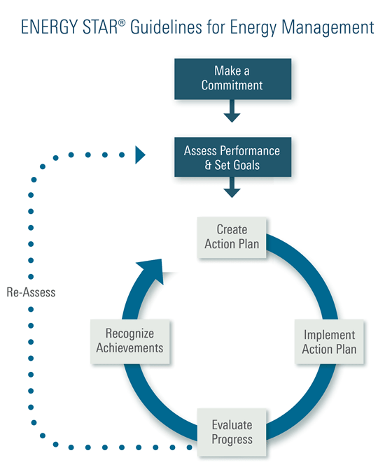
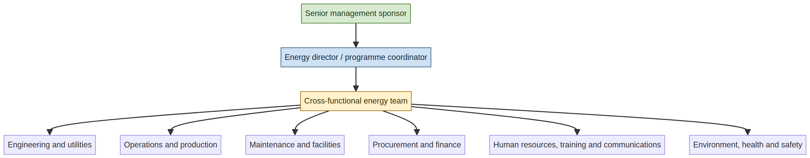
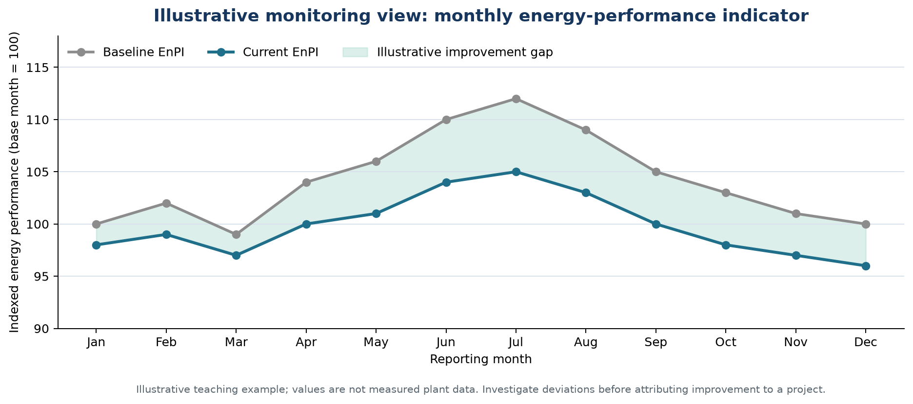

# EEOE4001 — Energy Conservation & Auditing
## Module II: Energy Management

**Lecture duration:** 05 hours  
**Prepared for:** Undergraduate Electrical / Energy Engineering students  
**Prepared by:** Manus AI  
**Scope:** Principles of energy management; organizing an energy-management programme; initiating, planning, controlling, promoting, monitoring, and reporting.

> **Central idea:** Energy management is a continuous organizational process that converts energy performance from an isolated technical concern into a managed business responsibility supported by policy, people, data, targets, action, review, and continual improvement.

---

## 1. Learning outcomes

After completing this module, a student should be able to:

1. Define energy management and distinguish it from an energy audit and an individual energy-efficiency project.
2. Explain the principles that make energy management effective over the long term.
3. Design the basic structure of an energy-management programme, including policy, leadership, team responsibilities, data systems, targets, and reporting.
4. Explain how to initiate an energy-management programme and obtain senior-management commitment.
5. Prepare an energy-management plan using baselines, energy-performance indicators, goals, action items, timelines, resources, and responsibilities.
6. Describe operational control, maintenance control, procurement control, design considerations, and change management as parts of energy management.
7. Develop communication, awareness, training, motivation, and recognition activities that promote employee participation.
8. Design a monitoring and reporting system that supports variance analysis, corrective action, management review, and continual improvement.

### Module map

| Section | Topic | Approximate teaching emphasis |
|---|---|---:|
| 2 | Meaning, scope, and principles of energy management | 0.75 h |
| 3 | Energy-management programme architecture and organization | 0.75 h |
| 4 | Initiating the programme | 0.50 h |
| 5 | Planning: review, baselines, EnPIs, targets, and action plans | 1.25 h |
| 6 | Controlling and implementing the programme | 0.75 h |
| 7 | Promoting participation and building energy culture | 0.50 h |
| 8 | Monitoring, evaluating, and reporting performance | 0.75 h |
| 9 | Worked examples, checklists, and tutorial questions | 0.75 h |

---

## 2. Meaning and scope of energy management

### 2.1 Definition

**Energy management** is the coordinated use of technical, operational, financial, organizational, and behavioural measures to control energy use, improve energy performance, reduce avoidable cost, maintain required service or production, and support organizational objectives.

The U.S. ENERGY STAR programme describes comprehensive energy management as embedding energy management in an organization’s culture and business operations through a process of monitoring, controlling, and reducing energy use.[2] ISO explains that an energy-management system should support an energy policy, objectives, data-based decisions, measurement of results, review, and continual improvement.[3]

> **Working definition for this course:** Energy management is the continuous cycle of establishing direction, understanding energy performance, setting objectives, implementing actions, controlling operations, measuring results, communicating progress, and improving the system.

Energy management is broader than equipment efficiency. It includes the way an organization purchases energy, designs facilities, schedules production, operates equipment, trains staff, allocates budgets, evaluates projects, maintains systems, communicates results, and learns from performance data.

### 2.2 Energy management versus related activities

| Activity | Main purpose | Time orientation | Typical output |
|---|---|---|---|
| **Energy audit** | Investigate energy use and identify opportunities | Periodic diagnostic exercise | Audit report and recommendations |
| **Energy-efficiency project** | Improve a specific system or process | Project-based | Installed measure and verified saving |
| **Energy conservation campaign** | Encourage specific behaviours or operational changes | Short- or medium-term | Awareness and behaviour-change activities |
| **Energy management** | Coordinate all energy-related decisions and improvement activities | Continuous | Policy, programme, targets, controls, reports, and continual improvement |
| **Energy-management system** | Formalize energy-management processes and responsibilities | Continuous and auditable | Documented system aligned with a chosen framework, such as ISO 50001 |

An audit can identify opportunities, but it does not ensure implementation. A project may reduce energy use, but its savings can decline if operating conditions change or maintenance is neglected. Energy management provides the structure that keeps improvements visible, funded, operated, measured, and sustained.

### 2.3 Why organizations need energy management

Energy is an operating cost, a production input, a reliability concern, and an environmental issue. Poorly managed energy can increase cost, expose an organization to tariff fluctuations, create unnecessary peak demand, reduce equipment life, increase greenhouse-gas emissions, and weaken competitiveness. Effective management can improve cost control, production reliability, maintenance quality, comfort, environmental performance, and employee awareness.

An organization may have efficient equipment and still perform poorly if the equipment is oversized, operated at the wrong schedule, poorly maintained, or not controlled according to actual demand. Energy management therefore combines **technical efficiency** with **management discipline**.

---

## 3. Principles of effective energy management

### 3.1 Senior-management commitment

A programme requires visible commitment from the people who control policy, budgets, staffing, operations, procurement, and capital investment. NRCan’s energy-management guidelines identify commitment, staff allocation, funding, an Energy Director, an Energy Team, and an energy policy as the foundation of a successful programme.[1]

Commitment should be demonstrated through action rather than a statement alone. Senior management can approve a policy, appoint a programme leader, set expectations for departments, allocate resources, require energy performance in management reviews, and recognize achievements. When energy objectives conflict with production, maintenance, or budget decisions, leadership must help resolve the conflict.

### 3.2 Clear accountability

Energy performance should have named owners. A programme becomes weak when “everyone” is responsible but no one is accountable. Responsibilities should be defined at organization, facility, department, process, and equipment levels.

Accountability does not mean that one energy manager performs every task. It means that each task has an owner, a deadline, a required resource, and an escalation path when progress is blocked.

### 3.3 Data-based decision-making

Energy management must be supported by reliable data. The organization should know how much energy is used, where it is used, when it is used, what drives the use, what it costs, and how performance compares with a baseline or target. Data should be sufficiently accurate and timely for the decision being made.

A complex information system is not always necessary. NRCan notes that tracking can range from a simple spreadsheet to detailed databases and IT systems; the appropriate system depends on scope, frequency, detail, maintainability, and reporting needs.[1]

### 3.4 Focus on significant energy uses

Resources should be concentrated on systems that have large energy consumption, high energy cost, high variability, major improvement potential, operational risk, or strategic importance. Significant energy uses may include a boiler house, furnace, chiller plant, compressed-air system, large motor system, process line, HVAC system, or high-demand building.

The largest user is not always the easiest or most economical project. Selection should consider energy magnitude, avoidable loss, technical feasibility, cost, risk, and the organization’s ability to implement and verify the action.

### 3.5 Integration with core business processes

Energy management should be connected to strategic planning, budgeting, maintenance, procurement, engineering design, production planning, environmental management, health and safety, and human-resource development. An energy programme that operates outside normal business processes may produce isolated projects but struggle to sustain them.

For example, procurement procedures can require life-cycle energy performance rather than lowest purchase price alone. Maintenance procedures can include energy-related operating checks. Capital-approval forms can require an energy and life-cycle-cost assessment. Production planning can include demand-management considerations.

### 3.6 Operational control and standardization

Energy performance depends on how equipment is operated. Standard operating procedures should define normal operating ranges, start-up and shutdown practices, setpoints, sequencing, idle-time controls, alarm response, cleaning, inspection, and escalation of abnormal conditions.

Standardization reduces dependence on individual memory and makes performance less vulnerable to staff turnover. Procedures must still allow trained operators to respond safely to changing production, weather, quality, or reliability conditions.

### 3.7 Competence, awareness, and participation

People affect energy use through design decisions, operating choices, maintenance work, purchasing, shift practices, housekeeping, and everyday behaviour. Energy management therefore requires suitable competence, awareness of objectives, clear information, and opportunities to contribute ideas.

Training should be matched to role. Operators need practical operating guidance; maintenance staff need diagnostic and preventive-maintenance skills; engineers need performance analysis; procurement staff need energy and life-cycle criteria; managers need financial and performance information.

### 3.8 Measurement, verification, and learning

The organization should distinguish between expected savings and measured results. Measurements should be normalized when necessary for production, weather, occupancy, operating hours, or product mix. If a target is missed, the purpose of review is to find the cause and take corrective or preventive action rather than to assign blame.

### 3.9 Continual improvement

Continual improvement means that the organization repeatedly evaluates performance, identifies gaps, implements actions, checks results, updates plans, and sets new objectives. It does not mean that consumption must fall every month regardless of production or service. It means that the management system becomes more capable and energy performance improves over a meaningful and properly defined baseline.

---

## 4. Energy-management programme architecture

A practical programme consists of linked elements rather than independent activities.

| Programme element | Main question answered | Typical evidence |
|---|---|---|
| Energy policy | What does the organization commit to? | Approved policy and communication record |
| Leadership and governance | Who provides direction and removes barriers? | Sponsor, Energy Director, management review |
| Energy Team | Who coordinates and executes the programme? | Team charter, meeting records, action register |
| Energy review | Where and why is energy used? | Energy map, significant-use register, audit findings |
| Baseline | What is the starting point? | Base-year data and normalization method |
| EnPIs | How is performance expressed? | kWh/t, GJ/m², kW peak, cost/unit, etc. |
| Objectives and targets | What improvement is required and by when? | Approved targets and milestones |
| Action plan | What actions will close the performance gap? | Project register, roles, cost, savings, deadlines |
| Operational control | How will performance be maintained daily? | Procedures, setpoints, inspection and maintenance records |
| Competence and awareness | Can people perform their roles effectively? | Training records, campaigns, feedback, ideas |
| Monitoring and measurement | Are actions producing the intended result? | Meter data, dashboards, variance analysis, M&V |
| Reporting and review | What was achieved and what should happen next? | Monthly reports, management review, revised plan |
| Recognition | How will success be reinforced? | Awards, communications, internal recognition |

### 4.1 Continual-improvement cycle

The ENERGY STAR guidelines organize energy management around a seven-step road map: make a commitment, assess performance, set goals, create an action plan, implement the plan, evaluate progress, and recognize achievements.[2] The process then returns to reassessment and a new improvement cycle.

*Figure 1. ENERGY STAR seven-step energy-management roadmap, reproduced from the official ENERGY STAR guidance page.[2] The visual emphasizes that energy management is cyclical rather than a one-time project.*

A simplified course-oriented version is shown below.

*Figure 2. Deterministic instructional rendering of the energy-management cycle. The cycle is aligned with the commitment, performance assessment, goal, action, implementation, evaluation, and recognition sequence described by ENERGY STAR and NRCan.[1] [2]*

### 4.2 Programme maturity

Energy-management programmes often develop in stages. A reactive organization responds to high bills or equipment failures. A systematic organization establishes a policy, team, baseline, targets, and action plan. A mature organization integrates energy criteria into capital planning, procurement, design, operations, maintenance, employee performance, and management review.

| Maturity stage | Typical characteristics |
|---|---|
| **Reactive** | Actions occur after complaints, failures, or unusually high bills. Data are incomplete and responsibility is unclear. |
| **Project-oriented** | Audits and isolated projects are conducted, but savings depend heavily on individual champions. |
| **Systematic** | Policy, team, baseline, targets, action register, monitoring, and review are established. |
| **Integrated** | Energy is included in business planning, procurement, design, maintenance, training, and management decisions. |
| **Optimizing** | Performance is continuously improved using high-quality data, advanced controls, benchmarking, learning, and innovation. |

---

## 5. Organizing an energy-management programme

### 5.1 Energy policy

An energy policy is a concise statement approved by senior management that establishes the organization’s direction and commitment. It should be appropriate to the organization’s size, activities, energy use, and strategic priorities.

A useful energy policy normally addresses efficient energy use, continual improvement of energy performance, provision of information and resources, compliance with applicable obligations, support for energy-efficient purchasing and design, and communication to relevant personnel. It should avoid vague language that cannot guide decisions.

A policy should answer four practical questions:

1. What energy-performance outcome is the organization committed to pursuing?
2. Which parts of the organization and which energy uses are covered?
3. Who has authority and accountability for implementation?
4. How will the policy be reviewed and improved?

### 5.2 Energy Director or programme coordinator

The Energy Director is the central coordinator of the programme. NRCan notes that this person need not be the organization’s most technically specialized engineer; the role requires an understanding of how energy management supports financial, environmental, and operational objectives.[1]

Typical responsibilities include coordinating the programme, preparing or maintaining the policy, leading the Energy Team, obtaining resources, ensuring accountability, identifying opportunities, coordinating training, tracking results, communicating progress, and supporting recognition of achievements.

The Energy Director should have sufficient authority, access to management, time, information, and budget support. If the person reports through a technical or administrative department, an executive sponsor can provide a direct link to senior management.

### 5.3 Energy Team

The Energy Team is a cross-functional group that brings together the people who influence energy use and implementation. It should include representatives from engineering, operations, maintenance, facilities, procurement, finance, human resources, environmental health and safety, information systems, and communications as appropriate.

The team should not exist only as a discussion forum. It should have a written charter covering purpose, membership, meeting frequency, decision rights, deliverables, escalation, and reporting. Meetings should review performance, action status, barriers, new opportunities, measurement issues, and communication needs.

*Figure 3. Deterministic organization diagram showing the relationship between senior management, the Energy Director, the Energy Team, and participating departments. The exact structure should be adapted to the organization.*

### 5.4 Roles and responsibility matrix

A responsibility matrix reduces ambiguity. The following simplified RACI convention may be used: **R** means responsible for performing the work, **A** means accountable for the result, **C** means consulted, and **I** means informed.

| Activity | Senior management | Energy Director | Energy Team | Department owner | Finance / HR / Procurement |
|---|---|---|---|---|---|
| Approve policy | A | R | C | I | C |
| Establish baseline | I | A | R | C | C |
| Identify significant energy uses | I | A | R | R | C |
| Set organizational targets | A | R | C | C | C |
| Implement operational measures | I | A | C | R | C |
| Approve capital projects | A | C | C | R | R |
| Monitor EnPIs | I | A | R | R | I |
| Communicate progress | C | A | R | C | R |
| Conduct management review | A | R | C | C | C |

The matrix is an organizing tool, not a substitute for discussion. Responsibilities should be confirmed with the people who will actually perform the work.

---

## 6. Initiating the energy-management programme

### 6.1 Build the business case

Initiation begins when an organization understands why energy management matters. The business case should connect energy performance with operating cost, production reliability, asset life, maintenance, environmental performance, regulatory expectations, resilience, and organizational reputation.

A convincing business case combines current energy cost, historical trends, major energy uses, avoidable losses, possible savings, implementation cost, risks, non-energy benefits, and the consequences of inaction. The case should explain not only how much energy may be saved but also how the programme will improve decision quality and sustain results.

### 6.2 Secure senior-management commitment

The first formal decisions should include approval of the policy or programme charter, appointment of a responsible leader, establishment of the Energy Team, confirmation of scope, allocation of staff time and funding, and agreement on the initial performance review.

Commitment is stronger when management sets expectations for departments and includes energy performance in routine reviews. It is also important to clarify that energy objectives must not compromise safety, product quality, legal compliance, or essential reliability.

### 6.3 Define scope and boundaries

The initial scope may include one facility, a group of buildings, a process line, a utility plant, or the whole organization. A manageable first phase is often preferable to an undefined programme covering everything.

The scope statement should identify the organizational units, physical sites, energy carriers, major equipment, data period, reporting frequency, decision-makers, and interfaces with other programmes. Scope can be expanded after the basic system is functioning.

### 6.4 Establish the initial team and communication plan

At initiation, the organization should identify affected audiences and determine what each audience needs to know. Senior managers need financial and strategic implications. Operators need practical instructions. Maintenance staff need equipment and diagnostic information. Procurement staff need purchasing criteria. Employees need understandable goals and ways to contribute.

The communication plan should identify the audience, message, communicator, medium, frequency, feedback method, and required action. Communication is not limited to announcing targets; it includes listening to concerns and reporting progress.

---

## 7. Planning the energy-management programme

### 7.1 Energy review

The energy review is the analytical foundation of planning. It examines current and historical energy use, energy sources, significant energy uses, relevant variables, performance trends, existing controls, opportunities, and data gaps.

A useful energy review answers:

| Question | Planning use |
|---|---|
| What energy carriers enter the organization? | Defines the energy inventory and accounting basis. |
| Which facilities, processes, or equipment consume the most? | Identifies significant energy uses. |
| What variables affect consumption? | Determines normalization and appropriate EnPIs. |
| What controls or procedures already exist? | Identifies strengths and gaps. |
| What projects have been implemented? | Avoids double-counting and evaluates persistence. |
| Where is data incomplete or unreliable? | Defines metering and data-improvement actions. |
| What opportunities are technically and financially feasible? | Provides the basis for objectives and action plans. |

### 7.2 Data collection and tracking

NRCan recommends collecting complete and accurate energy data, accounting for all purchased and on-site-generated sources, documenting energy uses, and gathering operational data needed for normalization and benchmarking.[1]

At minimum, the organization should maintain energy use and cost by relevant fuel type and facility. Where feasible, submetering should be used for major processes or systems. Data should be current, traceable, easy to update, and supported by documented units and conversion factors.

A data register should include the meter or source, unit, period, reading method, responsible person, quality check, and location. Estimates should be clearly labelled. If a bill is based on an estimated reading, the correction should be recorded when actual data become available.

### 7.3 Energy baseline

An **energy baseline** is a reference point against which future performance is compared. It may be a base year, an average of several historical years, a normalized model, or a project-specific pre-implementation period.

A baseline should be selected from complete and representative data. The organization may need to normalize for production, weather, occupancy, operating hours, product mix, or other relevant variables. The baseline should be documented and revised only through a controlled process.

For a simple production-normalized indicator:

\[
\text{EnPI} = \frac{\text{Energy use}}{\text{Relevant activity or output}}
\]

For example:

\[
\text{Electricity EnPI} = \frac{\text{kWh}}{\text{tonnes of product}}
\]

\[
\text{Building EnPI} = \frac{\text{kWh}}{\text{m}^2\text{ of conditioned area}}
\]

A baseline is not automatically fair or useful. It should be tested for completeness, abnormal conditions, data gaps, and relevance to the current operating context.

### 7.4 Energy-performance indicators

An **energy-performance indicator (EnPI)** expresses energy performance in a form that can be monitored and compared. Possible EnPIs include total kWh, kWh per unit of product, GJ per batch, kW peak, kWh per occupied room-night, cost per tonne, boiler efficiency, auxiliary power percentage, and energy use per operating hour.

| EnPI type | Example | Appropriate when |
|---|---|---|
| Absolute energy | Monthly electricity in kWh | Tracking total demand or emissions exposure |
| Normalized intensity | kWh/t or GJ/m² | Comparing periods with different output or area |
| Demand indicator | Maximum kW or kW/m² | Managing peak-demand charges or capacity |
| Efficiency indicator | Boiler efficiency or COP | Assessing equipment performance |
| Financial indicator | ₹/t or ₹/m² | Connecting energy performance to cost |
| Operational indicator | kWh per operating hour | Comparing equipment or shifts |

A single EnPI is rarely sufficient. A plant may need both total energy and energy per unit output. A building may need energy intensity, peak demand, occupancy, and weather normalization.

### 7.5 Benchmarking

Benchmarking compares performance with a baseline, another facility, an industry average, a best-in-class reference, or a best practice. NRCan identifies past performance, industry average, best in class, and best practices as useful comparison bases.[1]

Benchmarking must avoid comparing unlike systems. Differences in climate, production mix, building function, occupancy, operating hours, product quality, or process technology can affect energy use. Normalization is required when these variables materially influence performance.

### 7.6 Setting objectives and targets

Objectives state the desired direction; targets define measurable results and dates. A good target is specific, measurable, achievable but challenging, relevant, time-bound, and assigned to an accountable owner.

Examples include:

- reduce normalized electricity intensity from 210 to 190 kWh/t by the end of the financial year;
- reduce maximum demand by 8% within six months through scheduling and automatic control;
- improve boiler efficiency by three percentage points before the next heating season;
- complete submetering of the compressed-air system by the end of the second quarter;
- train all shift operators on start-up and shutdown procedures within three months.

Targets can be organization-wide, facility-level, process-level, or equipment-level. They may be expressed as absolute reduction, percentage reduction, improved intensity, best-in-class performance, environmental benefit, or completion of a capability-building milestone.

### 7.7 Creating the action plan

The action plan converts targets into work. NRCan organizes action planning around defining technical steps and targets, determining roles and resources, obtaining buy-in, and communicating the plan across affected areas.[1]

Each action should have a clear description, responsible owner, supporting departments, baseline, expected saving, implementation cost, deadline, milestones, risks, dependencies, and verification method.

| Action-plan field | Example |
|---|---|
| Action | Stagger start-up of three large process motors. |
| Problem addressed | Simultaneous start-up creates a monthly demand peak. |
| Owner | Production manager with electrical engineer. |
| Baseline | Highest 15-minute demand during the last 12 months. |
| Target | Reduce start-up demand by 120 kW without reducing output. |
| Resources | Control-programming time, operator training, demand-data review. |
| Deadline | Commission before the next billing cycle. |
| Risk | Start-up delay or process interruption. |
| Verification | Compare demand profile and production schedule before and after implementation. |

### 7.8 Resource and funding plan

The resource plan should include staff time, technical expertise, metering, software, training, contractor support, capital, operating expense, and time for commissioning and verification. A project may appear attractive but fail if implementation resources are not available.

Capital requests should present energy savings alongside reliability, maintenance, quality, safety, environmental, and productivity benefits. Procurement and finance should be involved early so that the action plan is compatible with approval procedures and budget cycles.

---

## 8. Controlling and implementing the programme

The syllabus uses the term **controlling** in the management sense: directing activities so that energy objectives are achieved and performance remains within defined requirements. Control includes operational control, maintenance control, procurement, design, documentation, change management, and corrective action.

### 8.1 Operational control

Operational control translates energy objectives into daily practice. Procedures should define normal operation, start-up, shutdown, setpoints, scheduling, sequencing, alarm response, and acceptable operating ranges for significant energy uses.

Examples include maintaining boiler excess air within an appropriate range, switching off compressed-air generation when production is stopped, preventing simultaneous heating and cooling, operating pumps and fans according to demand, controlling lighting by occupancy, and avoiding equipment idling.

Procedures should be accessible at the point of use. They should be reviewed when equipment, process conditions, product requirements, or control logic changes.

### 8.2 Maintenance control

Maintenance is an energy-management activity because degraded equipment often consumes more energy to deliver the same service. Maintenance controls may include lubrication, alignment, cleaning, filter replacement, insulation inspection, leak detection, sensor calibration, combustion checks, heat-exchanger cleaning, belt tension, refrigeration charging, and verification of control valves and dampers.

Preventive maintenance should include energy-related checks. Predictive maintenance can use vibration, temperature, electrical, pressure, flow, and trend data to identify developing problems before efficiency and reliability deteriorate.

### 8.3 Procurement control

Procurement decisions influence energy use for many years. Energy criteria should be considered in equipment specifications, vendor evaluation, bids, contracts, and total-cost analysis. Relevant criteria may include rated efficiency, part-load performance, control range, standby consumption, operating cost, maintenance requirement, spare parts, expected life, emissions, and compatibility with existing systems.

The lowest purchase price is not necessarily the lowest total cost. A more efficient pump, motor, chiller, boiler, transformer, or lighting system may cost more initially but reduce operating cost over its life. Module V develops life-cycle and economic analysis in detail.

### 8.4 Design and modification control

New facilities, expansions, process changes, and equipment replacements are opportunities to avoid future energy waste. Design review should consider energy performance, system sizing, controls, metering, maintainability, heat recovery, process integration, commissioning, and future operating conditions.

Design decisions should be recorded along with assumptions. If a process is expected to change after commissioning, the control strategy and EnPIs should be designed to accommodate the change.

### 8.5 Change management

Changes in product, production schedule, occupancy, equipment, tariff, fuel, control software, staffing, or building use can alter energy performance. A change-management process should identify the expected energy impact, responsible reviewers, required documentation, training, commissioning, and post-change verification.

Energy performance may decline when a new control sequence is installed without operator training or when a production expansion uses existing utilities beyond their efficient operating range. Change management helps prevent such unintended consequences.

### 8.6 Document and record control

The programme should control energy policies, procedures, records, meter data, baselines, targets, project calculations, training records, reports, approvals, and corrective actions. Records should be identifiable, accessible, protected from unauthorized alteration, and retained for an appropriate period.

Documentation should support learning, not create unnecessary bureaucracy. The test is whether another competent person can understand what was decided, why it was decided, who implemented it, and how the result was measured.

### 8.7 Corrective and preventive action

A corrective action addresses a nonconformity or performance failure that has already occurred. A preventive action addresses a potential cause before failure occurs. Examples include correcting a failed sensor, revising a start-up procedure, adding a maintenance inspection, improving meter validation, or redesigning a control sequence.

Corrective-action records should include the problem, immediate containment, root cause, action, responsible owner, due date, verification of effectiveness, and lesson learned.

---

## 9. Promoting energy management

### 9.1 Communication

Communication makes the programme visible and relevant. It should be planned for different audiences rather than delivered as a single generic announcement. Management may need financial and strategic results; operators need practical instructions; employees need understandable actions; contractors need site requirements; and external stakeholders may need verified performance information.

A communication plan can be organized as follows:

| Audience | Main information need | Suitable method | Desired response |
|---|---|---|---|
| Senior management | Cost, risk, progress, resource needs, strategic benefit | Executive review and dashboard | Approve resources and remove barriers |
| Energy Team | EnPI trends, project status, data quality, corrective actions | Monthly team meeting | Coordinate implementation |
| Operators | Setpoints, schedules, abnormal conditions, safe practices | Toolbox talk and visual instruction | Operate equipment correctly |
| Maintenance staff | Efficiency-related inspection and repair requirements | Work orders and technical training | Maintain performance |
| Procurement and finance | Life-cycle cost, project business case, energy criteria | Procedure and approval template | Support efficient purchases |
| All employees | Goals, personal contribution, achievements | Intranet, posters, briefings | Participate and suggest ideas |
| Contractors and suppliers | Energy requirements and operating expectations | Contract and induction | Comply and support performance |

### 9.2 Awareness

Awareness activities explain how energy use affects cost, production, comfort, safety, reliability, and the environment. Effective awareness is specific. Instead of stating only “save energy,” show the operating practice, the equipment affected, the expected result, and the method of feedback.

Examples include new-employee orientation, shift briefings, posters near equipment, energy scorecards, intranet pages, energy fairs, facility tours, case studies, and announcements of verified achievements. Awareness should be repeated because people, equipment, and priorities change.

### 9.3 Training and capacity-building

Training should be planned from a competence analysis. Identify the tasks that affect energy performance, the knowledge and skills required, current gaps, training method, trainer, evaluation, and refresher frequency.

| Role | Possible training content |
|---|---|
| Operators | Start-up/shutdown, setpoints, sequencing, alarms, idle operation, reporting abnormalities |
| Maintenance staff | Leak detection, alignment, lubrication, sensor calibration, cleaning, preventive checks |
| Engineers | Energy review, EnPIs, system measurement, controls, technical assessment, M&V |
| Managers | Business case, targets, risk, progress review, resource allocation |
| Procurement | Energy specifications, life-cycle cost, vendor data, commissioning requirements |
| Finance | Tariffs, demand charges, savings accounting, project appraisal |
| Communications and HR | Awareness, recognition, engagement, performance integration |

Training effectiveness should be checked through observation, practical demonstration, test results, work-order quality, energy trends, or feedback rather than attendance alone.

### 9.4 Motivation and incentives

Motivation can be intrinsic, professional, financial, environmental, social, or recognition-based. Possible methods include internal competitions, department scorecards, recognition of ideas, awards, prizes, performance standards, and linking departmental goals to wider organizational objectives.

Incentives must be designed carefully. If employees are rewarded only for lower energy use, they may reduce necessary operating hours, compromise comfort, or delay maintenance. Performance measures should therefore include production, quality, safety, reliability, and service requirements where relevant.

### 9.5 Recognition

Recognition reinforces the behaviour and practices that the organization wants to sustain. It may be given to individuals, teams, departments, facilities, projects, or suppliers. Criteria should be transparent and may include verified savings, best idea, sustained performance, successful training, reliable data, or outstanding cooperation.

Recognition should not replace fair compensation or adequate resources. Its purpose is to make energy performance visible, acknowledge contribution, and maintain momentum.

---

## 10. Monitoring and evaluating performance

### 10.1 Monitoring framework

Monitoring determines whether the programme and its projects are progressing as intended. It should cover energy use, EnPIs, targets, project milestones, costs, implementation status, data quality, operational conditions, and corrective actions.

A monitoring system can range from a spreadsheet to an energy-management information system. The system should be proportionate to the organization’s size and decision needs. It should be centralized enough to provide a consistent view while allowing facilities and departments to understand their own performance.

### 10.2 What should be monitored?

| Monitoring category | Example measure |
|---|---|
| Energy consumption | Monthly electricity, gas, steam, fuel, and water use |
| Demand | Maximum kW, demand duration, load factor |
| Normalized performance | kWh/t, GJ/m², kWh/occupied hour |
| Equipment performance | Boiler efficiency, chiller COP, compressed-air pressure, motor loading |
| Project progress | Milestones completed, commissioning date, implementation percentage |
| Financial performance | Capital spent, operating cost, avoided cost, verified savings |
| Operational compliance | Setpoint adherence, schedule compliance, maintenance completion |
| Engagement | Training completion, ideas submitted, participation, recognition |
| Data quality | Missing readings, estimated bills, meter faults, validation exceptions |

### 10.3 Monitoring frequency

Frequency should match the variability and importance of the energy use. Utility bills may support monthly organizational reporting. High-demand systems may require 15-minute or hourly data. A process with rapid variation may require real-time measurement. Maintenance checks may be daily, weekly, monthly, or condition-based.

The programme should define who reviews each data stream, what constitutes an abnormal result, when an investigation is required, and how the result is recorded.

### 10.4 Performance dashboards

A dashboard should present a small number of meaningful indicators rather than a large volume of unprocessed data. It may show current performance, baseline, target, trend, variance, project status, top opportunities, and data-quality alerts.

*Figure 4. Illustrative monitoring view comparing a baseline EnPI with current performance. Values are teaching examples, not measured plant data. A lower EnPI is not automatically an improvement unless output, quality, operating conditions, and data validity are also checked.*

### 10.5 Variance analysis

Variance analysis compares actual performance with a baseline, target, budget, forecast, or expected project result. The variance should be interpreted using relevant variables.

A basic calculation is:

\[
\text{Variance} = \text{Actual performance} - \text{Reference performance}
\]

For an intensity indicator where lower is better:

\[
\text{Improvement percentage} = \frac{\text{Baseline EnPI} - \text{Current EnPI}}{\text{Baseline EnPI}} \times 100
\]

If current performance is unexpectedly poor, investigate production, weather, occupancy, product mix, operating hours, equipment condition, control changes, tariff changes, meter errors, and data-entry errors before concluding that the programme failed.

### 10.6 Measurement and verification

Measurement and verification (M&V) establishes whether an implemented measure achieved the expected result. It should define the baseline, measurement boundary, data source, calculation method, adjustment factors, reporting period, and uncertainty.

Examples include comparing normalized kWh/t before and after a motor-control project, comparing demand profiles after start-up sequencing, measuring boiler efficiency after combustion adjustment, or comparing building energy use after HVAC scheduling changes.

M&V should be planned before implementation because the required meters, sensors, operating records, or baseline data may not be available afterward.

### 10.7 Evaluate progress and review the action plan

ENERGY STAR guidance recommends measuring results against goals and reviewing the action plan to understand what worked, what did not, and what corrective or preventive action is required.[1] [2]

The review should consider both quantitative and qualitative results. Quantitative results include kWh, GJ, kW, cost, EnPI, and emissions. Qualitative results include improved comfort, reliability, maintenance, productivity, staff capability, safety, data quality, and organizational learning.

A project that misses its energy target may still produce valuable information. The review should identify whether the cause was an inaccurate baseline, incomplete implementation, poor commissioning, changed operating conditions, inadequate training, equipment failure, or an unrealistic target.

### 10.8 Management review

Senior management should periodically review whether the programme remains suitable, adequate, effective, and aligned with organizational priorities. A management review may consider energy policy, EnPI performance, objectives, action-plan status, audits, nonconformities, resource needs, changing conditions, risks, opportunities, and recommendations for improvement.

Management review is not simply a presentation of good news. It should provide decisions: approve resources, revise targets, prioritize projects, correct governance gaps, change scope, improve measurement, or update the policy.

---

## 11. Reporting energy-management performance

### 11.1 Purpose of reporting

Reporting converts monitoring information into a form that supports decisions. A report should be accurate, timely, relevant to its audience, comparable with the baseline or target, and clear about assumptions and limitations.

The report should distinguish between energy consumption, energy performance, financial impact, implementation progress, and verified savings. A fall in energy use may be caused by lower production rather than improved efficiency; a rise in cost may be caused by tariffs rather than higher consumption.

### 11.2 Reporting levels

| Report level | Audience | Typical frequency | Main content |
|---|---|---:|---|
| Operational | Operators and maintenance | Daily/weekly | Alarms, abnormal conditions, setpoints, equipment status |
| Department or facility | Department managers and Energy Team | Monthly | EnPIs, variance, projects, action status, data gaps |
| Executive | Senior management | Quarterly | Strategic progress, savings, risk, resource requirements |
| Annual programme | Internal and external stakeholders | Annual | Energy, cost, emissions, targets, projects, lessons, next-year plan |
| Project M&V | Project owner and finance | Project-specific | Baseline, method, measured result, adjustment, uncertainty |

### 11.3 Monthly energy-performance report

A practical monthly report may contain an executive summary, energy use by carrier, performance indicators, comparison with baseline and target, explanation of significant variances, project status, savings verification, data-quality issues, corrective actions, safety or production impacts, and decisions required.

A compact reporting table can be useful:

| Indicator | Baseline | Target | Current | Variance | Status / action |
|---|---:|---:|---:|---:|---|
| Electricity intensity (kWh/t) | 210 | 195 | 202 | +7 | Investigate April production mix and compressor runtime |
| Maximum demand (kW) | 2,400 | 2,200 | 2,260 | +60 | Complete start-up sequencing trial |
| Boiler efficiency (%) | 82 | 85 | 84 | -1 | Verify excess air sensor and clean heat-transfer surfaces |
| Training completion (%) | 0 | 100 | 86 | -14 | Schedule remaining shift sessions |

The numbers above are illustrative. In a real report, the units, baseline period, data source, and responsible owner must be stated.

### 11.4 Reporting to different audiences

The same result should be translated for the audience. Senior management may need ₹ savings, payback, risk, and strategic alignment. The Energy Team may need EnPI trends and corrective actions. Operators may need a clear instruction such as “switch off compressor C-2 during the scheduled shutdown.” Procurement may need a specification and life-cycle-cost comparison.

Good reporting avoids both extremes: excessive technical detail that hides the decision, and oversimplification that hides assumptions and uncertainty.

### 11.5 Public and external reporting

External reporting should be accurate, consistent, and supported by evidence. It may include energy consumption, intensity, targets, verified reductions, emissions, projects, and recognition. Claims should state the baseline, reporting period, boundary, and method. The organization should not claim a project’s full expected saving before it has been implemented and verified.

---

## 12. Worked example: establishing an energy-management programme

### 12.1 Situation

A manufacturing facility spends ₹24 million per year on electricity and fuel. Utility bills are available, but there is no formal energy policy, no cross-functional team, and no consistent monthly EnPI. The plant manager wants to reduce energy cost without affecting production or product quality.

### 12.2 Initiation

Senior management appoints an Energy Director and forms a team with representatives from engineering, production, maintenance, finance, procurement, human resources, and environment, health and safety. The policy commits the organization to efficient and responsible energy use, continual improvement, compliance, information and resources, and communication to employees.

### 12.3 Assessment and baseline

The team collects 24 months of electricity and fuel bills, production records, operating hours, product mix, and major equipment information. It identifies the boiler, compressed-air system, cooling plant, and large motor systems as significant energy uses. The baseline is set using the most complete representative year and is normalized for production.

The initial EnPIs are selected as:

\[
\text{Electricity intensity} = \frac{\text{kWh}}{\text{tonne of product}}
\]

\[
\text{Fuel intensity} = \frac{\text{GJ}}{\text{tonne of product}}
\]

\[
\text{Peak demand} = \text{maximum billed kW per month}
\]

### 12.4 Goals and action plan

The organization sets a target to reduce normalized electricity intensity by 8% in twelve months and reduce peak demand by 5% within six months. The action plan includes compressed-air leak repair, demand-based sequencing of large motors, boiler combustion optimization, operator training, and submetering of the compressed-air system.

Each action is assigned to an owner with a deadline, resource estimate, risk assessment, expected saving, and verification method. Finance reviews the operating and capital requirements. Procurement includes efficiency and life-cycle criteria for replacement equipment.

### 12.5 Implementation and promotion

Operators receive training on shutdown procedures and leak reporting. Maintenance staff receive a compressed-air and boiler-efficiency checklist. A monthly scorecard is displayed in the production area. Departments are recognized for verified savings and for reliable data reporting, not merely for reducing output or operating hours.

### 12.6 Monitoring and reporting

The Energy Team reviews monthly kWh/t, GJ/t, maximum demand, project completion, and data quality. A variance review investigates any month in which performance differs materially from target. After implementation, savings are verified using the defined baseline and production-normalized data.

At the end of the year, management reviews the results, identifies lessons, revises the policy or targets if necessary, and approves the next action plan. The programme has moved from a one-time project to a managed continual-improvement system.

---

## 13. Practical implementation checklist

### Initiating

| Check | Evidence of completion |
|---|---|
| Has senior management approved the programme? | Signed policy, charter, or management decision |
| Has an Energy Director been appointed? | Role description and appointment |
| Has an Energy Team been established? | Membership, charter, meeting schedule |
| Is the programme scope defined? | Scope statement and boundary map |
| Are staff time and funding available? | Approved resource plan |

### Planning

| Check | Evidence of completion |
|---|---|
| Are energy sources and major uses known? | Energy inventory and energy review |
| Is there a documented baseline? | Base period, data set, normalization method |
| Are EnPIs suitable for the organization? | Indicator definitions and units |
| Are objectives measurable and dated? | Approved targets and milestones |
| Does every action have an owner? | Action register and responsibility matrix |

### Controlling and implementation

| Check | Evidence of completion |
|---|---|
| Are operating procedures available? | Controlled procedures and operator instructions |
| Are maintenance activities linked to efficiency? | Work orders, checklists, inspection records |
| Are energy criteria used in procurement? | Specifications and bid evaluations |
| Are design changes reviewed for energy impact? | Design review and commissioning records |
| Are corrective actions tracked to closure? | Corrective-action register |

### Promoting

| Check | Evidence of completion |
|---|---|
| Are employees aware of goals and responsibilities? | Briefings, posters, intranet, toolbox talks |
| Is role-specific training provided? | Training matrix and competency evidence |
| Can employees submit ideas? | Idea register and feedback process |
| Are achievements recognized? | Recognition criteria and records |

### Monitoring and reporting

| Check | Evidence of completion |
|---|---|
| Are data collected at the required frequency? | Meter records and tracking system |
| Are results compared with baseline and target? | EnPI dashboard and variance report |
| Are project savings verified? | M&V report |
| Are missed targets investigated? | Root-cause and corrective-action records |
| Does management review the programme? | Review minutes and decisions |

---

## 14. Common failures and corrective lessons

| Failure mode | Consequence | Corrective lesson |
|---|---|---|
| Policy is issued but not connected to decisions | Programme becomes symbolic | Link policy to budgets, procurement, design, and reviews. |
| Energy manager has responsibility but no authority | Actions are delayed | Define decision rights and provide an executive sponsor. |
| Goals are not normalized | Production or weather changes distort results | Select EnPIs and normalization variables carefully. |
| Too many indicators are collected | Staff stop using the system | Monitor a small set of decision-relevant indicators. |
| Action plan lacks owners and dates | Opportunities remain ideas | Assign responsibility, milestones, resources, and escalation. |
| Training measures attendance only | Competence may not improve | Evaluate practical performance and follow-up results. |
| Incentives reward lower use without safeguards | Quality, comfort, or production may suffer | Include service, quality, safety, and reliability criteria. |
| Reports contain only good news | Risks and failures are hidden | Report variances, uncertainty, and corrective action openly. |
| Savings are claimed without verification | Financial credibility is weakened | Define M&V before implementation and retain evidence. |
| One project is treated as the programme | Savings degrade over time | Continue monitoring, review, recognition, and reassessment. |

---

## 15. Key takeaways

Energy management is a **continuous management function**, not a single audit or equipment replacement. It combines policy, leadership, organization, data, goals, action, operational control, communication, training, monitoring, reporting, and learning.

The programme should begin with senior-management commitment and a clear scope. An Energy Director and cross-functional Energy Team provide coordination. An energy review identifies significant uses and relevant variables. Baselines and EnPIs make performance measurable. Objectives and targets convert ambition into measurable direction. The action plan assigns work, resources, deadlines, risks, and verification.

Controlling the programme means embedding energy performance into operations, maintenance, procurement, design, change management, and corrective action. Promoting the programme means building awareness, competence, participation, motivation, and recognition. Monitoring and reporting provide the feedback necessary to identify success, expose problems, make decisions, and begin the next improvement cycle.

---

## 16. Tutorial and examination questions

### Short-answer questions

1. Define energy management and distinguish it from an energy audit.
2. State six principles of effective energy management.
3. What is the role of an Energy Director?
4. Why should an Energy Team be cross-functional?
5. List the main elements of an energy policy.
6. Define an energy baseline and explain why normalization may be necessary.
7. What is an energy-performance indicator? Give four examples.
8. Distinguish between an objective and a target.
9. What should an action plan contain?
10. Explain operational control in energy management.
11. Why are procurement and design important to energy performance?
12. Distinguish awareness, training, motivation, and recognition.
13. What is variance analysis?
14. What is the purpose of measurement and verification?
15. What information should be presented in a monthly energy-performance report?

### Long-answer and discussion questions

1. Explain the seven-step ENERGY STAR road map for continuous energy management.
2. Design an organizational structure for an energy-management programme in a manufacturing plant.
3. Discuss the role of senior management, the Energy Director, the Energy Team, and department owners.
4. Explain how to initiate an energy-management programme, beginning with the business case and ending with an approved scope and team.
5. Describe the process of establishing a baseline, selecting EnPIs, setting targets, and preparing an action plan.
6. Discuss how energy performance can be controlled through operations, maintenance, procurement, design, and change management.
7. Prepare a communication and awareness plan for operators, maintenance staff, managers, and procurement personnel.
8. Explain how monitoring, variance analysis, M&V, corrective action, and management review support continual improvement.
9. Develop a reporting format for a facility that must reduce electricity intensity and peak demand.
10. Discuss why recognition and incentives should be designed with production, quality, safety, comfort, and reliability safeguards.

### Application problem

A commercial facility has an annual electricity intensity of 180 kWh/m²-year and a target of 165 kWh/m²-year. After an HVAC scheduling project, the reported intensity falls to 160 kWh/m²-year. Occupancy also falls by 12% during the comparison period.

Prepare an analysis plan that identifies the additional data required, determines whether normalization is needed, checks whether comfort and operating hours were maintained, defines a suitable verification method, and states how the result should be reported to management. The important lesson is that a lower raw EnPI is not sufficient evidence of project success until relevant variables and service quality have been considered.

---

## References

[1] [Natural Resources Canada, *Guidelines for Energy Management*.](https://natural-resources.canada.ca/sites/nrcan/files/energy/pdf/EM%20Guidelines%20Eng%20Mar_27_2019.pdf) Government of Canada / ENERGY STAR guidance for commitment, assessment, planning, implementation, evaluation, and recognition.

[2] [ENERGY STAR, “Comprehensive Energy Management.”](https://www.energystar.gov/buildings/save-energy-commercial-buildings/comprehensive-energy-management) U.S. Environmental Protection Agency. Includes the seven-step road map for continuous improvement.

[3] [International Organization for Standardization, “ISO 50001 — Energy management.”](https://www.iso.org/iso-50001-energy-management.html) Official overview of the energy-management-system framework and continual-improvement model.

[4] [Natural Resources Canada, “Energy management for industry.”](https://natural-resources.canada.ca/energy-efficiency/industry-energy-efficiency/energy-management-industry) Gateway to energy audits, energy-management information systems, ISO 50001, benchmarking, guidelines, and employee awareness resources.

[5] User-provided syllabus: **EEOE4001 Energy Conservation & Auditing**, Module II outline and course objectives.

### Visual-attribution notes

The seven-step roadmap is reproduced from the official ENERGY STAR guidance page and should retain the source attribution in any reuse. The continual-improvement cycle, organizational diagram, and monitoring chart were created deterministically for these lecture notes. The monitoring chart uses explicitly illustrative values and should not be treated as plant or industry data.
