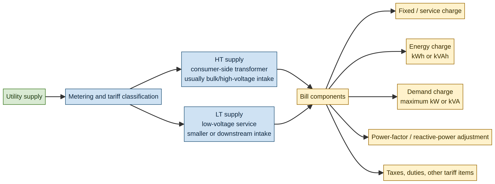
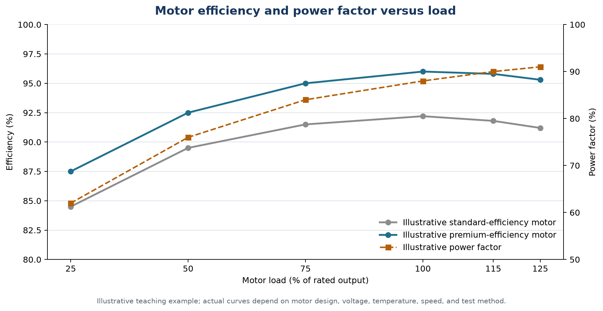
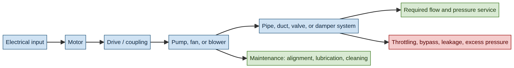
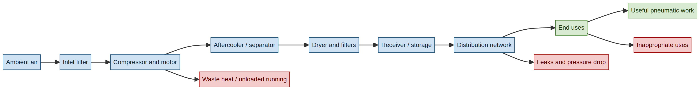
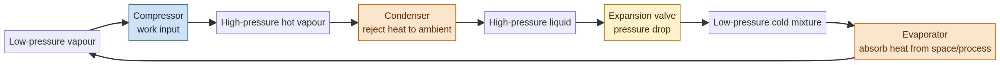
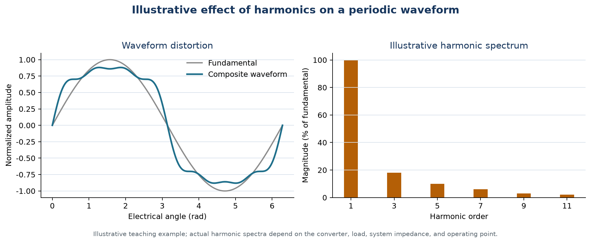

# EEOE4001 — Energy Conservation & Auditing
## Module III: Electrical Energy Efficiency and Major Utility Systems

**Lecture duration:** 08 hours  
**Prepared for:** Undergraduate Electrical / Energy Engineering students  
**Prepared by:** Manus AI  
**Scope:** Electricity billing; HT and LT supply; transformers; electric motors; motor-efficiency computation; energy-efficient motors; pumps; fans; blowers; compressed-air systems; refrigeration and air-conditioning systems; cooling towers; electric heaters; DG sets; illuminating devices; power-factor improvement; and harmonics.

> **Central idea:** Electrical energy efficiency is achieved by managing the complete chain from utility supply and billing to transformers, motors, driven equipment, thermal utilities, lighting, power factor, and power quality. The most effective audit is system-based rather than limited to individual equipment nameplates.

---

## 1. Learning outcomes

After completing this module, a student should be able to:

1. Read and analyse the major components of an industrial or commercial electricity bill.
2. Explain the practical distinction between HT and LT supply and identify the implications for metering, transformation, demand, and losses.
3. Calculate transformer efficiency, motor input power, motor efficiency, motor loading, annual energy consumption, and simple energy savings.
4. Evaluate energy-efficient motor replacement and motor-system improvement opportunities.
5. Analyse pump, fan, and blower systems using flow, pressure, head, efficiency, and affinity-law relationships.
6. Explain the supply and demand sides of compressed-air systems and identify leakage, pressure, storage, control, and end-use opportunities.
7. Describe the refrigeration and air-conditioning cycle and calculate or interpret COP and EER.
8. Audit cooling towers, electric heaters, DG sets, and lighting systems for energy-efficiency opportunities.
9. Define power factor and harmonics, calculate capacitor requirements for power-factor correction, and explain the risks of inappropriate correction.
10. Prepare a practical electrical-energy audit checklist and formulate technically sound conservation recommendations.

### Module map

| Section | Topic | Approximate teaching emphasis |
|---|---|---:|
| 2 | Electrical-energy-use framework and units | 0.50 h |
| 3 | Electricity billing, HT/LT supply, and demand analysis | 1.00 h |
| 4 | Transformers | 0.75 h |
| 5 | Motors and energy-efficient motors | 1.25 h |
| 6 | Pumps, fans, and blowers | 0.75 h |
| 7 | Compressed-air systems | 0.75 h |
| 8 | Refrigeration, air conditioning, and cooling towers | 1.00 h |
| 9 | Electric heaters, DG sets, and illuminating devices | 0.75 h |
| 10 | Power factor and harmonics | 1.00 h |
| 11 | Integrated audit checklist, calculations, and questions | 0.75 h |

---

## 2. Electrical-energy-use framework

### 2.1 Electrical power and electrical energy

Electrical **power** is the rate at which electrical energy is transferred or consumed. It is measured in watts (W), kilowatts (kW), or megawatts (MW). Electrical **energy** is power integrated over time and is commonly measured in watt-hours (Wh), kilowatt-hours (kWh), or megawatt-hours (MWh).

\[
\text{Electrical energy (kWh)} = \text{Power (kW)} \times \text{Operating time (h)}
\]

A 10 kW load operating for 8 hours consumes:

\[
10 \times 8 = 80\ \text{kWh}
\]

The same load may consume very different energy over a month depending on runtime, duty cycle, control, and production schedule. Therefore, an audit should measure both power and time.

### 2.2 Active, reactive, and apparent power

In an alternating-current system, three power quantities are important:

| Quantity | Symbol and unit | Meaning |
|---|---|---|
| Active or real power | P, kW | Power converted into useful work, heat, light, or other net energy transfer. |
| Reactive power | Q, kVAr | Power exchanged between magnetic/electric fields and the source; important for motors, transformers, and other inductive loads. |
| Apparent power | S, kVA | Product of RMS voltage and RMS current; determines current loading of many electrical components. |

For sinusoidal conditions:

\[
S^2 = P^2 + Q^2
\]

\[
\text{Power factor} = \frac{P}{S} = \cos\phi
\]

For a balanced three-phase system:

\[
P = \sqrt{3} V_L I_L \cos\phi
\]

\[
S = \sqrt{3} V_L I_L
\]

where \(V_L\) is line-to-line voltage and \(I_L\) is line current.

### 2.3 Electrical-energy audit viewpoint

An electrical audit follows the energy path from the utility point of supply through the incoming meter, transformer, switchgear, cables, distribution boards, motor control centres, drives, end-use equipment, and final service. It considers:

- the quantity and cost of electricity purchased;
- maximum demand and demand profile;
- voltage level, voltage imbalance, and current loading;
- transformer and distribution losses;
- motor and driven-equipment efficiency;
- power factor and reactive power;
- harmonics and power quality;
- operating hours, control, maintenance, and standby consumption; and
- the quality and quantity of the useful service delivered.

The audit should not recommend a higher-efficiency motor, capacitor bank, or variable-speed drive without first confirming the actual load, operating schedule, process requirement, system curve, harmonics, and safety constraints.

---

## 3. EB billing, HT/LT supply, and demand analysis

In this module, **EB billing** refers to electricity-board or utility billing. The term includes the energy, demand, power-factor, tariff, tax, and other charges recorded on the consumer’s electricity bill.

### 3.1 Reading an electricity bill

The U.S. Department of Energy emphasizes that learning to read and analyse utility bills is an important step in improving plant energy efficiency. Bill data can support an energy baseline and progress tracking.[3]

An industrial electricity bill may contain several categories of charge. The exact structure depends on the utility, tariff category, supply voltage, contract demand, metering method, local regulation, taxes, and applicable power-factor provisions.

*Figure 1. Simplified electricity-billing structure showing the relationship between supply classification, metering, and bill components. The exact HT/LT definitions and tariff items vary by utility and jurisdiction.*

| Bill component | Typical basis | Audit significance |
|---|---|---|
| Fixed or service charge | Fixed amount per billing period | Usually independent of consumption; verify tariff category and contract terms. |
| Energy charge | ₹/kWh, ₹/kVAh, or another unit | Depends on total energy consumed and tariff blocks or time periods. |
| Demand charge | ₹/kW or ₹/kVA of maximum demand | Peaks may be caused by simultaneous starting, poor scheduling, or uncontrolled loads. |
| Power-factor adjustment | Penalty, incentive, or reactive-energy charge | Indicates the financial effect of low or poor-quality power factor. |
| Time-of-use component | Different rates by time or season | Provides an incentive to shift flexible loads. |
| Fuel or adjustment surcharge | Tariff-dependent | Separates energy use from price changes. |
| Taxes, duties, and other items | Jurisdiction-specific | Must be separated when estimating technical savings. |

### 3.2 HT and LT supply

**High-tension (HT)** and **low-tension (LT)** are supply classifications used in many electricity systems, including India. The voltage thresholds, tariff definitions, metering arrangements, and consumer categories are jurisdiction-specific and must be taken from the applicable utility schedule.

In practical terms, an HT consumer generally receives supply at a higher voltage and operates a consumer-side transformer to reduce the voltage for internal distribution. An LT consumer receives supply at a lower utilization voltage and may not have the same primary-side transformation arrangement. HT supply can reduce current for a given transmitted power and may be appropriate for larger loads, but it requires transformer ownership, protection, maintenance, metering, and demand management.

| Aspect | HT supply | LT supply |
|---|---|---|
| Point of supply | Higher distribution voltage | Lower utilization or service voltage |
| Typical consumer | Large industrial or commercial facility | Smaller facility or downstream connection |
| Transformer | Consumer-side transformer commonly required | May be upstream utility-owned or facility-level depending on arrangement |
| Metering | Often includes demand and energy measurement at HT side | May be at LT side with tariff-specific demand measurement |
| Main audit focus | Transformer loading/losses, demand, protection, power quality, internal distribution | Service capacity, voltage drop, demand, power factor, distribution losses |
| Key caution | Tariff and metering rules vary by utility | Tariff and metering rules vary by utility |

### 3.3 Maximum demand

**Maximum demand** is the highest average power or apparent power recorded over a specified demand interval during the billing period. The interval may be 15 minutes, 30 minutes, or another utility-defined period.

A facility can consume moderate monthly kWh but still incur a high demand charge if several large loads operate simultaneously for a short interval. Demand control therefore focuses on the shape and timing of the load profile.

Common demand-management measures include staggered motor starting, production scheduling, load sequencing, automatic demand limiters, thermal storage, shifting flexible loads to off-peak periods, switching off non-essential loads, and avoiding simultaneous operation of large compressors, chillers, heaters, and pumps.

### 3.4 Load factor

Load factor indicates how uniformly demand is used over a period:

\[
\boxed{\text{Load factor} = \frac{\text{Average demand}}{\text{Maximum demand}}}
\]

For a billing period:

\[
\text{Load factor} = \frac{\text{Energy consumed (kWh)}}{\text{Maximum demand (kW)} \times \text{Hours in period}}
\]

A low load factor may indicate short peaks, poor scheduling, oversized equipment, or intermittent operation. A high load factor is not automatically proof of efficiency because a facility may maintain a high unnecessary base load.

### 3.5 Electricity-bill audit procedure

The auditor should collect at least twelve months of bills, and preferably a longer period when available. The analysis should record units, maximum demand, power factor, tariff category, time-of-use charges, fixed charges, penalties, and adjustment factors. Bills should be reconciled with meter readings and operating records.

The following questions are useful:

| Question | Possible finding |
|---|---|
| Is energy consumption rising faster than production? | Deteriorating energy intensity or changed operation. |
| Is maximum demand rising while kWh remains stable? | Short peaks, simultaneous starting, or poor scheduling. |
| Is billed kVA much higher than kW? | Low power factor or reactive-power demand. |
| Does consumption remain high during shutdown? | Base-load waste, standby operation, leakage, or uncontrolled HVAC. |
| Are bills estimated or corrected later? | Data-quality problem requiring meter or record review. |
| Are tariff blocks or time-of-use rates being used effectively? | Opportunity for schedule and load-shifting improvement. |

### 3.6 Worked billing example

A facility records 180,000 kWh in a month, a maximum demand of 400 kW, and 720 operating hours in the billing period. The load factor is:

\[
\text{Load factor} = \frac{180{,}000}{400 \times 720} = 0.625 = 62.5\%
\]

If the facility reduces its maximum demand to 340 kW without reducing production, the new load factor becomes:

\[
\frac{180{,}000}{340 \times 720} = 0.735 = 73.5\%
\]

The energy charge may remain unchanged, but a demand-based charge may fall. The actual monetary saving depends on the utility tariff.

---

## 4. Transformers

### 4.1 Function and construction

A transformer transfers alternating-current electrical energy between circuits through electromagnetic induction, normally changing voltage and current while maintaining approximately the same frequency. A practical transformer includes a magnetic core, primary and secondary windings, insulation, tank or enclosure, cooling arrangements, bushings, tap-changing equipment where applicable, and protection devices.

A transformer does not create energy. Its efficiency is less than 100% because of core losses, winding losses, stray losses, dielectric losses, auxiliary consumption, and cooling-system power.

### 4.2 Transformer losses

Transformer losses are commonly separated into:

| Loss | Cause | Behaviour |
|---|---|---|
| Core or iron loss | Hysteresis and eddy currents in the magnetic core | Approximately present whenever the transformer is energized; depends mainly on voltage and frequency. |
| Copper or winding loss | Resistance of primary and secondary windings | Approximately proportional to current squared, and therefore to load squared. |
| Stray load loss | Leakage flux inducing currents in structural parts and conductors | Increases with load and may be significant under harmonic currents. |
| Dielectric loss | Loss in insulation materials | Usually smaller but affected by insulation condition and voltage. |
| Auxiliary loss | Cooling fans, pumps, control systems | Depends on cooling mode and operation. |

The approximate transformer loss model is:

\[
P_{loss} = P_0 + x^2 P_{cu,FL}
\]

where \(P_0\) is no-load loss, \(P_{cu,FL}\) is full-load copper loss, and \(x\) is the fraction of rated load.

### 4.3 Transformer efficiency

For a transformer delivering active output power \(P_{out}\):

\[
\eta_t = \frac{P_{out}}{P_{out}+P_0+P_{cu}} \times 100
\]

For a transformer rated in kVA and operating at load fraction \(x\) and power factor \(\cos\phi\):

\[
P_{out} = x S_{rated} \cos\phi
\]

Maximum efficiency occurs approximately when variable copper loss equals constant core loss:

\[
P_{cu} = P_0
\]

This condition is useful for selecting and operating transformers, but actual loading must also consider redundancy, thermal limits, voltage regulation, reliability, future expansion, and harmonic currents.

### 4.4 All-day efficiency

For distribution transformers with varying load, **all-day efficiency** or energy efficiency over a period may be more informative than point efficiency:

\[
\text{All-day efficiency} = \frac{\text{Energy output over period}}{\text{Energy input over period}} \times 100
\]

It includes energy losses during lightly loaded and no-load periods. A transformer with low average loading may have substantial annual core losses even when copper losses are small.

### 4.5 Transformer conservation opportunities

Possible measures include selecting appropriate transformer capacity, avoiding unnecessary energization of redundant units, balancing phases, reducing voltage deviation, maintaining cooling, tightening connections, correcting overheating, reducing harmonic current, selecting low-loss transformers, operating parallel units efficiently, and ensuring that tap settings are appropriate.

Oversizing should not be judged from nameplate capacity alone. A larger transformer may provide future capacity and lower copper loss at a given load but may have higher no-load loss. The decision should use load profile, expansion plan, efficiency data, redundancy requirement, and life-cycle cost.

### 4.6 Worked transformer example

A 500 kVA transformer operates at 60% loading and 0.90 power factor. Its no-load loss is 1.5 kW and full-load copper loss is 5 kW.

The output power is:

\[
P_{out} = 0.60 \times 500 \times 0.90 = 270\ \text{kW}
\]

The copper loss is:

\[
P_{cu} = 0.60^2 \times 5 = 1.8\ \text{kW}
\]

Therefore:

\[
\eta_t = \frac{270}{270+1.5+1.8} \times 100 = 98.79\%
\]

The transformer’s annual energy loss requires the load duration and energized hours. A transformer that remains energized continuously should include no-load loss in annual energy and cost analysis.

---

## 5. Electric motors and energy-efficient motors

### 5.1 Motor-system viewpoint

Electric motors convert electrical energy into mechanical shaft power. They drive pumps, fans, blowers, compressors, conveyors, machine tools, refrigeration compressors, elevators, mixers, and many other loads. The motor is only one part of a motor-driven system; the useful service depends on the motor, drive, coupling, driven equipment, controls, transmission, and process requirement.

The U.S. Department of Energy’s motor-systems guidebook emphasizes continuous improvement in motor-driven systems and provides methods for assessing motors, pumps, fans, compressors, and chilled-water systems.[1]

A motor audit should therefore begin with the useful service required by the process. Replacing a motor without correcting excessive pressure, throttling, oversizing, poor scheduling, or mechanical losses may provide limited benefit.

### 5.2 Motor efficiency

DOE reports the NEMA definition of motor efficiency as the ratio of useful mechanical power output to total electrical power input, expressed as a percentage.[1]

\[
\boxed{\eta_m = \frac{P_{out}}{P_{in}} \times 100}
\]

Motor losses include stator copper loss, rotor copper loss, core loss, friction and windage loss, stray-load loss, and additional losses due to voltage imbalance, harmonics, overheating, poor ventilation, or poor maintenance.

### 5.3 Motor input power

For a balanced three-phase motor:

\[
P_{in} = \sqrt{3} V_L I_L \cos\phi
\]

For a single-phase motor:

\[
P_{in} = V I \cos\phi
\]

If efficiency is known:

\[
P_{out} = \eta_m P_{in}
\]

where efficiency is used as a decimal in the calculation.

### 5.4 Motor loading

Motor loading is the ratio of actual shaft output to rated shaft output:

\[
\text{Motor load fraction} = \frac{P_{shaft,actual}}{P_{shaft,rated}}
\]

or, as a percentage:

\[
\text{Motor loading} = \frac{P_{shaft,actual}}{P_{shaft,rated}} \times 100
\]

A motor nameplate rating is not the same as actual operating load. Field measurement of voltage, current, power factor, input power, speed, and operating time provides better evidence. DOE notes that field measurement is important because motor efficiency and load cannot be inferred reliably from the nameplate alone.[1]

### 5.5 Slip and speed

For an induction motor:

\[
N_s = \frac{120 f}{P}
\]

where \(N_s\) is synchronous speed in rpm, \(f\) is frequency in Hz, and \(P\) is the number of poles.

Slip is:

\[
s = \frac{N_s-N_r}{N_s}
\]

where \(N_r\) is rotor speed. Slip increases with load. The slip method can provide a rough load estimate, but it is sensitive to nameplate-speed accuracy, voltage, temperature, and measurement uncertainty. Direct input-power measurement is generally preferred when practical.

### 5.6 Worked motor-efficiency calculation

A three-phase motor operates at 415 V, draws 50 A, and has a power factor of 0.84. Its measured shaft output is 27.5 kW.

\[
P_{in} = \sqrt{3} \times 415 \times 50 \times 0.84 / 1000
\]

\[
P_{in} = 30.19\ \text{kW}
\]

The motor efficiency is:

\[
\eta_m = \frac{27.5}{30.19} \times 100 = 91.09\%
\]

If the rated output is 37 kW, the approximate shaft-load fraction is:

\[
\frac{27.5}{37} \times 100 = 74.3\%
\]

The result should be interpreted with the accuracy of the power and shaft-output measurements in mind.

*Figure 2. Illustrative motor-efficiency and power-factor curves. The chart is prepared for teaching; actual performance depends on motor design, voltage, speed, temperature, repair history, and test method.*

### 5.7 Energy-efficient and premium-efficiency motors

Energy-efficient motors reduce losses through improved electrical design, materials, manufacturing tolerances, and cooling. Premium-efficiency motors generally provide lower losses than standard-efficiency motors, but the economic value depends on operating hours, loading, energy price, motor size, replacement cost, efficiency difference, and expected life.

A motor should not be replaced only because it is old. The audit should consider:

| Decision factor | Audit question |
|---|---|
| Operating hours | Does the motor operate long enough for efficiency savings to matter? |
| Loading | Is it lightly loaded, overloaded, or appropriately sized? |
| Failure condition | Is the motor being replaced after failure or while still serviceable? |
| Repair history | Has it been rewound repeatedly or suffered efficiency degradation? |
| Efficiency difference | What are the tested or certified efficiencies at the actual load? |
| Starting requirements | Will the replacement provide required starting torque and acceleration? |
| Drive compatibility | Is a variable-speed drive or soft starter used? |
| Reliability | Will the replacement improve temperature, bearings, insulation, and availability? |
| Economic result | What are annual savings, payback, present value, and life-cycle cost? |

### 5.8 Motor conservation opportunities

Motor-system opportunities include avoiding idle running, right-sizing oversized motors when process and starting conditions permit, maintaining voltage balance, correcting poor connections, improving ventilation, maintaining alignment and lubrication, reducing mechanical transmission losses, using efficient couplings, selecting efficient motors at replacement, applying variable-speed control to suitable variable-torque loads, and establishing a motor-management plan.

A motor replacement may reduce losses, but a control or process change may save more by reducing the required shaft output. The system audit should always compare these alternatives.

### 5.9 Motor replacement calculation

A 30 kW shaft load operates 4,000 hours per year. An old motor has efficiency 88%, while a replacement motor has efficiency 93%.

Old input power:

\[
P_{old} = \frac{30}{0.88} = 34.09\ \text{kW}
\]

New input power:

\[
P_{new} = \frac{30}{0.93} = 32.26\ \text{kW}
\]

Power saving:

\[
\Delta P = 34.09-32.26 = 1.83\ \text{kW}
\]

Annual energy saving:

\[
\Delta E = 1.83 \times 4{,}000 = 7{,}331\ \text{kWh/year approximately}
\]

The monetary saving requires the applicable energy and demand tariff. The investment decision should also include capital cost, installation, downtime, maintenance, and remaining life of the existing motor.

---

## 6. Pumps, fans, and blowers

### 6.1 System approach

Pumps move liquids; fans and blowers move air or gases. Their energy use depends on required flow, pressure or head, fluid properties, system resistance, operating hours, control method, motor and drive efficiency, and maintenance condition.

The audit should evaluate the complete system:

\[
\text{Electrical input} \rightarrow \text{Motor} \rightarrow \text{Drive/coupling} \rightarrow \text{Pump or fan} \rightarrow \text{Distribution system} \rightarrow \text{Process service}
\]

### 6.2 Pump power

The hydraulic power delivered to a liquid is:

\[
P_{hyd} = \rho g Q H
\]

where \(\rho\) is fluid density in kg/m³, \(g\) is gravitational acceleration in m/s², \(Q\) is volumetric flow in m³/s, and \(H\) is total head in metres.

The electrical input is approximately:

\[
P_{in} = \frac{\rho g Q H}{\eta_{pump}\eta_{motor}\eta_{drive}}
\]

In practical units for water, the auditor should use a consistent conversion factor and document the assumed density and efficiency.

### 6.3 Fan and blower power

Fans and blowers deliver airflow against pressure. A simplified relationship is:

\[
P_{air} = Q \Delta p
\]

and the electrical input is:

\[
P_{in} = \frac{Q \Delta p}{\eta_{fan}\eta_{motor}\eta_{drive}}
\]

where \(Q\) is air volume flow in m³/s and \(\Delta p\) is pressure rise in Pa.

### 6.4 Affinity laws

For geometrically similar pumps and fans operating with the same fluid and comparable conditions:

\[
Q \propto N
\]

\[
H \text{ or } \Delta p \propto N^2
\]

\[
P \propto N^3
\]

where \(N\) is rotational speed. The cubic relationship explains why speed reduction can provide large savings in suitable variable-torque applications. The laws must not be applied blindly when system conditions, fluid properties, control mode, or machine geometry changes substantially.

*Figure 3. System-level audit boundary for a pump, fan, or blower. The useful service and the main loss mechanisms should be evaluated together rather than treating the motor as an isolated component.*

### 6.5 Throttling versus speed control

Throttling reduces flow by increasing resistance through a valve or damper. The motor may continue to operate near full speed while useful flow is restricted, causing avoidable pressure loss. Variable-speed control changes the operating point and can reduce power substantially in appropriate applications.

Variable-speed control is not universally beneficial. It should be evaluated when flow varies, the system is suitable for speed control, minimum-flow and motor-cooling requirements are satisfied, the drive’s own losses are included, and the process can tolerate the changed operating point.

### 6.6 Pump, fan, and blower audit checklist

The auditor should measure or verify flow, pressure or head, suction and discharge conditions, power, speed, operating hours, control position, system demand, leakage, bypass flow, and maintenance condition. The analysis should compare actual duty with the required duty and identify whether the machine is oversized, throttled, bypassing, cycling, or operating during low-demand periods.

Typical conservation measures include impeller trimming where appropriate, speed control, improved scheduling, reduction of unnecessary pressure, elimination of bypass flow, correction of leakage, system balancing, filter and coil maintenance, efficient motors, improved transmission, and replacement with a correctly sized machine.

---

## 7. Compressed-air systems

### 7.1 System components

The DOE compressed-air sourcebook describes a compressed-air system as a supply side and a demand side. Supply-side components include compressors, prime movers, controls, treatment equipment, and accessories. Demand-side components include storage, distribution, and end-use equipment.[2]

*Figure 4. Compressed-air system flow diagram showing supply-side components, storage, distribution, end uses, and common loss points. The diagram is prepared for these notes; technical guidance is based on the DOE sourcebook.[2]*

### 7.2 Compressor types and controls

Industrial compressors may be positive-displacement or dynamic. Positive-displacement machines trap a quantity of air and reduce its volume. Dynamic machines add velocity energy and convert it into pressure energy. The appropriate type depends on flow, pressure, duty cycle, air quality, and system requirements.

Common control methods include start/stop, load/unload, modulation, multi-step control, variable-speed control, and master sequencing. At part load, some control methods can consume considerable power while delivering little useful air. Control should match production demand while maintaining stable pressure and avoiding excessive cycling.

### 7.3 Supply and demand sides

A supply-side audit examines compressor efficiency, inlet conditions, aftercoolers, dryers, filters, cooling, controls, discharge pressure, and sequencing. A demand-side audit examines pressure requirements, leaks, end uses, distribution pressure drop, storage, inappropriate uses, and operating schedules.

The DOE sourcebook emphasizes that both sides and their interaction must be considered.[2] Increasing compressor pressure to compensate for a distribution problem may increase energy use without solving the underlying issue.

### 7.4 Common compressed-air losses and measures

| Loss or problem | Possible action |
|---|---|
| Leakage at joints, hoses, valves, or fittings | Survey and repair leaks; establish a leak-management programme. |
| Excessive system pressure | Determine minimum required pressure and reset controls. |
| Pressure drop through filters or undersized piping | Clean, replace, or resize components; improve distribution. |
| Inappropriate use for cooling, cleaning, or personal comfort | Replace with blower air, fans, nozzles, or other suitable methods. |
| Unloaded compressor operation | Improve sequencing, storage, controls, and shutdown logic. |
| Poor compressor selection | Match compressor type and capacity to demand profile. |
| Inadequate storage | Add correctly located storage for demand fluctuations where justified. |
| Poor air treatment | Maintain dryers and filters without excessive pressure loss. |
| Operation during non-production hours | Install automatic shutdown and verify essential loads. |

### 7.5 Compressed-air audit measurements

The auditor should collect compressor input power, discharge pressure, flow, operating mode, loaded/unloaded time, receiver pressure, dew point where relevant, filter differential pressure, leakage evidence, and end-use requirements. A time-based profile is particularly useful because compressed-air demand often varies with shifts and production.

### 7.6 Specific power and cost

A useful compressed-air performance indicator is specific power:

\[
\text{Specific power} = \frac{\text{Compressor input power (kW)}}{\text{Delivered air flow}}
\]

The unit must be stated, such as kW per m³/min. The system should be compared at a defined pressure and air-quality condition. Total package input should include compressor motor, controls, cooling fans, dryers, and relevant accessories when assessing total system cost.

---

## 8. Refrigeration and air-conditioning systems

### 8.1 Basic refrigeration cycle

A vapour-compression refrigeration system contains a compressor, condenser, expansion device, and evaporator. The compressor raises refrigerant pressure and temperature. The condenser rejects heat to ambient or cooling water. The expansion device reduces pressure. The evaporator absorbs heat from the conditioned space, process, or product.

*Figure 5. Vapour-compression refrigeration cycle. The useful cooling effect occurs in the evaporator; the compressor requires work input and the condenser rejects both absorbed heat and compressor work.*

### 8.2 Coefficient of performance

For a refrigeration system:

\[
\boxed{COP_R = \frac{Q_L}{W_{in}}}
\]

where \(Q_L\) is useful cooling capacity and \(W_{in}\) is compressor and relevant system input.

For a heat pump operating in heating mode:

\[
COP_{HP} = \frac{Q_H}{W_{in}}
\]

where \(Q_H\) is useful heat delivered.

The COP is dimensionless. A higher COP indicates more useful cooling or heating per unit of input work under the stated operating conditions. Performance depends strongly on evaporating temperature, condensing temperature, refrigerant condition, compressor loading, heat-exchanger cleanliness, airflow or water flow, and controls.

### 8.3 Refrigeration and air-conditioning audit

The auditor should record cooling capacity, compressor input, suction and discharge conditions, chilled-water or air temperatures, condenser temperature, flow, setpoints, operating schedule, and part-load behaviour. The audit should inspect filters, coils, refrigerant charge, insulation, dampers, valves, fans, pumps, controls, and simultaneous heating and cooling.

Important indicators include COP, kW per refrigeration tonne, kWh per ton-hour, chilled-water supply and return temperatures, condenser approach, evaporator approach, and part-load efficiency.

### 8.4 Conservation measures

Common measures include correcting setpoints, improving scheduling, maintaining coils and filters, reducing chilled-water temperature reset where appropriate, improving condenser-water temperature, using variable-speed drives on pumps and fans, sequencing chillers, eliminating simultaneous heating and cooling, improving insulation, controlling ventilation, reducing infiltration, and recovering heat where practical.

A lower setpoint is not automatically more efficient. Comfort, product quality, humidity, ventilation, microbial control, and process requirements must be maintained.

---

## 9. Cooling towers

### 9.1 Function

A cooling tower rejects heat from condenser water or process water to the atmosphere, usually through evaporative cooling. It includes a basin, fill, spray or distribution system, fan or air path, drift eliminators, pump, make-up water, blowdown, and controls.

### 9.2 Range and approach

The **cooling-tower range** is the difference between hot-water temperature entering the tower and cooled-water temperature leaving it:

\[
\text{Range} = T_{hot,in} - T_{cold,out}
\]

The **approach** is the difference between the cold-water outlet temperature and the entering ambient wet-bulb temperature:

\[
\text{Approach} = T_{cold,out} - T_{wet\ bulb}
\]

A smaller approach generally requires a larger or more effectively operated tower and may increase fan or water flow. The optimum depends on cooling demand, weather, equipment design, and energy cost.

### 9.3 Cooling-tower audit

The auditor should measure entering and leaving water temperatures, ambient wet-bulb temperature, water flow, fan power, pump power, fan speed, basin condition, cycles of concentration, make-up water, blowdown, approach, range, and condenser performance.

Conservation measures may include fan speed control, improved sequencing, fill and nozzle maintenance, drift reduction, water-treatment optimization, reduced unnecessary fan operation, condenser cleaning, higher allowable condenser-water temperature when safe, and improved control of pump flow.

Water and energy must be considered together. A measure that reduces fan energy but increases water treatment or blowdown may not be optimal without a combined assessment.

---

## 10. Electric heaters for space and liquid heating

### 10.1 Resistance heating

Resistance heaters convert electrical energy into heat. For an ideal resistance heater, the electrical-to-heat conversion at the element is close to unity, but overall system efficiency can be lower because of distribution losses, standby losses, radiation, convection, poor insulation, uncontrolled operation, and heat delivered when not required.

\[
P = VI = I^2R = \frac{V^2}{R}
\]

For three-phase resistive loads:

\[
P = \sqrt{3} V_L I_L
\]

when the power factor is approximately unity.

### 10.2 Space-heating audit

The auditor should inspect the building envelope, thermostat and setpoint, operating schedule, zoning, insulation, doors and windows, infiltration, heat distribution, heater location, control cycling, and simultaneous heating and cooling. Space heaters should not be used to compensate for poor envelope performance or incorrect control unless the operational need is confirmed.

### 10.3 Liquid-heating audit

For water or process liquid heating:

\[
Q = m c_p \Delta T
\]

where \(m\) is mass, \(c_p\) is specific heat, and \(\Delta T\) is temperature rise.

The electrical energy required is approximately:

\[
E_{in} = \frac{Q}{\eta_{system}}
\]

The audit should check tank insulation, pipe insulation, thermostat accuracy, temperature setpoint, leakage, circulation, storage size, operating schedule, and heat recovery. Reducing unnecessary temperature and maintaining insulation may save more than replacing the heating element.

### 10.4 Conservation measures

Possible measures include improved controls, occupancy or process scheduling, insulation, reduced temperature setpoints where acceptable, storage optimization, heat recovery, elimination of leaks, improved zoning, automatic shutdown, and replacement of uncontrolled heaters with properly controlled systems. Safety and scalding or process-quality requirements must be respected.

---

## 11. DG sets

### 11.1 Function and components

A diesel generator set, or DG set, converts fuel energy into electrical power through a diesel engine, alternator, excitation system, governor, control panel, cooling system, lubrication system, exhaust system, starting battery, fuel system, and protection equipment.

DG sets may operate as standby sources, peak-shaving units, prime-power sources, or synchronized generators. Their energy performance depends strongly on load, fuel quality, maintenance, ambient conditions, power factor, operating mode, and operating hours.

### 11.2 DG-set performance indicators

Useful indicators include electrical output, fuel consumption, specific fuel consumption, loading, efficiency, exhaust temperature, oil condition, coolant temperature, voltage, frequency, power factor, and operating hours.

Specific fuel consumption is:

\[
\text{SFC} = \frac{\text{Fuel consumed}}{\text{Electrical energy generated}}
\]

Typical units are litres/kWh or kg/kWh. The measurement period and load condition must be stated.

Approximate electrical efficiency can be expressed as:

\[
\eta_{DG} = \frac{P_{electric}}{\dot{m}_{fuel} \times CV} \times 100
\]

where \(\dot{m}_{fuel}\) is fuel mass flow and \(CV\) is the fuel calorific value, using consistent units.

### 11.3 DG-set audit

The auditor should review loading pattern, fuel consumption, maintenance records, cooling, lubrication, air and fuel filters, exhaust condition, alternator voltage, frequency, power factor, synchronization, load sharing, battery condition, and operation during low-load periods.

Low-load operation may be inefficient and can create maintenance or combustion problems. However, operating a DG set at high load without adequate reserve can compromise reliability. The audit must respect emergency requirements and manufacturer limits.

### 11.4 Conservation measures

Measures include maintaining appropriate loading, avoiding unnecessary operation, improving load scheduling, maintaining filters and injectors, correcting cooling problems, checking fuel quality, optimizing synchronization and load sharing, reducing parasitic loads, using waste heat where appropriate, and considering the economic and environmental effect of using a DG set versus grid supply.

---

## 12. Illuminating devices and lighting systems

### 12.1 Lighting quantities

The audit of illuminating devices should distinguish between electrical input, light output, visual task requirement, and operating time.

| Quantity | Meaning |
|---|---|
| Luminous flux | Light output, measured in lumens (lm). |
| Illuminance | Light falling on a surface, measured in lux (lm/m²). |
| Luminous efficacy | Light output per electrical input, measured in lm/W. |
| Lighting power density | Lighting input power per floor area, commonly W/m². |
| Colour rendering and colour temperature | Visual-quality characteristics that affect suitability and comfort. |
| Utilization and maintenance factor | Factors affecting how much emitted light reaches and remains on the task surface. |

### 12.2 Lighting-energy audit

The auditor should inventory lamp type, wattage, ballast or driver, luminaire, quantity, operating hours, control method, area, task requirement, measured illuminance, daylight contribution, occupancy, and maintenance condition. Measurements should be taken under representative operating conditions.

The audit should identify over-lighting, unnecessary operating hours, poor zoning, failed or dirty luminaires, inefficient lamps, poor controls, excessive glare, and lighting that increases cooling load.

### 12.3 Conservation measures

Measures include efficient lamps and luminaires, LED retrofits where suitable, occupancy sensors, daylight dimming, time scheduling, task lighting, improved zoning, cleaning, reduced over-lighting, automatic control, and commissioning. Any replacement must maintain required illuminance, glare control, colour quality, emergency lighting, and safety.

A simple lighting-energy calculation is:

\[
E_{lighting} = N \times P_{fixture} \times H
\]

where \(N\) is the number of fixtures, \(P_{fixture}\) is input power per fixture in kW, and \(H\) is annual operating hours.

### 12.4 Lighting example

A room contains 80 fixtures, each consuming 0.10 kW, and operates 3,000 hours per year.

\[
E = 80 \times 0.10 \times 3{,}000 = 24{,}000\ \text{kWh/year}
\]

If controls reduce operating hours by 15% without reducing required service:

\[
\Delta E = 24{,}000 \times 0.15 = 3{,}600\ \text{kWh/year}
\]

The final saving should be verified using operating schedules and maintained illuminance.

---

## 13. Power factor improvement

### 13.1 Definition

Power factor is the ratio of active power to apparent power:

\[
PF = \frac{kW}{kVA}
\]

For sinusoidal voltage and current, it is approximately \(\cos\phi\). With nonlinear loads, the total or true power factor also includes distortion effects:

\[
PF_{true} = PF_{displacement} \times PF_{distortion}
\]

A low power factor increases current for the same active power. Higher current can increase cable and transformer losses, reduce available capacity, increase voltage drop, and influence utility charges.

### 13.2 Why power factor is low

Common causes include induction motors operating lightly loaded, transformers, magnetic ballasts, welding equipment, induction furnaces, compressors, pumps, fans, and other inductive loads. Harmonic currents from rectifiers, variable-speed drives, UPS systems, switched-mode power supplies, and other power-electronic loads can reduce true power factor even when displacement power factor appears acceptable.

### 13.3 Capacitor correction

Capacitors supply leading reactive power locally and reduce the reactive current drawn from the supply. For a load with active power \(P\) and power factor changing from \(PF_1\) to \(PF_2\):

\[
Q_c = P\left[\tan(\cos^{-1}PF_1)-\tan(\cos^{-1}PF_2)\right]
\]

where \(Q_c\) is the required capacitor rating in kVAr when \(P\) is in kW.

### 13.4 Worked capacitor-sizing example

A 500 kW load operates at 0.75 power factor. The desired power factor is 0.95.

\[
Q_c = 500\left[\tan(\cos^{-1}0.75)-\tan(\cos^{-1}0.95)\right]
\]

\[
Q_c \approx 276.6\ \text{kVAr}
\]

A practical design would select a suitable stepped bank after considering voltage, detuning, harmonics, switching, inrush, resonance, load variation, and utility requirements. The calculation is a first estimate, not a complete capacitor-bank design.

### 13.5 Methods of power-factor improvement

Methods include correctly sized shunt capacitors, automatic power-factor correction panels, synchronous motors operating with leading current, high-efficiency motors, avoidance of lightly loaded transformers and motors, load scheduling, and reduction of unnecessary reactive equipment.

### 13.6 Location of capacitors

Capacitors may be installed at individual motors, groups of loads, distribution boards, or the main incoming bus. Local correction reduces current in upstream conductors and transformers, while centralized correction is easier to control and maintain. The location should consider load variation, switching, harmonics, motor starting, safety, and the possibility of overcorrection during light load.

Capacitors should not be connected blindly at motors with special starting arrangements, variable-speed drives, or rapid load changes. Switching and protection must be designed appropriately.

### 13.7 Power-factor audit

The auditor should record kW, kVA, kVAr, power factor, voltage, current, demand interval, load variation, capacitor status, harmonic distortion, and utility charges. The audit should determine whether the measured power factor is displacement or true power factor and whether the correction equipment operates correctly across the load range.

---

## 14. Harmonics and power quality

### 14.1 Meaning of harmonics

Harmonics are sinusoidal components whose frequencies are integer multiples of the fundamental power-system frequency. A nonlinear load draws a nonsinusoidal current even when the supply voltage is approximately sinusoidal.

*Figure 6. Illustrative waveform distortion and harmonic spectrum. The values are teaching examples; actual measurements depend on the converter, load, system impedance, and operating point.*

### 14.2 Sources of harmonics

Common sources include six-pulse and twelve-pulse converters, variable-frequency drives, UPS systems, switched-mode power supplies, battery chargers, arc furnaces, induction furnaces, electronic lighting ballasts, data-centre power supplies, and other power-electronic equipment.

### 14.3 Harmonic measures

Total harmonic distortion of current can be expressed as:

\[
THD_I = \frac{\sqrt{I_2^2+I_3^2+I_4^2+\cdots}}{I_1} \times 100
\]

where \(I_1\) is the fundamental current and the other terms are harmonic RMS currents. A similar expression applies to voltage distortion.

The auditor should record harmonic order, magnitude, phase, voltage distortion, current distortion, neutral current, transformer temperature, capacitor current, and operating condition. Measurements should be taken with a suitable power-quality analyser and interpreted against the applicable standard or utility requirement.

### 14.4 Effects of harmonics

Harmonics can cause transformer heating, additional cable loss, neutral-current accumulation, capacitor overheating, resonance, nuisance tripping, malfunction of sensitive equipment, torque pulsations in motors, voltage distortion, reduced equipment life, and inaccurate operation of some meters or protection systems.

Harmonics can also affect power factor. A system may show a reasonable displacement power factor but a lower true power factor because current waveform distortion increases apparent current.

### 14.5 Harmonic mitigation

Possible measures include selecting low-distortion converters, line reactors, DC chokes, passive filters, active harmonic filters, tuned or detuned capacitor banks, phase-shifting transformers, twelve-pulse or higher-pulse arrangements, isolation transformers, equipment segregation, improved system impedance, and proper neutral sizing.

Mitigation must be based on measurement and system analysis. Installing capacitors in a harmonic-rich system without resonance assessment can amplify distortion or damage the capacitor bank. A harmonic study should consider source impedance, transformer characteristics, capacitor size, load spectrum, operating modes, and future expansion.

---

## 15. Integrated electrical-energy audit checklist

### 15.1 Supply and billing

| Audit item | Data or measurement |
|---|---|
| Supply classification | HT/LT category, voltage, contract demand, tariff schedule |
| Utility bills | kWh/kVAh, maximum demand, power factor, charges, penalties, time-of-use items |
| Demand profile | Interval demand, peak timing, base load, load factor |
| Metering | Meter location, calibration, CT/PT ratio, data interval, estimated readings |
| Voltage quality | Voltage level, imbalance, dips, swells, interruptions |

### 15.2 Transformers and distribution

| Audit item | Data or measurement |
|---|---|
| Transformer loading | kVA, current, load profile, parallel-unit operation |
| Losses | No-load and load-loss data, temperature, efficiency |
| Power quality | Harmonics, neutral current, capacitor interaction |
| Distribution | Cable size, voltage drop, connection condition, phase balance |
| Maintenance | Thermography, tightening, cooling, insulation, protection |

### 15.3 Motors and driven systems

| Audit item | Data or measurement |
|---|---|
| Motor inventory | Rating, voltage, current, speed, efficiency, power factor, age, repair history |
| Operating condition | Input power, load, runtime, starts, control mode |
| Driven service | Flow, pressure, head, airflow, compressed-air demand, torque |
| Mechanical condition | Alignment, lubrication, belts, couplings, vibration, temperature |
| Improvement options | Scheduling, right-sizing, speed control, efficient motor, maintenance |

### 15.4 Utility systems

| System | Key audit quantities |
|---|---|
| Compressed air | Compressor input, pressure, flow, loaded/unloaded time, leaks, storage, dew point |
| Refrigeration/HVAC | Cooling capacity, compressor input, COP, temperatures, setpoints, airflow, condenser condition |
| Cooling tower | Range, approach, water flow, fan/pump power, wet-bulb temperature, cycles of concentration |
| Electric heaters | Power, temperature, operating time, insulation, control, useful heat demand |
| DG set | Fuel use, kWh, SFC, load, power factor, maintenance, exhaust and cooling |
| Lighting | Fixtures, input watts, operating hours, illuminance, controls, area, maintenance |

### 15.5 Power factor and harmonics

| Audit item | Data or measurement |
|---|---|
| Power factor | kW, kVA, kVAr, displacement and true PF |
| Capacitors | Rating, location, switching, detuning, operating condition |
| Harmonics | THD, harmonic orders, voltage and current spectrum |
| Thermal effects | Transformer, cable, neutral, capacitor, and motor temperature |
| Corrective action | Filter, reactor, detuned bank, converter change, load segregation |

---

## 16. Integrated worked example

### 16.1 Electrical bill and motor system

A plant operates a 37 kW motor at 415 V, 50 A, and 0.84 power factor. The motor produces 27.5 kW shaft output for 4,000 hours per year. The plant’s tariff is ₹9/kWh and a demand charge applies separately.

The motor input is:

\[
P_{in}=\sqrt{3}\times415\times50\times0.84/1000=30.19\ \text{kW}
\]

Motor efficiency is 91.09%. Annual energy consumed by the motor is approximately:

\[
E=30.19\times4{,}000=120{,}760\ \text{kWh/year}
\]

Approximate energy cost, excluding demand and other bill components, is:

\[
120{,}760\times₹9=₹1{,}086{,}840\ \text{per year}
\]

If a replacement motor and system improvement reduce input power by 1.83 kW, annual energy saving is approximately 7,331 kWh and energy-cost saving is approximately:

\[
7{,}331\times₹9=₹65{,}979\ \text{per year}
\]

The final decision must include capital cost, demand saving, maintenance, reliability, installation, downtime, and whether the motor is actually operating at the same shaft output after the project.

### 16.2 Power factor and apparent power

For the original motor input of 30.19 kW and power factor 0.84:

\[
S = \frac{P}{PF} = \frac{30.19}{0.84} = 35.94\ \text{kVA}
\]

If the motor’s true power factor is improved to 0.95 while active power remains approximately 30.19 kW:

\[
S_{new} = \frac{30.19}{0.95}=31.78\ \text{kVA}
\]

The reduction in apparent power reduces current-related loading upstream, although the actual energy saving in kWh may be small unless losses or tariff charges are affected. This distinction is important: power-factor correction primarily reduces reactive current and apparent demand, while motor-efficiency improvement directly reduces active energy input.

---

## 17. Common mistakes in Module III electrical audits

| Mistake | Why it is a problem | Better practice |
|---|---|---|
| Treating kW and kWh as the same quantity | Power and energy have different meanings | State both quantity and time period clearly. |
| Assuming HT or LT tariff rules are universal | Tariffs differ by utility and jurisdiction | Use the applicable tariff schedule and meter configuration. |
| Using nameplate motor rating as actual load | Rated power is not measured shaft output | Measure input power, runtime, and useful service. |
| Replacing a motor without checking the driven system | System losses may dominate motor losses | Audit motor, drive, machine, distribution, and process together. |
| Installing a capacitor bank without checking harmonics | Resonance and capacitor damage may result | Measure distortion and conduct a resonance assessment. |
| Reducing pump or fan flow only by throttling | Pressure loss and motor input may remain high | Evaluate speed control and system optimization. |
| Increasing compressed-air pressure to solve a leak | Higher pressure increases compressor energy | Repair leaks and pressure drops first. |
| Operating compressors unloaded for long periods | Input power may remain high with little useful air | Improve sequencing, storage, controls, and shutdown. |
| Lowering HVAC setpoints without considering comfort | Energy saving may compromise service | Maintain required temperature, humidity, ventilation, and quality. |
| Comparing DG-set fuel consumption at different loads | SFC varies with load and operating condition | Compare at defined output, load, fuel, and ambient conditions. |
| Replacing lamps without measuring illuminance | The result may be over-lighting or poor visual quality | Verify task illumination, glare, colour, and controls. |

---

## 18. Key takeaways

Electricity billing should be analysed in terms of energy, demand, power factor, tariff, and operating pattern. HT and LT supply arrangements influence metering, transformation, internal distribution, protection, and losses; the applicable utility tariff must always be checked.

Transformers have constant and load-dependent losses. Motors should be evaluated by measured input, useful shaft output, loading, operating hours, efficiency, power factor, and driven-system requirements. Pumps, fans, blowers, and compressors are system opportunities: the required flow and pressure should be optimized before selecting equipment or controls.

Compressed-air systems require attention to both supply and demand sides. Refrigeration and air-conditioning performance depends on temperatures, pressures, heat transfer, part-load operation, and controls. Cooling towers require combined consideration of range, approach, water, fan power, pump power, and condenser performance.

Electric heaters can be efficient at the element but waste energy through poor control, insulation, standby operation, or unnecessary temperature. DG-set efficiency depends strongly on load, fuel, maintenance, and operating mode. Lighting audits should combine electrical input, illuminance, operating hours, controls, maintenance, and visual requirements.

Power-factor correction reduces reactive current and apparent demand, while harmonics affect true power factor and can create heating, resonance, and equipment problems. Capacitor banks and filters must be designed from measurements and system analysis rather than installed as isolated remedies.

---

## 19. Tutorial and examination questions

### Short-answer questions

1. Define electrical power, electrical energy, active power, reactive power, and apparent power.
2. What are the major components of an industrial electricity bill?
3. Distinguish between HT and LT supply in practical audit terms.
4. Define maximum demand and load factor.
5. Explain transformer core loss and copper loss.
6. Define motor efficiency and motor loading.
7. Why should motor-driven systems be audited as systems?
8. State the pump and fan affinity laws.
9. What are the supply-side and demand-side components of a compressed-air system?
10. Define COP for a refrigeration system.
11. Define cooling-tower range and approach.
12. What is specific fuel consumption of a DG set?
13. Define luminous efficacy and lighting power density.
14. Define power factor and true power factor.
15. What are harmonics and why can they damage capacitor banks?

### Numerical questions

1. A three-phase load operates at 415 V, 80 A, and 0.85 power factor for 2,500 hours per year. Calculate active power and annual energy consumption.
2. A 1,000 kVA transformer operates at 70% load and 0.90 power factor. Its no-load loss is 2 kW and full-load copper loss is 8 kW. Calculate output power, copper loss, and efficiency.
3. A motor draws 415 V, 60 A, and 0.82 power factor and delivers 35 kW shaft output. Calculate input power and efficiency.
4. A 22 kW motor operates 5,000 hours per year at 90% efficiency. Calculate annual electrical input energy if the shaft output remains 22 kW.
5. A pump delivers 0.05 m³/s of water through a head of 35 m. If pump, motor, and drive efficiency is 70%, calculate approximate electrical input power.
6. A 500 kW load has power factor 0.75 and is to be improved to 0.95. Calculate the approximate capacitor rating required.
7. A lighting installation has 120 fixtures of 0.08 kW each and operates 3,200 hours per year. Calculate annual consumption and the saving from a 20% operating-hour reduction.
8. A DG set consumes 120 litres of fuel to generate 480 kWh. Calculate specific fuel consumption in litres/kWh.
9. A refrigeration system provides 300 kW of cooling while consuming 75 kW of input power. Calculate COP.
10. A current waveform contains harmonic RMS currents of 18 A, 10 A, and 6 A for the 3rd, 5th, and 7th harmonics, while the fundamental current is 100 A. Calculate current THD.

### Long-answer and discussion questions

1. Explain how to analyse an industrial electricity bill and identify opportunities related to energy, demand, tariff, and power factor.
2. Compare HT and LT supply from the viewpoints of voltage, current, transformer requirement, metering, losses, maintenance, and audit priorities.
3. Explain transformer losses, efficiency, all-day efficiency, loading, and conservation measures.
4. Derive the motor-efficiency and motor-input-power equations and explain field measurement methods.
5. Discuss energy-efficient motor selection and the factors that determine whether replacement is economically and technically justified.
6. Explain the affinity laws and compare throttling with variable-speed control for pumps and fans.
7. Describe a complete compressed-air-system audit from compressor supply through distribution and end use.
8. Explain the vapour-compression refrigeration cycle and list major refrigeration and air-conditioning conservation measures.
9. Discuss cooling-tower range, approach, water use, fan power, pump power, and maintenance.
10. Explain methods of power-factor improvement and the precautions required when harmonics are present.
11. Describe the effects of harmonics on transformers, cables, neutral conductors, capacitors, motors, protection, and sensitive equipment.
12. Prepare an integrated electrical-energy audit plan for a plant containing HT supply, transformers, motors, pumps, compressors, chillers, cooling towers, electric heaters, DG sets, and lighting.

---

## References

[1] [U.S. Department of Energy, *Continuous Energy Improvement in Motor Driven Systems: A Guidebook for Industry*.](https://www.energy.gov/sites/prod/files/2014/04/f15/amo_motors_guidebook_web.pdf) Advanced Manufacturing Office, U.S. Department of Energy. Guidance on motor efficiency, loading, measurement, pumps, fans, compressors, chilled-water systems, and system-level improvement.

[2] [U.S. Department of Energy, *Improving Compressed Air System Performance: A Sourcebook for Industry*.](https://www1.eere.energy.gov/manufacturing/tech_assistance/pdfs/compressed_air_sourcebook.pdf) U.S. Department of Energy and Compressed Air Challenge. Guidance on compressed-air supply, demand, controls, storage, leakage, pressure, end uses, and maintenance.

[3] [U.S. Department of Energy, “Understanding Your Electricity Bills.”](https://www.energy.gov/cmei/ito/understanding-your-electricity-bills) Industrial Technologies Office. Guidance on utility-bill analysis, electricity charges, baselines, and performance tracking.

[4] [Natural Resources Canada, *Energy Savings Toolbox — An Energy Audit Manual and Tool*.](https://natural-resources.canada.ca/sites/nrcan/files/oee/pdf/publications/infosource/pub/cipec/energyauditmanualandtool.pdf) Canadian Industry Program for Energy Conservation. Reference for electrical-system auditing, energy analysis, load profiles, and energy-management opportunities.

[5] [ENERGY STAR, *Managing Your Energy: An ENERGY STAR Guide for Identifying Energy-Saving Opportunities in Industrial Facilities*.](https://www.energystar.gov/sites/default/files/buildings/tools/Managing_Your_Energy_Final_LBNL-3714E.pdf) U.S. Environmental Protection Agency / Lawrence Berkeley National Laboratory. Cross-cutting guidance for motors, pumps, fans, compressed air, lighting, refrigeration, HVAC, and related systems.

[6] [U.S. Department of Energy, “Energy Efficiency and Renewable Energy.”](https://www.energy.gov/cmei) General DOE industrial energy-efficiency and technical-assistance resource gateway.

[7] User-provided syllabus: **EEOE4001 Energy Conservation & Auditing**, Module III outline and course objectives.

### Visual-attribution notes

The DOE motor-systems guidebook cover and compressed-air sourcebook cover are rendered from the official PDFs cited in References [1] and [2]. The remaining diagrams and charts were created deterministically for these lecture notes. The motor-efficiency and harmonic charts use explicitly illustrative values and must not be treated as measured equipment data. The electricity-billing, compressed-air, and refrigeration diagrams are instructional schematics rather than equipment drawings or design documents.
