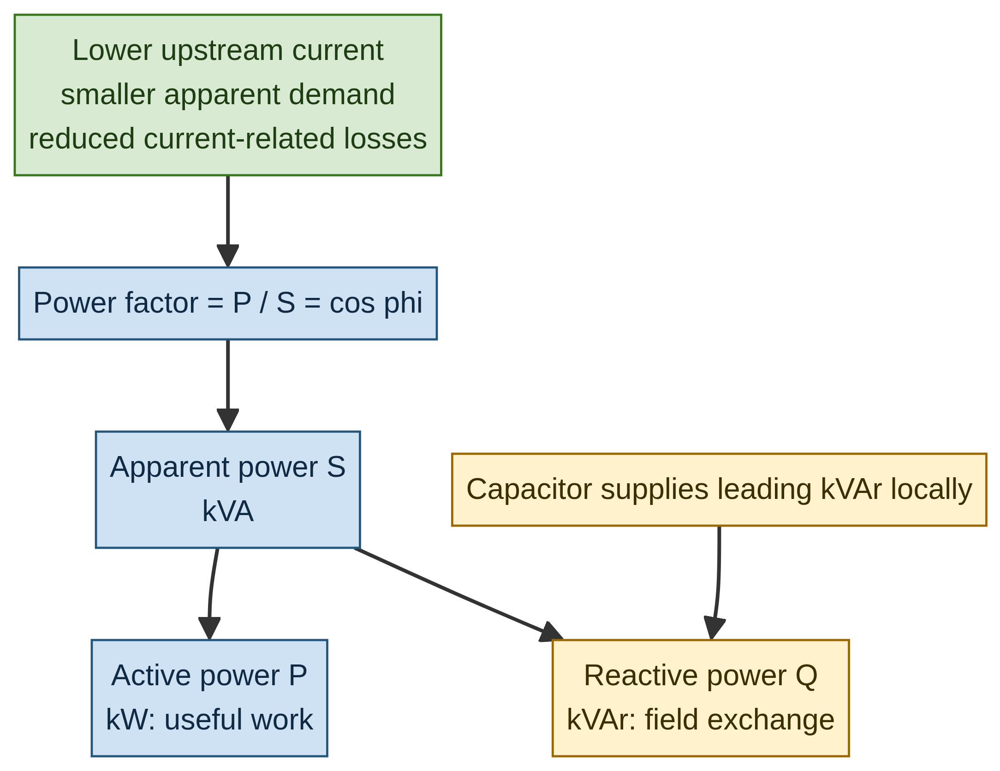
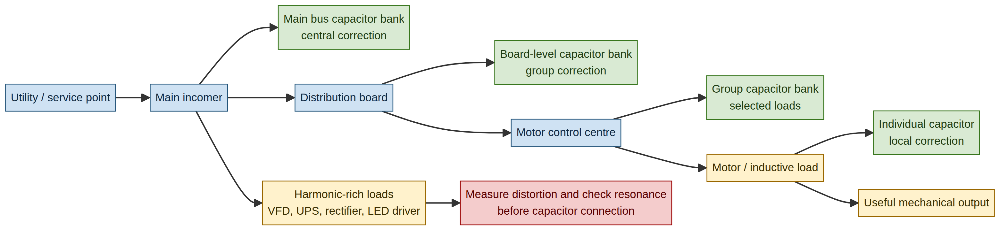
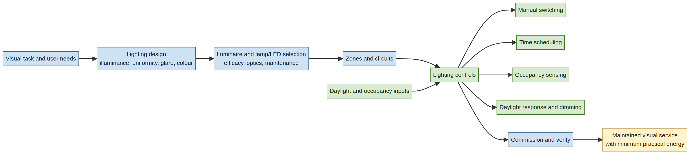
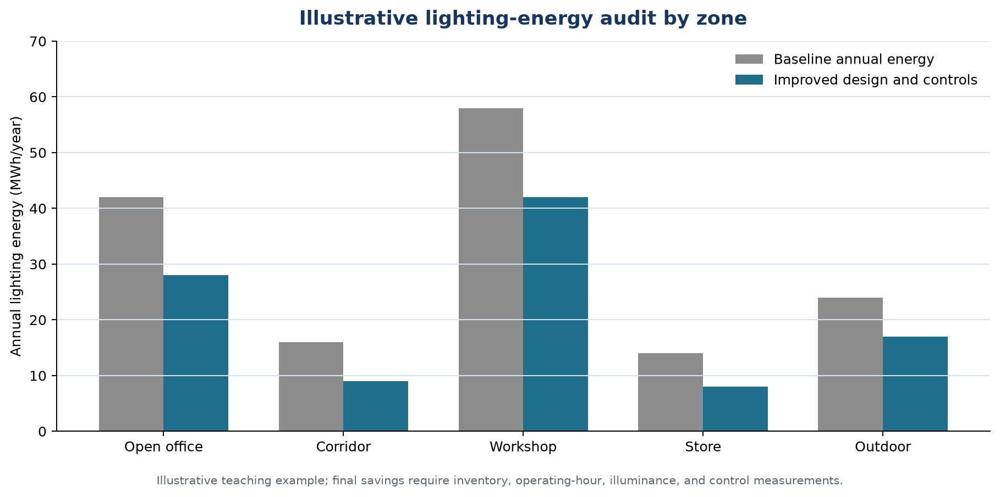
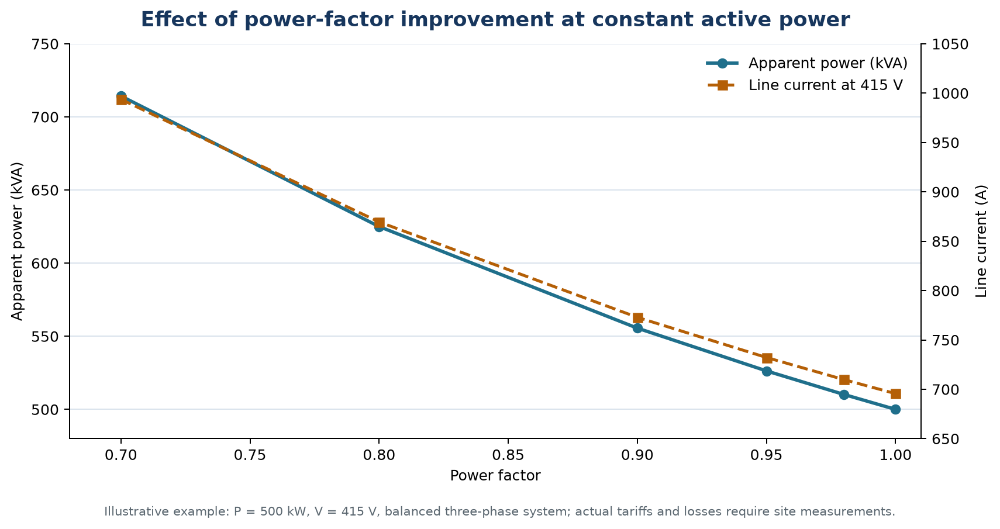

# EEOE4001 — Energy Conservation & Auditing
## Module IV: Power-Factor Improvement, Harmonics, Motor Controllers, and Lighting-Energy Audits

**Lecture duration:** 06 hours  
**Prepared for:** Undergraduate Electrical / Energy Engineering students  
**Prepared by:** Manus AI  
**Scope:** Power-factor improvement; methods of improvement; location of capacitors; power factor with nonlinear loads; effects of harmonics on power factor; power-factor motor controllers; good lighting-system design and practice; lighting control; and lighting-energy audit.

> **Central idea:** A successful electrical-efficiency programme does not merely install capacitors or replace lamps. It measures active power, reactive power, distortion, demand, visual service, operating hours, and control behaviour, then applies the least-risk solution that improves the required service at acceptable life-cycle cost.

---

## 1. Learning outcomes

After completing this module, a student should be able to:

1. Define active power, reactive power, apparent power, displacement power factor, distortion factor, and true power factor.
2. Explain the technical and financial consequences of low power factor.
3. Calculate required capacitor kVAr for a specified change in power factor.
4. Compare individual, group, distribution-board, and main-bus capacitor placement.
5. Explain why nonlinear loads affect true power factor and why capacitor installation requires harmonic and resonance assessment.
6. Describe the effects of harmonics on cables, transformers, motors, neutral conductors, capacitors, protection systems, and sensitive equipment.
7. Explain the role and limitations of motor controllers, soft starters, variable-frequency drives, and automatic control in improving motor-system performance.
8. Design a good lighting system that satisfies visual requirements while minimizing practical energy use.
9. Compare manual, time-based, occupancy, daylight-responsive, dimming, and networked lighting controls.
10. Conduct a lighting-energy audit using inventory data, illuminance measurements, operating hours, power density, control assessment, and savings verification.
11. Distinguish energy savings from apparent-power, current, and demand savings.
12. Prepare technically defensible recommendations for power factor, harmonics, motor control, and lighting systems.

### Module map

| Section | Topic | Approximate teaching emphasis |
|---|---|---:|
| 2 | Power-factor and lighting-audit framework | 0.50 h |
| 3 | Power factor fundamentals | 0.75 h |
| 4 | Methods of power-factor improvement | 0.75 h |
| 5 | Capacitor location and installation practice | 0.50 h |
| 6 | Nonlinear loads and harmonics | 1.00 h |
| 7 | Power-factor motor controllers | 0.50 h |
| 8 | Good lighting-system design and practice | 0.75 h |
| 9 | Lighting control | 0.50 h |
| 10 | Lighting-energy audit and savings verification | 0.50 h |
| 11 | Worked examples, checklist, and tutorial questions | 0.75 h |

---

## 2. Power-factor and lighting-audit framework

Module IV combines two related but distinct audit areas. **Power-factor improvement** concerns the relationship between useful active power and the current or apparent power required from the electrical system. **Lighting efficiency** concerns the visual service delivered to occupants, equipment, products, roads, or work surfaces per unit of electrical input.

A power-factor project can reduce current, transformer loading, cable losses, and demand-related charges, but it does not automatically reduce the kWh consumed by the useful load. A lighting project can reduce kWh and peak demand, but it must preserve required illuminance, uniformity, glare control, colour quality, safety, and user comfort.

The audit should therefore separate the following performance questions:

| Question | Primary indicator |
|---|---|
| How much useful real power is required? | kW and kWh |
| How much current and apparent capacity are required? | kVA, current, and power factor |
| Is waveform distortion present? | Voltage/current THD and harmonic spectrum |
| Is the visual task adequately served? | Illuminance, uniformity, glare, colour quality |
| How long does the equipment operate? | Operating hours, schedules, and occupancy |
| How effectively is the system controlled? | Switching, dimming, sensing, sequencing, and commissioning |
| Are savings real and sustainable? | Baseline, measured variables, and normalized verification |

---

## 3. Power-factor fundamentals

### 3.1 Active, reactive, and apparent power

In an AC system, **active power** performs net useful work, **reactive power** oscillates between the source and fields associated with inductive or capacitive elements, and **apparent power** represents the combined voltage-current loading of the system.

\[
S^2=P^2+Q^2
\]

where \(P\) is active power in kW, \(Q\) is reactive power in kVAr, and \(S\) is apparent power in kVA.

For sinusoidal voltage and current:

\[
PF=\frac{P}{S}=\cos\phi
\]

For a balanced three-phase system:

\[
P=\sqrt{3}V_LI_L\cos\phi
\]

\[
S=\sqrt{3}V_LI_L
\]

where \(V_L\) is line-to-line voltage and \(I_L\) is line current.

*Figure 1. Power triangle concepts and the effect of locally supplying leading reactive power. The diagram is instructional; the actual capacitor-bank design requires measurements and applicable standards.*

### 3.2 Displacement power factor and true power factor

For a sinusoidal system, power factor is commonly expressed as \(\cos\phi\), where \(\phi\) is the phase angle between voltage and current. This is called **displacement power factor**.

Modern loads may draw nonsinusoidal current. In that case, the current contains a fundamental component and harmonic components. **True power factor** includes both phase displacement and waveform distortion:

\[
PF_{true}=PF_{displacement}\times PF_{distortion}
\]

A system can have a good displacement power factor and still have poor true power factor if current distortion is high. This is why a power-quality analyser should be used when variable-frequency drives, rectifiers, UPS systems, LED drivers, data-processing equipment, or other nonlinear loads are significant.

### 3.3 Causes of low power factor

Typical causes include induction motors operating at light load, transformers, magnetic ballasts, welding machines, induction furnaces, arc equipment, and other inductive loads. Nonlinear electronic loads may further reduce true power factor through current distortion.

The audit should distinguish between:

| Condition | Main cause | Appropriate response |
|---|---|---|
| Low displacement PF | Inductive reactive power | Capacitors, synchronous correction, improved loading, and equipment selection. |
| Low distortion PF | Harmonic current | Low-distortion equipment, reactors, filters, phase-shifting arrangements, or active correction. |
| Low true PF from both effects | Inductive and nonlinear loads | Combined reactive and harmonic assessment. |
| Poor PF only during light load | Fixed capacitor overcorrection or intermittent inductive load | Automatic switched correction and operating review. |

### 3.4 Effects of low power factor

For a given active power and voltage, lower power factor requires higher current:

\[
I=\frac{P}{\sqrt{3}V_LPF}
\]

Higher current can increase conductor and transformer losses, voltage drop, thermal loading, and apparent-demand charges. It can also reduce the usable capacity of transformers, switchgear, cables, and generators.

The technical and financial effect depends on the utility tariff and the internal distribution system. Some utilities charge or incentivize on the basis of power factor, kVA demand, kVArh, or related quantities. The applicable tariff must always be consulted rather than assuming a universal rule. Eaton’s power-factor guide covers the meaning of power factor, reasons for correction, capacitor selection, installation location, and harmonic precautions.[1]

---

## 4. Methods of power-factor improvement

### 4.1 Shunt capacitors

Shunt capacitors supply leading reactive power close to inductive loads. They reduce the reactive current drawn from upstream equipment and can improve voltage profile and apparent-power utilization.

The approximate capacitor rating required to change power factor is:

\[
\boxed{Q_c=P\left[\tan(\cos^{-1}PF_1)-\tan(\cos^{-1}PF_2)\right]}
\]

where \(P\) is active power in kW, \(PF_1\) is the initial power factor, \(PF_2\) is the target power factor, and \(Q_c\) is the capacitor rating in kVAr.

Capacitors should be selected in steps when the load changes. An automatic power-factor correction panel can switch stages according to measured reactive demand. Fixed capacitors are appropriate only when the associated inductive load is sufficiently stable and the risk of overcorrection is controlled.

### 4.2 Synchronous motors and synchronous condensers

An over-excited synchronous motor can operate with a leading power factor and supply reactive power to the system. A synchronous condenser is a synchronous machine operated without mechanical output primarily for reactive-power control.

These solutions may be justified in large facilities with substantial constant reactive demand, but they require higher capital, maintenance, excitation controls, and technical expertise than capacitor correction.

### 4.3 Efficient motor operation

Motor power factor generally improves as a motor approaches an appropriate loading range, although the exact curve depends on motor design. Right-sizing, reducing unnecessary idle operation, maintaining correct voltage, and avoiding severe underloading can improve both active-energy performance and power factor.

Motor replacement should not be justified by power factor alone. The auditor should consider efficiency, loading, operating hours, process output, starting requirements, harmonics, drive compatibility, and life-cycle cost. DOE motor-system guidance recommends field assessment and system-level analysis rather than relying only on nameplate values.[4]

### 4.4 Motor controllers and variable-speed drives

Electronic motor controllers may regulate motor starting, speed, torque, or load. Common devices include:

| Device | Main function | PF and energy considerations |
|---|---|---|
| Soft starter | Limits starting voltage/current and mechanical shock | Reduces starting stress; does not necessarily provide continuous speed control or eliminate harmonic effects. |
| Variable-frequency drive (VFD) | Controls motor speed and torque by varying frequency and voltage | Can reduce energy in variable-torque systems; input current waveform and displacement PF require assessment. |
| Automatic motor controller | Coordinates start/stop, sequencing, loading, and process response | Can reduce idle operation and demand peaks when correctly configured. |
| Electronic power-factor controller | Uses power-electronic switching or correction functions | Requires careful compatibility, thermal, harmonic, and maintenance assessment. |
| Capacitor-based correction | Supplies reactive power to inductive loads | Must be coordinated with switching, drives, harmonics, and resonance. |

A controller should be selected for the process, not merely for its electrical label. A VFD on a constant-speed or constant-torque application may not provide a favourable result if speed cannot be reduced, drive losses are significant, or the motor operates poorly at low speed. A soft starter can reduce starting current but generally does not replace a speed-control strategy.

### 4.5 Load management and operating practice

Power factor and demand can be improved by scheduling large inductive loads, avoiding simultaneous motor starting, switching off unnecessary transformers, coordinating generators, reducing idle operation, using thermal storage where justified, and maintaining consistent process schedules.

These measures are often inexpensive because they use control and operating practice rather than new equipment. They must be coordinated with production, safety, reliability, and maintenance requirements.

---

## 5. Capacitor location and installation practice

### 5.1 Placement options

Capacitors may be located at an individual motor, a group of motors, a distribution board, or the main incoming bus. Location determines how much upstream current is reduced, how flexible the correction is, and how much switching and maintenance are required.

*Figure 2. Individual, group, distribution-board, and main-bus capacitor placement. The harmonic-risk branch emphasizes that capacitors must be coordinated with nonlinear loads and system impedance.*

| Location | Advantages | Limitations |
|---|---|---|
| Individual motor | Reactive current is reduced close to the load; motor-specific correction. | May remain energized when the motor is off; risk of overcorrection; many units to maintain. |
| Group of motors | Balances flexibility and reduced upstream current; fewer units. | Requires knowledge of operating groups and load coincidence. |
| Distribution board or motor-control centre | Centralized within an area; automatic staged control is practical. | Upstream conductors still carry some group reactive current. |
| Main incoming bus | Simple centralized system and easy monitoring. | Does not reduce current in internal feeders; more sensitive to overall load variation and harmonics. |

### 5.2 Individual motor correction

An individual capacitor may be connected with a motor when the motor operates for a large portion of the time and the required reactive power is stable. The capacitor must be correctly rated for the motor’s operating conditions and switched with the motor where necessary.

The auditor must consider motor starting, disconnecting, reversing, variable-speed drives, regeneration, overvoltage, and manufacturer recommendations. A capacitor that remains connected after the motor is switched off can cause leading power factor or unwanted voltage conditions.

### 5.3 Group and centralized correction

Group or centralized correction is useful when several loads operate with coordinated schedules. Automatic staged capacitor banks can follow the reactive demand and reduce the risk of overcorrection. The controller’s measurement point should correspond to the tariff meter or the engineering objective.

Centralized banks should be installed with appropriate protection, discharge resistors, switching equipment, ventilation, clearances, and maintenance access. Capacitors and reactors can run hot; thermal design and inspection are important.

### 5.4 Overcorrection and resonance

Overcorrection occurs when the capacitive reactive power exceeds the inductive reactive demand. It can cause leading power factor, voltage rise, switching transients, and undesirable generator interaction.

Resonance can occur when the inductance of the supply system interacts with capacitor banks at or near a harmonic frequency. The resulting current amplification can damage capacitors, overheat transformers, and worsen voltage distortion. In harmonic-rich facilities, detuned capacitor banks, reactors, filters, or other arrangements may be required.

### 5.5 Design and commissioning checklist

A capacitor-bank project should document the supply voltage, system short-circuit strength, reactive load profile, harmonic spectrum, target power factor, step size, switching frequency, inrush, protection, ventilation, discharge time, maintenance requirements, and applicable codes. Commissioning should verify measured kW, kVAr, kVA, PF, voltage, current, harmonics, and stage operation under light, average, and peak loads.

---

## 6. Power factor with nonlinear loads and harmonics

### 6.1 Nonlinear loads

A linear load draws current with a waveform proportional to the applied voltage. A nonlinear load draws a nonsinusoidal current because of switching devices, rectifiers, magnetic saturation, or other nonlinear characteristics.

Common nonlinear loads include:

- six-pulse and twelve-pulse rectifiers;
- variable-frequency drives and soft-switching converters;
- UPS systems and battery chargers;
- switched-mode power supplies;
- electronic lighting drivers and LED power supplies;
- induction and arc furnaces; and
- information-technology and telecommunications equipment.

### 6.2 Harmonic current and true power factor

A distorted current waveform can be represented as a fundamental component plus harmonic components. If the fundamental current is \(I_1\) and the harmonic currents are \(I_2, I_3, I_4,\ldots\), current THD is:

\[
THD_I=\frac{\sqrt{I_2^2+I_3^2+I_4^2+\cdots}}{I_1}\times100
\]

The distortion factor may be approximated from the RMS current as:

\[
PF_{distortion}=\frac{I_1}{I_{rms}}
\]

Therefore:

\[
PF_{true}=PF_{displacement}\times PF_{distortion}
\]

### 6.3 Effects of harmonics on power factor

Harmonic currents increase RMS current without producing an equivalent increase in useful active power. This increases apparent power and can reduce true power factor. Consequently, simply adding capacitors may not solve the problem if the principal issue is waveform distortion rather than phase displacement.

The capacitor bank itself can interact with the supply inductance and amplify a harmonic. This is why the Eaton guide specifically includes harmonic issues related to power-factor correction and capacitor installation in nonlinear environments.[1]

### 6.4 Effects on electrical equipment

| Equipment | Possible harmonic effect |
|---|---|
| Transformer | Additional winding and stray losses, heating, derating, audible noise, and reduced life. |
| Cables | Higher RMS current and heating; increased losses. |
| Neutral conductor | Accumulation of triplen harmonic currents in three-phase four-wire systems. |
| Capacitor bank | Overcurrent, overheating, resonance, fuse operation, and failure. |
| Motors | Negative-sequence effects, torque pulsations, heating, and lower efficiency. |
| Protection and meters | Nuisance tripping, inaccurate measurements, and maloperation. |
| Sensitive electronic equipment | Malfunction, resets, communication issues, and reduced reliability. |
| Generator set | Voltage waveform distortion, heating, instability, and reduced usable capacity. |

### 6.5 Harmonic assessment procedure

The auditor should use a suitable power-quality analyser and measure voltage, current, frequency, kW, kVAr, kVA, displacement PF, true PF, THD, individual harmonic orders, neutral current, and operating state. Measurements should cover representative production conditions, large-drive operation, lighting operation, capacitor switching, generator operation, and low-load periods.

The report should state instrument accuracy, connection configuration, averaging interval, phase relationship, measurement location, operating condition, and the standard or utility criterion used. A single instantaneous value is rarely sufficient for a variable industrial system.

### 6.6 Harmonic mitigation

Possible measures include low-distortion converters, line reactors, DC chokes, phase-shifting transformers, multipulse arrangements, passive filters, active harmonic filters, detuned capacitor banks, isolation transformers, equipment segregation, improved neutral design, and replacement of poor-quality electronic equipment.

The choice depends on harmonic order, magnitude, source impedance, load variation, future expansion, cost, available space, maintenance, and the required power-quality objective. Mitigation should be verified after installation under the same operating conditions used for the baseline.

### 6.7 Worked harmonic example

Suppose a power-quality measurement records a 100 A fundamental current and harmonic currents of 18 A, 10 A, and 6 A for selected harmonic orders. The approximate THD is:

\[
THD_I=\frac{\sqrt{18^2+10^2+6^2}}{100}\times100
\]

\[
THD_I=21.4\%\ \text{approximately}
\]

This value is illustrative. An engineering decision must use the complete harmonic spectrum, voltage distortion, system impedance, and applicable requirements.

---

## 7. Power-factor motor controllers

### 7.1 Meaning of the term

The term **power-factor motor controller** is used in practice for equipment or control arrangements that improve the electrical operation of motors by reducing unnecessary current, controlling reactive demand, limiting starting stress, adjusting speed, or managing motor operation. The term should not be interpreted as a universal claim that every electronic motor controller improves both energy efficiency and true power factor under all conditions.

The auditor should identify the actual control function:

| Control objective | Appropriate technology or practice |
|---|---|
| Reduce starting current and mechanical shock | Soft starter, reduced-voltage starter, or controlled starting sequence. |
| Control speed and variable flow | VFD or other adjustable-speed drive. |
| Reduce idle operation | Automatic start/stop, sequencing, occupancy or process interlock. |
| Correct displacement reactive power | Capacitor bank, synchronous motor, or suitable reactive-power controller. |
| Reduce harmonic current | Low-distortion drive, line reactor, filter, multipulse or active-front-end arrangement. |
| Maintain process pressure or flow | Closed-loop controller using pressure, flow, temperature, or load feedback. |

### 7.2 Controllers and power factor

A VFD may have near-unity displacement power factor at its input while still drawing harmonic current unless a suitable input stage or filter is used. A soft starter reduces starting current but does not necessarily improve steady-state power factor. A motor controller that reduces motor voltage at light load may reduce some losses in specific applications, but it may also increase current, torque ripple, heating, or instability if applied to the wrong motor or load.

Therefore, the project should measure before and after kW, kVA, current, true PF, displacement PF, THD, motor temperature, speed, torque or process output, and operating hours. The correct criterion is the delivered service per unit of total electrical input, not a single display value.

### 7.3 Controller audit checklist

The auditor should record motor size, load type, control type, operating speed, frequency, current, voltage, power factor, THD, process setpoint, minimum-speed limit, bypass operation, drive losses, motor cooling, and controller fault history. The control loop should be checked for hunting, excessive pressure, poor tuning, unnecessary overrides, and operation outside the intended range.

---

## 8. Good lighting-system design and practice

### 8.1 Lighting as a service

A lighting system should provide the required visual conditions for the task. Energy efficiency is not achieved by reducing light indiscriminately. A good design balances illuminance, uniformity, glare, colour rendering, colour appearance, visual comfort, safety, maintenance, control, and life-cycle cost.

The U.S. General Services Administration’s LED and controls guidance provides a useful reference for combining efficient luminaires with appropriate lighting controls, commissioning, and building-use requirements.[2]

*Figure 3. Lighting design should begin with the visual task and continue through luminaire selection, zoning, control, commissioning, and verification.*

### 8.2 Lighting quantities

| Quantity | Meaning and use |
|---|---|
| Luminous flux | Total light output, measured in lumens (lm). |
| Illuminance | Light falling on a surface, measured in lux (lm/m²). |
| Luminous efficacy | Lumens per watt (lm/W), useful for comparing light output per input power. |
| Uniformity | Degree to which illumination is evenly distributed across the task area. |
| Glare | Visual discomfort or reduced visibility caused by excessive brightness or contrast. |
| Colour rendering | Ability of a source to reveal object colours accurately. |
| Colour temperature/appearance | Visual warmth or coolness of light. |
| Lighting power density | Lighting input power per unit floor area, commonly W/m². |
| Maintenance factor | Reduction in maintained illumination due to dirt, ageing, lamp depreciation, and environmental condition. |

### 8.3 Design principles

A good lighting design should:

1. define the visual task, occupancy pattern, and required illumination;
2. use daylight where practical without creating glare, overheating, or excessive contrast;
3. select luminaires with suitable optical distribution and maintenance access;
4. avoid over-lighting and unnecessary uniformity where task lighting is more appropriate;
5. divide the installation into meaningful zones;
6. provide control access to occupants and operators where appropriate;
7. account for reflected surfaces, room geometry, ceiling height, and maintenance;
8. coordinate lighting with HVAC because lighting heat can increase cooling load; and
9. commission and verify the system after installation or retrofit.

### 8.4 Lamp, luminaire, and driver selection

The lamp or LED package is only one part of the lighting system. The luminaire optics, driver, ballast, thermal management, power factor, current distortion, glare, control compatibility, and maintenance condition influence performance.

An LED replacement should be assessed for total luminaire wattage, light distribution, colour quality, driver reliability, flicker, emergency operation, dimming compatibility, thermal environment, and disposal or replacement requirements. A lower wattage is not automatically a better solution if the maintained visual service is inadequate.

### 8.5 Lighting maintenance

Dirt accumulation, lamp ageing, failed lamps, damaged reflectors, poor aiming, and degraded diffusers reduce useful illumination. Increasing lamp wattage to compensate can hide a maintenance problem and increase energy use. Cleaning, scheduled replacement, repair of damaged luminaires, and measurement of maintained illuminance should be part of the energy-management programme.

### 8.6 Good lighting practice by application

| Application | Practical design and efficiency focus |
|---|---|
| Offices and classrooms | Daylight, glare control, occupancy zoning, task-ambient design, and dimming. |
| Workshops | High-bay optics, maintained illuminance, task lighting, dust control, and safe maintenance. |
| Warehouses | Occupancy sensors, aisle zoning, high-bay distribution, and reduced lighting during low activity. |
| Corridors and stairs | Time delay, occupancy sensing, emergency requirements, and safe minimum illumination. |
| Outdoor areas | Photocells, astronomical schedules, uniformity, glare, security, and weatherproof equipment. |
| Industrial process areas | Task visibility, colour rendering, stroboscopic effects, heat, dust, vibration, and maintenance access. |

---

## 9. Lighting control

### 9.1 Manual switching

Manual switching is simple and inexpensive, but it depends on user behaviour. It is most effective when the installation is divided into logical zones and switches are clearly labelled. Manual controls should not be placed where users cannot access them or where switching off lighting creates safety concerns.

### 9.2 Time-based control

Time schedules switch lighting according to occupancy patterns, production shifts, daylight hours, or security requirements. They are useful for predictable schedules but require seasonal adjustment, override capability, and periodic review.

### 9.3 Occupancy and vacancy sensing

Occupancy sensors switch or dim lighting when a space is occupied. Vacancy sensors require manual activation and switch the system off automatically when the space becomes vacant. Sensor selection should consider mounting height, field of view, sensitivity, false triggering, time delay, task activity, and user acceptance.

### 9.4 Daylight-responsive control

Daylight sensors reduce electric lighting when adequate daylight is available. Good design requires sensor placement, calibration, zoning by daylight availability, glare control, window shading, and commissioning. A sensor installed in a dark location or exposed to direct sunlight may provide poor control.

### 9.5 Dimming and networked control

Dimming enables continuous or stepped control instead of simple on/off operation. Networked lighting controls can support scheduling, occupancy data, daylight response, fault reporting, and energy monitoring. Complexity should be justified by building size, control value, maintenance capability, cybersecurity, interoperability, and user needs.

### 9.6 Control commissioning

Commissioning should confirm sensor coverage, time delay, setpoints, dimming range, daylight response, manual override, emergency operation, user interaction, and fault reporting. A control system that is disabled by users because it is uncomfortable or unpredictable will not deliver its design savings.

---

## 10. Lighting-energy audit

### 10.1 Audit objectives

A lighting-energy audit determines whether the installation delivers the required visual service at minimum practical energy. The auditor should quantify existing energy use, identify over-lighting and operating waste, assess equipment and controls, estimate savings, and verify the result after implementation.

### 10.2 Lighting inventory

The inventory should include the area, room or zone, fixture count, lamp or LED type, rated wattage, measured input wattage, ballast or driver, mounting height, control type, operating hours, occupancy pattern, daylight availability, measured illuminance, maintenance condition, and user complaints.

| Data category | Example record |
|---|---|
| Space identification | Room, production bay, corridor, yard, or zone number. |
| Fixture information | Luminaire type, lamp/LED, ballast/driver, number of lamps. |
| Electrical input | Measured watts per fixture and total connected load. |
| Operation | Daily hours, annual days, shift pattern, vacancy periods. |
| Visual service | Lux, uniformity, glare, colour quality, task requirement. |
| Controls | Manual, timer, occupancy, daylight, dimming, networked. |
| Condition | Dirt, failed lamps, damaged optics, flicker, thermal issues. |
| Improvement | Retrofit, control, zoning, maintenance, redesign, or no action. |

### 10.3 Lighting calculations

Annual lighting energy is:

\[
E_{lighting}=N\times P_{fixture}\times H
\]

where \(N\) is the number of fixtures, \(P_{fixture}\) is input power per fixture in kW, and \(H\) is annual operating hours.

Lighting power density is:

\[
LPD=\frac{P_{lighting}}{A}
\]

where \(A\) is floor area. LPD is useful for comparison but should not be used without checking illuminance and the visual task.

Savings from a retrofit are:

\[
\Delta E=(P_{baseline}-P_{proposed})\times H
\]

Savings from controls are:

\[
\Delta E=P_{controlled}\times(H_{baseline}-H_{controlled})
\]

when the controlled lighting load and the two operating-hour estimates are appropriately defined.

### 10.4 Worked lighting-audit example

An installation contains 120 fixtures, each consuming 0.08 kW, and operates 3,200 hours per year.

\[
E_{baseline}=120\times0.08\times3{,}200=30{,}720\ \text{kWh/year}
\]

If occupancy and scheduling controls reduce effective operating hours or equivalent operating time by 20% while maintaining required lighting service:

\[
\Delta E=30{,}720\times0.20=6{,}144\ \text{kWh/year}
\]

The estimate is valid only if the control reduction does not compromise safety, emergency lighting, task visibility, or user requirements.

*Figure 4. Illustrative baseline and improved annual lighting energy by zone. Values are teaching examples, not measured facility data.*

### 10.5 Lighting audit measurements

Illuminance should be measured with a calibrated lux meter at representative task points and under representative daylight, occupancy, and operating conditions. The auditor should note whether measurements are maintained or initial values, whether daylight is present, and whether fixtures are clean and fully operational.

Electrical measurements should include real power, apparent power, power factor, current distortion where relevant, fixture input watts, and circuit operating time. LED drivers and electronic ballasts may have non-unity power factor or harmonic current, particularly when large numbers are installed. Their power quality should be considered in the same manner as other nonlinear loads.

### 10.6 Lighting savings verification

A lighting project should verify:

- connected lighting power before and after the project;
- operating schedule and control response;
- maintained illuminance and uniformity;
- user comfort, glare, flicker, colour, and safety;
- demand during occupied and unoccupied periods;
- power factor and harmonic behaviour where the electronic load is significant; and
- actual energy consumption normalized for occupancy, operating hours, season, or production.

A simple lighting project may be verified by spot measurements and operating-hour records. A large project may require submeters, interval data, control-system logs, and a formal measurement-and-verification plan.

---

## 11. Integrated power-factor and lighting audit checklist

### 11.1 Power-factor and harmonics

| Audit item | Data or measurement |
|---|---|
| Active power | kW profile by main feeder and major load. |
| Reactive power | kVAr profile, inductive load pattern, and capacitor operation. |
| Apparent power | kVA demand and transformer or generator loading. |
| Displacement PF | Phase angle between fundamental voltage and current. |
| True PF | PF including waveform distortion. |
| Harmonics | Voltage/current THD and individual harmonic orders. |
| Capacitor placement | Individual, group, distribution-board, or main-bus location. |
| Capacitor operation | Step size, switching, temperature, protection, discharge, and overcorrection. |
| Resonance risk | System impedance, transformer data, capacitor/reactor configuration, and harmonic spectrum. |
| Motor controllers | Type, speed, loading, bypass, drive input, PF, THD, and control setpoints. |

### 11.2 Lighting system

| Audit item | Data or measurement |
|---|---|
| Lighting inventory | Fixture, lamp/LED, ballast/driver, quantity, wattage, and location. |
| Visual requirement | Task type, maintained illuminance, uniformity, glare, colour quality, and safety. |
| Operating hours | Daily schedule, annual days, occupancy, shifts, and vacant periods. |
| Controls | Manual, timers, occupancy, daylight, dimming, network, and override. |
| Maintenance | Cleaning, failed lamps, damaged optics, ageing, flicker, and thermal condition. |
| Electrical performance | kW, kVA, PF, current, and harmonics where relevant. |
| Improvement options | Retrofit, control, zoning, maintenance, redesign, and daylighting. |
| Verification | Energy, demand, illuminance, control response, comfort, and normalized operation. |

---

## 12. Worked power-factor examples

### 12.1 Capacitor sizing

A 500 kW load operates at 0.70 power factor. The desired power factor is 0.95.

\[
Q_c=500\left[\tan(\cos^{-1}0.70)-\tan(\cos^{-1}0.95)\right]
\]

\[
Q_c=345.8\ \text{kVAr approximately}
\]

The selected bank should not automatically be rated exactly at this value. The practical design may use staged capacitors, detuning reactors, harmonic filters, or another correction method depending on load variation and power-quality measurements.

### 12.2 Apparent power and current reduction

For a balanced 415 V three-phase system delivering 500 kW, the apparent power is:

At 0.70 PF:

\[
S_1=\frac{500}{0.70}=714.3\ \text{kVA}
\]

At 0.95 PF:

\[
S_2=\frac{500}{0.95}=526.3\ \text{kVA}
\]

The line current is:

\[
I=\frac{P\times1000}{\sqrt{3}V_LPF}
\]

At 0.70 PF:

\[
I_1=993.7\ \text{A approximately}
\]

At 0.95 PF:

\[
I_2=732.2\ \text{A approximately}
\]

The active power remains 500 kW in this example. The principal benefits are lower upstream current, lower current-related losses, greater system capacity, and possible demand or tariff savings. The kWh consumed by the useful load does not fall merely because a capacitor is installed.

*Figure 5. Illustrative relationship between power factor, apparent power, and line current at constant active power. Actual savings require the site tariff, load profile, and measured losses.*

---

## 13. Common mistakes in Module IV audits

| Mistake | Why it is a problem | Better practice |
|---|---|---|
| Treating PF correction as automatic kWh reduction | Capacitors primarily reduce reactive current and apparent demand | Separate active-energy, demand, loss, and tariff effects. |
| Installing a fixed capacitor on a variable load | Overcorrection may occur during light load | Use staged automatic control or a better load strategy. |
| Correcting PF without checking harmonics | Resonance and capacitor damage may result | Measure THD and conduct a resonance assessment. |
| Assuming displacement PF equals true PF | Nonlinear loads distort current | Measure both displacement and true PF. |
| Installing capacitors at the main bus without a system objective | Internal feeder losses may remain | Choose location based on current paths, load schedules, and maintenance. |
| Treating a soft starter as a continuous PF or energy controller | Starting control is not the same as speed control | Identify actual control function and measure performance. |
| Installing a VFD on every motor | Drive losses, harmonics, motor cooling, and process suitability matter | Use VFDs where variable speed produces useful service savings. |
| Replacing lamps solely by wattage | Visual service may fall or glare may increase | Verify illuminance, uniformity, colour, glare, and user needs. |
| Disabling lighting controls because of poor commissioning | Control savings and user acceptance are lost | Commission, tune, educate users, and provide appropriate overrides. |
| Using LPD as the only lighting metric | Low wattage can still provide inadequate light | Combine LPD with maintained illuminance and visual quality. |
| Ignoring LED-driver power quality | Large electronic lighting loads can affect PF and harmonics | Include PF and THD measurements when material. |
| Estimating savings without operating-hour evidence | Annual energy may be overstated | Use schedules, submeters, control logs, and normalized data. |

---

## 14. Key takeaways

Power factor is the ratio of active power to apparent power. Improving it can reduce current, apparent demand, voltage drop, and upstream losses, but it does not automatically reduce the useful load’s active energy consumption. The method selected must match the load, operating pattern, tariff, and power-quality condition.

Capacitors may be installed at individual loads, groups, boards, or the main bus. Local correction reduces current in more of the upstream system, while central correction is simpler to control. In nonlinear-load environments, capacitor banks require harmonic and resonance assessment, and true power factor must be distinguished from displacement power factor.

Motor controllers should be selected for their actual control function. Soft starters, VFDs, automatic controllers, and reactive-power correction equipment solve different problems. A control system should be evaluated using kW, kVA, current, PF, THD, speed, process output, operating hours, reliability, and safety.

Good lighting design begins with the visual task. Efficient lamps or LED luminaires are valuable only when they provide adequate maintained illuminance, uniformity, glare control, colour quality, safety, maintainability, and user acceptance. Lighting controls can provide substantial savings when they are correctly zoned, commissioned, and maintained.

A complete Module IV audit combines power-quality measurement with visual-service measurement. The best recommendations reduce unnecessary electrical input while preserving the technical service that the equipment or space is intended to provide.

---

## 15. Tutorial and examination questions

### Short-answer questions

1. Define active power, reactive power, apparent power, and power factor.
2. Distinguish between displacement power factor and true power factor.
3. State the three-phase relationship between kW, kVA, voltage, current, and power factor.
4. List four causes of low power factor in an industrial facility.
5. State the formula for calculating capacitor kVAr for PF correction.
6. Compare individual, group, distribution-board, and main-bus capacitor placement.
7. What is overcorrection and why is it undesirable?
8. Define a nonlinear load and list four examples.
9. Define current THD.
10. Explain why capacitor banks can create harmonic resonance.
11. Distinguish between a soft starter and a variable-frequency drive.
12. Define luminous flux, illuminance, luminous efficacy, and lighting power density.
13. What is occupancy-based lighting control?
14. Why is commissioning important for lighting controls?
15. List the main data required for a lighting-energy audit.

### Numerical questions

1. A balanced three-phase load consumes 400 kW at 415 V and 0.80 PF. Calculate apparent power and line current.
2. A 600 kW load must be corrected from 0.72 PF to 0.95 PF. Calculate the approximate capacitor rating.
3. A 500 kW load improves from 0.70 PF to 0.95 PF at 415 V. Calculate apparent power and current before and after correction.
4. A current waveform has a fundamental component of 120 A and harmonic components of 20 A, 12 A, and 8 A. Calculate approximate THD.
5. A 250 kW nonlinear load has displacement PF 0.98 and distortion factor 0.92. Calculate true PF.
6. A lighting installation contains 150 fixtures of 0.06 kW each and operates 3,000 hours per year. Calculate annual energy consumption.
7. A lighting retrofit reduces connected lighting power from 18 kW to 12 kW while maintaining 3,200 operating hours per year. Calculate annual energy savings.
8. An occupancy-control project reduces effective lighting hours by 25% for a 20 kW connected load operating 3,000 hours per year. Calculate annual energy savings.
9. A 1,000 m² building has a measured lighting load of 18 kW. Calculate the lighting power density.
10. Explain which measurements are required before selecting a detuned capacitor bank for a facility with large VFD and UPS loads.

### Long-answer and discussion questions

1. Explain the technical and financial benefits of power-factor improvement and distinguish them from direct kWh savings.
2. Discuss the advantages and disadvantages of individual, group, distribution-board, and main-bus capacitor placement.
3. Explain the relationship between nonlinear loads, harmonic current, true power factor, and capacitor-bank resonance.
4. Describe a complete power-quality audit for a plant containing VFDs, UPS systems, LED drivers, and capacitor banks.
5. Compare soft starters, VFDs, automatic motor controllers, capacitor banks, and harmonic filters.
6. Explain the principles of good lighting-system design, including illuminance, uniformity, glare, colour, maintenance, and life-cycle cost.
7. Discuss manual, scheduled, occupancy, daylight-responsive, dimming, and networked lighting controls.
8. Prepare a lighting-energy audit procedure for an office building, warehouse, or industrial workshop.
9. Explain why lighting-energy savings should be verified using both electrical data and maintained visual-service measurements.
10. Develop an integrated recommendation for a facility with low PF, high THD, over-lighting, poor controls, and variable motor loads.

---

## References

[1] [Eaton, *Power Factor Correction: A Guide for the Plant Engineer*.](https://www.eaton.com/content/dam/eaton/products/industrialcontrols-drives-automation-sensors/enclosed-control-solutions/canada/eaton-power-factor-correction-guide-plant-engineer-technical-data-sa02607001e-ca.pdf) Technical reference on power-factor concepts, correction methods, capacitor sizing, placement, nonlinear environments, and harmonics.

[2] [U.S. General Services Administration, *LED Lighting and Controls Guidance for Federal Buildings*.](https://www.gsa.gov/system/files/LED%20and%20Controls%20Guidance%20for%20GSA.pdf) Guidance on LED lighting, control strategies, daylighting, occupancy sensing, dimming, commissioning, and retrofit considerations.

[3] [New York State Energy Research and Development Authority, *At-Load Power Factor Correction*.](https://www.nyserda.ny.gov/-/media/Project/Nyserda/Files/Publications/Research/Electic-Power-Delivery/at-load-power-factor-correction.pdf) Reference for power-factor correction concepts and customer-side reactive-power management.

[4] [U.S. Department of Energy, *Continuous Energy Improvement in Motor Driven Systems: A Guidebook for Industry*.](https://www.energy.gov/sites/prod/files/2014/04/f15/amo_motors_guidebook_web.pdf) Guidance on motor loading, motor efficiency, controllers, variable-speed drives, and system-level motor improvement.

[5] [U.S. Department of Energy, “Understanding Your Electricity Bills.”](https://www.energy.gov/cmei/ito/understanding-your-electricity-bills) Guidance on utility-bill analysis, demand, energy baselines, and tracking of savings.

[6] [Natural Resources Canada, *Energy Savings Toolbox — An Energy Audit Manual and Tool*.](https://natural-resources.canada.ca/sites/nrcan/files/oee/pdf/publications/infosource/pub/cipec/energyauditmanualandtool.pdf) Reference for energy-audit methods, electrical-system analysis, measurement, and savings verification.

[7] [ENERGY STAR, *Managing Your Energy: An ENERGY STAR Guide for Identifying Energy-Saving Opportunities in Industrial Facilities*.](https://www.energystar.gov/sites/default/files/buildings/tools/Managing_Your_Energy_Final_LBNL-3714E.pdf) Cross-cutting guidance for industrial energy management, motors, lighting, controls, and related systems.

[8] User-provided syllabus: **EEOE4001 Energy Conservation & Auditing**, Module IV outline and course objectives.

### Visual-attribution notes

The lecture notes use authoritative source links [1]–[7] for technical context. The power-triangle, capacitor-location, and lighting-design diagrams were created deterministically for these notes. The power-factor and lighting-audit charts use explicitly illustrative values and must not be treated as measured equipment or facility data. Preserve the source links when the notes are reused in assignments or presentations.
