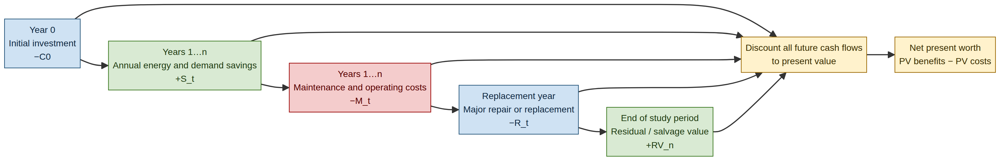
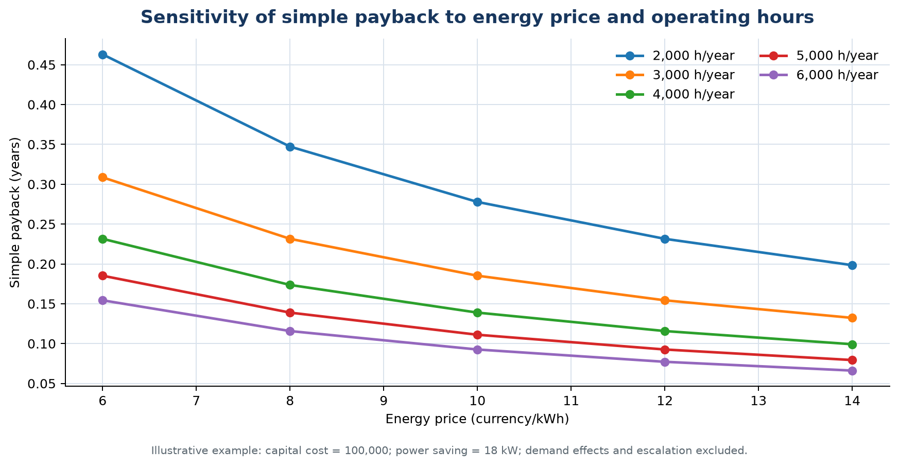
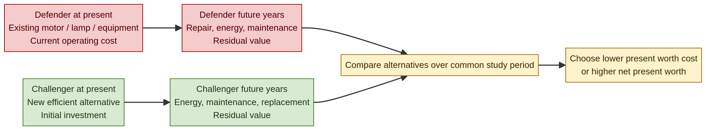
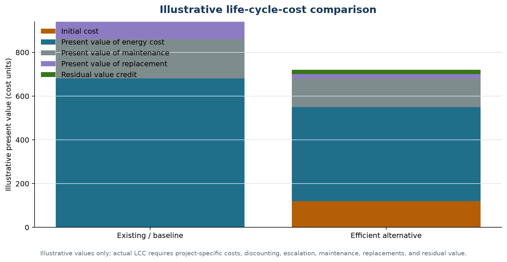

# EEOE4001 — Energy Conservation & Auditing
## Module V: Economic Aspects and Analysis of Energy-Conservation Projects

**Lecture duration:** 05 hours  
**Prepared for:** Undergraduate Electrical / Energy Engineering students  
**Prepared by:** Manus AI  
**Scope:** Economic analysis; depreciation methods; time value of money; rate of return; present-worth method; replacement analysis; life-cycle-costing analysis; energy-efficient motors; simple payback; net present worth; power-factor correction; lighting; life-cycle-cost applications; and return on investment.

> **Central idea:** An energy-conservation measure is technically attractive only when it delivers the required service safely and reliably. It is economically attractive when the value of its future savings and other benefits exceeds its investment, operating, maintenance, replacement, financing, and risk costs under clearly stated assumptions.

---

## 1. Learning outcomes

After completing this module, a student should be able to:

1. Explain the purpose and limitations of economic analysis in energy-conservation projects.
2. Distinguish capital cost, operating cost, maintenance cost, energy cost, demand cost, replacement cost, residual value, and non-monetary benefit.
3. Explain straight-line, declining-balance, sum-of-years-digits, and units-of-production depreciation.
4. Apply the time-value-of-money concept using present value, future value, discount factors, and annuity factors.
5. Calculate simple payback period, discounted payback period, return on investment, net present worth, and internal rate of return.
6. Compare alternatives using the present-worth method and annual-equivalent-cost method.
7. Conduct replacement analysis using defender and challenger alternatives over a common study period.
8. Prepare a life-cycle-cost model for an energy-efficient motor, power-factor-correction project, or lighting retrofit.
9. Evaluate energy-efficient motors using operating hours, efficiency, loading, energy price, demand effects, maintenance, and replacement cost.
10. Evaluate the economics of power-factor correction and lighting controls while separating energy, demand, and quality benefits.
11. Perform sensitivity analysis for energy price, operating hours, discount rate, capital cost, and equipment life.
12. Identify common errors in economic analysis and communicate assumptions transparently.

### Module map

| Section | Topic | Approximate teaching emphasis |
|---|---|---:|
| 2 | Economic-analysis framework and cost categories | 0.50 h |
| 3 | Depreciation methods | 0.50 h |
| 4 | Time value of money | 0.75 h |
| 5 | Payback, ROI, and rate of return | 0.75 h |
| 6 | Present worth and net present worth | 0.75 h |
| 7 | Replacement analysis | 0.50 h |
| 8 | Life-cycle costing | 0.75 h |
| 9 | Applications to motors, PF correction, and lighting | 0.75 h |
| 10 | Sensitivity, risks, checklist, and tutorial questions | 0.75 h |

---

## 2. Economic-analysis framework

### 2.1 Why economic analysis is required

Energy audits identify technical opportunities, but an organization must decide which opportunities to implement, when to implement them, and how to finance them. Economic analysis supports decisions such as:

- whether to repair or replace a motor;
- whether to install a variable-speed drive;
- whether to add a capacitor bank or harmonic filter;
- whether to replace lamps and luminaires;
- whether to add controls or submetering;
- whether to retrofit an existing chiller or install a new unit;
- whether to operate a DG set or purchase grid electricity; and
- whether a project should be implemented immediately, bundled with another project, or deferred.

The analysis should be based on the useful service delivered, not only on equipment rating. For example, a motor project should account for shaft output and operating hours; a lighting project should account for maintained illuminance and operating schedule; a power-factor project should account for demand charges, losses, tariffs, harmonics, and equipment loading.

### 2.2 Technical feasibility precedes economic feasibility

A project should first satisfy technical requirements. The following sequence is useful:

| Stage | Question |
|---|---|
| Need | What service is required: flow, pressure, light, cooling, torque, or reactive support? |
| Baseline | What is the existing energy, demand, operating, maintenance, and failure condition? |
| Alternatives | What technical options can deliver the same or better service? |
| Constraints | Are safety, quality, reliability, space, compatibility, and regulatory requirements satisfied? |
| Economics | Which technically feasible alternative has the best economic value? |
| Implementation | What investment, shutdown, training, procurement, and measurement are required? |
| Verification | Are energy, demand, maintenance, and service results achieved? |

### 2.3 Cost categories

A complete economic model may include the following cost and benefit categories:

| Category | Examples | Typical timing |
|---|---|---|
| Initial investment | Equipment, installation, engineering, commissioning, controls, taxes, training | Year 0 or construction period |
| Energy cost | Electricity, fuel, steam, water, compressed air, refrigeration | Recurring annually or by interval |
| Demand cost | kW/kVA demand charges, peak tariffs, power-factor penalties | Monthly, seasonal, or annual |
| Maintenance | Labour, spares, cleaning, calibration, lubrication, inspections | Recurring |
| Repair cost | Major repair, rewinding, replacement of controls, filter or battery change | Periodic |
| Downtime cost | Lost production, interruption, restart, quality loss | During implementation or failure |
| Replacement cost | New equipment or major component at end of life | Future year |
| Residual value | Sale, salvage, remaining service value, disposal cost avoided | End of study period |
| Financing cost | Interest, fees, lease, performance contract payment | According to finance structure |
| Tax effect | Depreciation tax shield, credits, duties, tax on gains | Jurisdiction-specific |
| Non-monetary benefit | Safety, comfort, quality, emissions, resilience, capacity, noise reduction | Throughout project life |

NIST Handbook 135 was developed for life-cycle-cost analysis of energy and water conservation and renewable-energy investments and emphasizes that future costs and benefits must be evaluated systematically.[1]

### 2.4 Baseline and project case

Economic analysis compares at least two cases:

- the **baseline case**, which represents continued operation of the existing system; and
- the **project or alternative case**, which includes investment and the expected future energy, demand, maintenance, replacement, and residual-value effects.

The difference between the two cases is the **incremental cash flow**. Economic analysis should normally use incremental costs and benefits rather than total facility costs.

### 2.5 Assumptions to document

Every analysis should state the study period, discount rate, inflation or escalation assumptions, energy-price assumptions, operating hours, load factor, equipment life, maintenance cost, replacement timing, residual value, taxes, financing, demand tariff, expected savings, and uncertainty range. DOE’s cost-effectiveness methodology distinguishes energy savings from cost-effectiveness and evaluates longer-term savings against incremental initial costs through a life-cycle-cost perspective.[2]

---

## 3. Depreciation methods

### 3.1 Meaning of depreciation

**Depreciation** is the systematic allocation of an asset’s depreciable cost over its expected service life. The depreciable base is commonly:

\[
\text{Depreciable base}=\text{Initial cost}-\text{Salvage value}
\]

Depreciation represents loss of book value or allocation of capital cost. It is not itself a cash payment. In after-tax analysis, depreciation may affect taxable income and therefore create a tax shield. In a pre-tax engineering-economic analysis, depreciation may be excluded if tax effects are not being modelled.

The accounting or tax method used depends on the applicable jurisdiction and organizational policy. The methods below are presented for engineering-economic understanding, not as tax advice.

### 3.2 Straight-line method

Straight-line depreciation allocates the same depreciation amount each year:

\[
D_{SL}=\frac{C-S}{n}
\]

where \(C\) is initial cost, \(S\) is salvage value, and \(n\) is useful life in years.

The book value after year \(t\) is:

\[
BV_t=C-tD_{SL}
\]

**Example:** An asset costs ₹1,000,000, has salvage value ₹100,000, and a five-year life.

\[
D_{SL}=\frac{1{,}000{,}000-100{,}000}{5}=₹180{,}000\ \text{per year}
\]

Straight-line depreciation is simple, transparent, and suitable when the asset’s service or economic benefit is approximately uniform.

### 3.3 Declining-balance method

The declining-balance method applies a fixed percentage to the opening book value:

\[
D_t=rBV_{t-1}
\]

\[
BV_t=BV_{t-1}-D_t
\]

where \(r\) is the depreciation rate. A common double-declining-balance rate is:

\[
r=\frac{2}{n}
\]

Depreciation is larger in the early years and decreases later. The book value should not be reduced below the planned salvage value; a final adjustment may be required.

### 3.4 Sum-of-years-digits method

For a life of \(n\) years, the denominator is:

\[
SYD=1+2+\cdots+n=\frac{n(n+1)}{2}
\]

The depreciation fraction in year \(t\), counting the remaining life, is:

\[
D_t=\frac{n-t+1}{SYD}(C-S)
\]

This is another accelerated method. It may represent assets whose productivity or obsolescence is greater in the early years.

### 3.5 Units-of-production method

Units-of-production depreciation relates depreciation to actual output or service:

\[
D_{per\ unit}=\frac{C-S}{\text{Expected total units of output}}
\]

\[
D_t=D_{per\ unit}\times\text{Units produced in year }t
\]

This method is useful when wear and economic benefit depend strongly on operating hours, production quantity, tonnes processed, or energy delivered.

### 3.6 Comparison of depreciation methods

| Method | Pattern | Suitable interpretation |
|---|---|---|
| Straight-line | Equal annual amount | Uniform service and simple allocation. |
| Declining balance | Larger early amounts | Rapid early obsolescence or tax acceleration. |
| Sum-of-years-digits | Accelerated but structured | Higher early benefit or wear. |
| Units of production | Follows actual output | Service strongly related to operating units. |

Depreciation method may change book value and tax cash flow, but it does not change the physical energy saving of a motor, lighting retrofit, or PF project. It changes the economic result only when taxes or accounting constraints are included.

---

## 4. Time value of money

### 4.1 Basic concept

One unit of money available today is generally more valuable than the same nominal unit available in the future because today’s money can be invested, prices may change, risk exists, and organizations have alternative uses for capital. This is the **time value of money**.

The analysis uses an interest or discount rate \(i\), expressed per period. The period may be a year, month, or another consistent interval.

### 4.2 Future value of a present amount

If a present amount \(P\) earns interest at rate \(i\) for \(n\) periods:

\[
F=P(1+i)^n
\]

### 4.3 Present value of a future amount

A future amount \(F\) received after \(n\) periods has present value:

\[
P=\frac{F}{(1+i)^n}
\]

The discount factor is:

\[
DF_n=\frac{1}{(1+i)^n}
\]

A future energy saving is therefore multiplied by a discount factor before it is compared with an immediate investment.

### 4.4 Uniform annual series

If an equal annual amount \(A\) occurs at the end of each year for \(n\) years, its present value is:

\[
P=A\left[\frac{1-(1+i)^{-n}}{i}\right]
\]

The bracketed term is the present-worth factor for a uniform annual series.

The equivalent annual amount corresponding to a present amount \(P\) is:

\[
A=P\left[\frac{i(1+i)^n}{(1+i)^n-1}\right]
\]

### 4.5 Inflation and energy-price escalation

Nominal and real analyses should not be mixed. A nominal analysis includes expected price escalation and a nominal discount rate. A real analysis excludes general inflation and uses a real discount rate. The relationship is approximately:

\[
1+i_n=(1+i_r)(1+f)
\]

where \(i_n\) is nominal rate, \(i_r\) is real rate, and \(f\) is general inflation.

Energy prices may escalate differently from general inflation. If energy-price escalation is modelled, the analyst should state the source, time basis, and uncertainty range. NIST notes that annual discount factors and energy-price indices are maintained for life-cycle-cost analysis.[1]

### 4.6 Cash-flow timeline

*Figure 1. Economic-analysis cash-flow structure. Future savings, costs, replacement, and residual value are discounted to present value before alternatives are compared.*

### 4.7 Worked time-value-of-money example

An amount of ₹100,000 is invested at 8% per year for five years.

Future value:

\[
F=100{,}000(1.08)^5=₹146{,}933\ \text{approximately}
\]

The present value of ₹146,933 received after five years at 8% is:

\[
P=\frac{146{,}933}{(1.08)^5}=₹100{,}000\ \text{approximately}
\]

If a project produces ₹80,000 at the end of each year for five years, its present value is:

\[
P=80{,}000\left[\frac{1-(1.08)^{-5}}{0.08}\right]=₹319{,}417\ \text{approximately}
\]

The result is larger than the initial amount because it represents the present value of five separate future savings.

---

## 5. Simple payback, discounted payback, ROI, and rate of return

### 5.1 Simple payback period

Simple payback is the time required for cumulative undiscounted savings to recover the initial investment:

\[
\boxed{SPB=\frac{\text{Initial investment}}{\text{Annual net saving}}}
\]

If annual savings vary, cumulative cash flow should be calculated year by year.

**Advantages:** simple, easy to communicate, useful for screening.  
**Limitations:** ignores the time value of money, savings after payback, equipment life, residual value, replacement cost, taxes, and risk.

DOE describes simple payback as the number of years required for energy-cost savings to exceed the incremental first cost.[2]

### 5.2 Discounted payback period

Discounted payback uses the present value of each annual net saving. The discounted payback is reached when cumulative discounted cash flow becomes non-negative.

\[
PV_t=\frac{CF_t}{(1+i)^t}
\]

Discounted payback is more realistic than simple payback when the discount rate is significant, but it still ignores some savings after payback and may not rank alternatives as well as NPV.

### 5.3 Return on investment

A simple annual return on investment may be expressed as:

\[
ROI=\frac{\text{Annual net benefit}}{\text{Initial investment}}\times100
\]

For a project with ₹70,000 annual net benefit and ₹240,000 initial cost:

\[
ROI=\frac{70{,}000}{240{,}000}\times100=29.17\%
\]

ROI is useful for communication but must be defined clearly. Different organizations use different ROI denominators and may include taxes, depreciation, residual value, or average invested capital.

### 5.4 Rate of return and internal rate of return

The **internal rate of return (IRR)** is the discount rate that makes the net present worth equal to zero:

\[
0=-C_0+\sum_{t=1}^{n}\frac{CF_t}{(1+IRR)^t}+\frac{RV_n}{(1+IRR)^n}
\]

A project is usually considered attractive when IRR exceeds the organization’s minimum acceptable rate of return (MARR), subject to risk, reinvestment assumptions, and mutually exclusive alternatives.

IRR can be misleading when cash flows change sign multiple times, when projects have different sizes, or when reinvestment assumptions are unrealistic. NPV at a stated discount rate is often easier to interpret for mutually exclusive energy projects.

### 5.5 Worked rate-of-return example

Consider the following cash flow:

| Year | Cash flow |
|---:|---:|
| 0 | −₹240,000 |
| 1 | ₹70,000 |
| 2 | ₹70,000 |
| 3 | ₹70,000 |
| 4 | ₹70,000 |
| 5 | ₹90,000, including residual value |

Solving the present-worth equation gives an IRR of approximately **15.78%**. If the organization’s MARR is 10%, the project passes the rate-of-return screen, subject to technical feasibility and risk.

---

## 6. Present-worth method and net present worth

### 6.1 Present worth

The present-worth method converts all future costs and benefits to their equivalent value at the base date. For a project with initial cost, annual cash flows, and residual value:

\[
PW=-C_0+\sum_{t=1}^{n}\frac{CF_t}{(1+i)^t}+\frac{RV_n}{(1+i)^n}
\]

For a conservation project, \(CF_t\) may be annual energy savings, demand savings, maintenance savings, production benefits, avoided repair costs, or other net benefits.

### 6.2 Net present worth

Net present worth or net present value is:

\[
\boxed{NPW=PV(\text{benefits})-PV(\text{costs})}
\]

If NPW is positive at the selected discount rate, the project generates value above the required return under the stated assumptions. If NPW is negative, the project does not meet the required return unless other benefits or constraints justify it.

### 6.3 NPV decision rules

| Result | Interpretation |
|---|---|
| NPW > 0 | Project is economically attractive at the selected discount rate. |
| NPW = 0 | Project earns approximately the selected discount rate. |
| NPW < 0 | Project does not meet the selected return under stated assumptions. |
| Higher NPW among mutually exclusive alternatives | Usually preferred, if alternatives deliver comparable service and risk. |

### 6.4 Worked NPV example

Suppose a project requires ₹240,000 initially, produces ₹70,000 net annual cash flow for five years, and has ₹20,000 residual value at year 5. At an 8% discount rate:

\[
NPW=-240{,}000+70{,}000\left[\frac{1-(1.08)^{-5}}{0.08}\right]+\frac{20{,}000}{(1.08)^5}
\]

\[
NPW=₹53{,}101\ \text{approximately}
\]

The positive NPW indicates that the project exceeds an 8% discount rate under the assumed cash flows.

### 6.5 Equivalent annual cost and annual worth

When alternatives have different lives or repeated replacement cycles, present worth alone may not be directly comparable. Equivalent annual cost converts a present cost into an equal annual cost over the study period:

\[
EAC=PW\left[\frac{i(1+i)^n}{(1+i)^n-1}\right]
\]

The alternative with the lower EAC is preferred when both alternatives deliver equivalent service and are compared over an appropriate common basis.

### 6.6 Sensitivity of economic results

Economic results depend on energy price, operating hours, load, efficiency, demand charges, maintenance, capital cost, discount rate, and project life. A sensitivity analysis calculates the result under multiple assumptions rather than reporting one false-precision value.

*Figure 2. Illustrative sensitivity of simple payback to energy price and operating hours. Actual analysis should include demand, maintenance, escalation, and project-specific cash flows.*

---

## 7. Replacement analysis

### 7.1 Purpose

Replacement analysis determines whether an existing asset, called the **defender**, should continue operating or be replaced by a new alternative, called the **challenger**. It is commonly applied to motors, lighting systems, pumps, compressors, chillers, boilers, DG sets, transformers, and control systems.

### 7.2 Defender and challenger

The defender’s original purchase cost is usually a sunk cost. The decision should focus on future avoidable costs, remaining service, repair probability, energy use, maintenance, downtime, residual value, and the opportunity cost of continuing to operate it.

The challenger includes initial cost, installation, commissioning, expected energy and maintenance cost, replacement timing, residual value, and reliability benefits.

*Figure 3. Replacement analysis compares a defender and challenger over a common study period. The original purchase cost of the defender is normally sunk and should not be counted as a future avoidable cost.*

### 7.3 Replacement decision factors

| Factor | Defender question | Challenger question |
|---|---|---|
| Energy | What is current kWh, fuel, demand, or reactive cost? | What is expected consumption at the actual load? |
| Maintenance | What repairs, rewinds, cleaning, or spares are expected? | What planned maintenance and warranty are included? |
| Reliability | Is failure probability increasing? | Does the new option improve availability? |
| Capacity | Does the asset meet required service? | Is the new size correctly selected? |
| Quality | Does existing performance affect product or comfort? | Does the alternative preserve or improve quality? |
| Life | How long can it reliably operate? | What is the economic life and replacement cycle? |
| Residual value | What is the resale or salvage value? | What value remains at the end of the study period? |
| Risk | What are failure, downtime, and obsolescence risks? | What are technology, supplier, and integration risks? |

### 7.4 Common study period

If defender and challenger lives differ, options include using the least common multiple of lives, using a specified study period with residual values, applying annual equivalent cost, or using an infinite-repeat assumption when justified. The selected method must be consistent across alternatives.

### 7.5 Economic life versus physical life

Physical life is how long an asset can operate. Economic life is how long it remains the least-cost option relative to available alternatives. An asset may be physically serviceable but economically obsolete because energy, maintenance, quality, or downtime costs have become excessive.

### 7.6 Repair versus replacement

Repair should be evaluated using the future avoidable cost of the repair, expected energy performance after repair, remaining life, reliability, downtime, and the cost of a new alternative. For a rewound motor, the analysis should consider repair quality, efficiency degradation, operating hours, loading, and the potential for a premium-efficiency replacement.

---

## 8. Life-cycle-costing analysis

### 8.1 Definition

Life-cycle costing (LCC) evaluates all significant costs and benefits over the study period rather than only the initial purchase price. NIST Handbook 135 provides formal guidance for life-cycle-cost analysis of energy and water conservation investments and related projects.[1]

A simplified life-cycle cost model is:

\[
LCC=PV(C_0)+PV(Energy)+PV(Maintenance)+PV(Repair)+PV(Replacement)+PV(Other\ costs)-PV(Residual\ value)
\]

The alternative with the lower LCC is preferred when it delivers equivalent service and the analysis assumptions are comparable.

### 8.2 LCC categories for energy projects

| LCC component | Motor example | Lighting example |
|---|---|---|
| Initial cost | Motor, drive, installation, alignment, commissioning | Lamps, luminaires, drivers, controls, installation |
| Energy cost | kWh, demand, reactive-power effects | Fixture power, controls, HVAC interaction |
| Maintenance | Bearings, lubrication, inspection | Cleaning, driver maintenance, replacement labour |
| Repair | Rewind, coupling, controls | Driver or control replacement |
| Replacement | Motor or drive replacement | Lamp, LED driver, or control replacement |
| Residual value | Salvage or remaining service | Salvage or disposal value |
| Non-monetary benefit | Reliability, production, noise, temperature | Visual comfort, safety, quality, productivity |

### 8.3 Life-cycle cost versus life-cycle assessment

Life-cycle costing is an economic method focused on monetary costs and benefits. Life-cycle assessment is a broader environmental method that may include material extraction, manufacturing, emissions, transport, use, and disposal. The two methods may support one another but should not be confused.

### 8.4 Life-cycle cost comparison

*Figure 4. Illustrative present-value cost categories for a baseline and an efficient alternative. The efficient alternative has a higher initial cost but lower energy, maintenance, and replacement costs in this teaching example.*

### 8.5 Non-monetary benefits and difficult-to-value effects

Some projects create benefits that are difficult to express precisely in money. Examples include improved safety, lower noise, better lighting quality, reduced temperature, reduced emissions, improved resilience, production quality, reduced downtime, and increased capacity. The analysis should identify these benefits explicitly rather than hiding them inside an arbitrary numerical assumption.

### 8.6 Risk and uncertainty

Economic results are uncertain because future operating hours, energy price, production, maintenance, equipment life, and savings may differ from estimates. The report should provide a base case and sensitivity cases. For major projects, scenario analysis or probabilistic analysis may be appropriate.

---

## 9. Application 1: Energy-efficient motor economics

### 9.1 Motor energy-saving model

For a constant shaft output:

\[
P_{old,in}=\frac{P_{shaft}}{\eta_{old}}
\]

\[
P_{new,in}=\frac{P_{shaft}}{\eta_{new}}
\]

\[
\Delta E=(P_{old,in}-P_{new,in})H
\]

where \(H\) is annual operating hours.

Annual cost saving may include energy and demand components:

\[
S_{annual}=\Delta E\times c_E+\Delta kW\times c_D+\Delta M
\]

where \(c_E\) is energy price, \(c_D\) is demand-charge rate, and \(\Delta M\) is maintenance saving.

### 9.2 Worked motor replacement example

A 30 kW shaft load operates 4,000 hours per year. An old motor has efficiency 88%; a replacement motor has efficiency 93%. Electricity costs ₹10/kWh. The replacement investment is ₹120,000.

Old input:

\[
P_{old,in}=\frac{30}{0.88}=34.09\ \text{kW}
\]

New input:

\[
P_{new,in}=\frac{30}{0.93}=32.26\ \text{kW}
\]

Annual energy saving:

\[
\Delta E=(34.09-32.26)\times4{,}000=7{,}331\ \text{kWh/year approximately}
\]

Annual energy-cost saving:

\[
S_E=7{,}331\times₹10=₹73{,}314\ \text{per year approximately}
\]

Simple payback:

\[
SPB=\frac{₹120{,}000}{₹73{,}314}=1.64\ \text{years approximately}
\]

The final decision should include demand savings, maintenance, installation downtime, starting torque, repair history, drive compatibility, and the actual measured shaft load. If the motor is lightly loaded, right-sizing or process control may provide more value than a higher-efficiency motor alone.

### 9.3 Repair versus replacement

A motor that fails may be rewound or replaced. The economic comparison should include repair cost, expected efficiency after repair, warranty, remaining life, future failure risk, downtime, spare availability, and energy use. A replacement may have a higher initial cost but a lower LCC.

### 9.4 Motor project decision table

| Condition | Likely economic direction |
|---|---|
| High hours, high load, low old efficiency | Replacement often becomes attractive. |
| Low hours, lightly loaded motor | Motor replacement alone may have a weak return. |
| Motor has repeated rewinds or overheating | Replacement may reduce risk and energy loss. |
| Variable flow or pressure | Process and speed control may dominate motor-efficiency savings. |
| Large demand-charge effect | Include peak reduction and load profile. |
| Uncertain shaft output | Measure before final investment decision. |

---

## 10. Application 2: Power-factor-correction economics

### 10.1 Sources of economic benefit

Power-factor correction can produce benefits through:

- reduced kVA demand charges;
- avoided power-factor penalties or improved incentives;
- increased transformer, cable, and generator capacity;
- reduced current-related distribution losses;
- improved voltage profile; and
- reduced need for new capacity.

The kWh saving from a capacitor bank may be modest if the primary load is unchanged. It becomes more significant when current-related losses in transformers and conductors are large and measurable.

### 10.2 PF correction economic model

\[
S_{annual}=S_{demand}+S_{loss}+S_{penalty}+S_{capacity}-C_{maintenance}
\]

The project cash flow should include capacitor-bank cost, reactors or filters, installation, protection, maintenance, replacement, monitoring, and the expected demand and loss benefits.

### 10.3 Worked PF-correction example

A 500 kW facility improves power factor from 0.70 to 0.95. The reduction in apparent demand is:

\[
\Delta kVA=\frac{500}{0.70}-\frac{500}{0.95}=188.0\ \text{kVA approximately}
\]

Assume a demand-charge rate of ₹180/kVA-month. Annual demand saving is:

\[
S_D=188.0\times₹180\times12=₹406{,}015\ \text{per year approximately}
\]

If the capacitor bank, reactors, protection, installation, and commissioning cost ₹250,000:

\[
SPB=\frac{₹250{,}000}{₹406{,}015}=0.62\ \text{years approximately}
\]

This is a screening calculation. The final analysis must verify the actual tariff, demand interval, load profile, harmonic conditions, capacitor switching, maintenance, and the risk of resonance. A harmonic filter or detuned bank may change both cost and savings.

### 10.4 PF correction and life-cycle cost

A low-cost fixed capacitor may have a short simple payback but create overcorrection during low load. A more expensive automatic detuned bank may have a better LCC because it reduces harmonic and switching risk. Economic analysis must include the cost of failure, downtime, capacitor replacement, harmonic mitigation, and technical compliance.

---

## 11. Application 3: Lighting economics

### 11.1 Lighting project cash flows

A lighting project may have benefits from lower connected power, reduced operating hours, lower maintenance labour, fewer lamp replacements, reduced cooling load, improved safety, and better visual quality. Costs include luminaires, lamps or LED modules, drivers, sensors, control wiring, commissioning, access equipment, and disposal.

The annual energy saving is:

\[
\Delta E=(P_{baseline}-P_{project})H
\]

The annual net saving is:

\[
S_{net}=\Delta E\times c_E+S_{demand}+S_{maintenance}-C_{control\ maintenance}
\]

### 11.2 Worked lighting retrofit example

A lighting retrofit costs ₹200,000. It is expected to save 30,000 kWh per year at ₹9/kWh and reduce maintenance expenditure by ₹20,000 per year.

Annual energy saving:

\[
S_E=30{,}000\times₹9=₹270{,}000
\]

Annual total saving:

\[
S_{annual}=₹270{,}000+₹20{,}000=₹290{,}000
\]

Simple payback:

\[
SPB=\frac{₹200{,}000}{₹290{,}000}=0.69\ \text{years approximately}
\]

The project should not be approved on energy cost alone. The auditor must confirm maintained illuminance, uniformity, glare, colour quality, control operation, emergency lighting, flicker, user acceptance, and actual operating hours.

### 11.3 Lighting LCC considerations

A low-cost lamp may have high replacement frequency and labour cost. A higher-quality luminaire may have lower energy use, longer service life, better optics, lower glare, improved controls, and lower maintenance. LCC is more suitable than simple payback when equipment lives and replacement cycles differ.

### 11.4 Lighting control economics

Controls may save energy without changing connected wattage. The economic model should use measured or defensible operating-hour reductions:

\[
\Delta E=P_{controlled}(H_{baseline}-H_{controlled})
\]

Control investment should include sensors, wiring, commissioning, software, calibration, user training, maintenance, and replacement. User overrides and control failures should be included in risk analysis.

---

## 12. Economic comparison methods

### 12.1 Simple payback versus NPV

| Feature | Simple payback | NPV / NPW |
|---|---|---|
| Time value of money | Ignored | Included through discounting |
| Savings after payback | Ignored in the final number | Included over study period |
| Residual value | Usually ignored | Can be included |
| Replacement cost | Usually ignored | Included when timed correctly |
| Uncertainty | Simple screening | Can include scenarios and sensitivity |
| Communication | Very easy | Requires more assumptions and calculation |
| Best use | Early screening | Final comparison and investment decision |

### 12.2 When simple payback is acceptable

Simple payback is useful for rapid screening, small projects, and situations where management uses a short-payback rule. It should not be the only method for long-life equipment, alternatives with different lives, projects with major maintenance or replacement costs, or projects with significant uncertainty.

### 12.3 When NPV or LCC is preferred

NPV or LCC should be preferred when initial costs differ significantly, savings occur over many years, equipment lives differ, maintenance and replacement costs matter, energy prices may change, residual value exists, or the project has substantial non-energy benefits.

---

## 13. Sensitivity and risk analysis

### 13.1 Key sensitivity variables

The most influential variables in energy-conservation projects are often:

- annual operating hours;
- actual load and production;
- energy price and demand tariff;
- capital cost and installation cost;
- efficiency at the actual load;
- maintenance and repair cost;
- discount rate;
- equipment life and replacement timing;
- savings persistence and control performance; and
- residual value and disposal cost.

### 13.2 Scenario analysis

A useful analysis presents at least three cases:

| Scenario | Typical assumption |
|---|---|
| Conservative | Lower operating hours, lower energy price, higher capital cost, lower savings. |
| Base case | Best estimate from measured audit data and supplier quotations. |
| Optimistic | Higher operating hours, higher energy price, strong savings, and lower implementation cost. |

### 13.3 Sensitivity interpretation

If a project remains economically attractive under conservative assumptions, it is more robust. If the result changes from positive to negative with a small change in energy price or operating hours, the project should receive additional measurement, quotation, or risk review.

Non-monetary benefits can strengthen the implementation case, but they should be identified separately rather than inserted as unsupported monetary values.

---

## 14. Integrated economic-analysis checklist

| Audit stage | Required information |
|---|---|
| Define service | Required flow, pressure, light, cooling, torque, capacity, or reactive support. |
| Establish baseline | Energy, demand, operating hours, maintenance, failures, quality, and cost. |
| Define alternatives | Existing, repair, retrofit, replacement, control, and high-efficiency options. |
| Estimate investment | Equipment, installation, engineering, commissioning, training, shutdown, and taxes. |
| Estimate benefits | Energy, demand, maintenance, repairs avoided, capacity, production, safety, and quality. |
| Estimate future costs | Maintenance, replacements, filters, drivers, batteries, software, and disposal. |
| Select study period | Common period or annual-equivalent method for alternatives with different lives. |
| Select discount rate | Organization’s MARR, real or nominal basis, and financing assumptions. |
| Include residual value | Salvage, resale, remaining service, or disposal cost at study-period end. |
| Calculate metrics | Payback, discounted payback, ROI, NPW/NPV, IRR, and LCC/EAC. |
| Test uncertainty | Energy price, hours, capital cost, efficiency, maintenance, and life scenarios. |
| Make recommendation | State assumptions, risks, non-monetary benefits, and verification plan. |

---

## 15. Common mistakes in Module V economic analysis

| Mistake | Why it is a problem | Better practice |
|---|---|---|
| Using total facility cost instead of incremental cost | The project value becomes distorted | Compare baseline and project cases using incremental cash flow. |
| Treating depreciation as a cash expense | Book allocation is confused with cash flow | Include depreciation only when tax or accounting cash effects are being modelled. |
| Using simple payback as the final decision method | Time value, residual value, and later savings are ignored | Use NPW/NPV or LCC for final comparison. |
| Mixing nominal energy escalation with a real discount rate | Results may double-count or omit inflation | Use a consistent nominal or real framework. |
| Ignoring demand charges | PF, motor, and control savings may be understated | Include kW/kVA demand and tariff structure. |
| Assuming rated motor efficiency at all loads | Actual efficiency varies with loading and condition | Use measured input and shaft/service data. |
| Ignoring replacement and maintenance | Efficient alternatives may appear too expensive or too cheap | Model all major future costs. |
| Comparing alternatives with different lives directly | The comparison is not equivalent | Use common study period or annual-equivalent cost. |
| Treating residual value as zero without justification | The result may be biased | Include salvage, remaining service, or disposal cost where relevant. |
| Reporting an exact payback from uncertain estimates | False precision hides risk | Provide base, conservative, and optimistic cases. |
| Ignoring quality and safety | A cheap project may fail operationally | Verify the required service and constraints first. |
| Counting energy savings twice | Savings may be included in both energy and demand calculations | Define each cash-flow component and avoid overlap. |

---

## 16. Key takeaways

Economic analysis converts technical energy-saving opportunities into comparable financial decisions. The analyst must distinguish cash costs from accounting allocations, and immediate costs from future discounted costs. Depreciation affects book value and may affect taxes, but it is not itself a cash payment.

Simple payback is useful for screening but does not account for the time value of money, project life, residual value, or future replacement. Present worth, NPW/NPV, IRR, annual equivalent cost, and LCC provide stronger methods for comparing long-life or mutually exclusive energy projects.

Replacement analysis compares a defender with a challenger using future avoidable costs. The defender’s original purchase cost is normally sunk. Life-cycle costing includes initial, energy, maintenance, repair, replacement, residual, financing, and relevant non-monetary effects.

For energy-efficient motors, actual shaft load, efficiency, operating hours, demand, repair history, and reliability are essential. For PF correction, include demand savings, penalties or incentives, distribution losses, capacitor and harmonic costs, and the risk of resonance. For lighting, include fixture power, operating hours, controls, maintenance, visual quality, and user acceptance.

A good economic analysis is not a single number. It is a transparent model with documented assumptions, verified baseline data, sensitivity analysis, risk discussion, and a measurement-and-verification plan.

---

## 17. Tutorial and examination questions

### Short-answer questions

1. Define capital cost, operating cost, maintenance cost, residual value, and incremental cash flow.
2. What is depreciation and why is it not normally treated as a cash payment?
3. State the straight-line depreciation formula.
4. Distinguish between straight-line and declining-balance depreciation.
5. Define the time value of money.
6. State the formula for present value of a future amount.
7. Define simple payback period and list two limitations.
8. Define discounted payback period.
9. Define ROI, IRR, NPW, and LCC.
10. What is the difference between a defender and a challenger in replacement analysis?
11. Why must alternatives with different lives be compared over a common basis?
12. List the main cost components of a life-cycle-cost analysis.
13. Why should demand savings be included in PF-correction economics?
14. List the economic factors that influence energy-efficient motor replacement.
15. Why should lighting economics include maintenance and controls?

### Numerical questions

1. An asset costs ₹900,000, has a salvage value of ₹90,000, and a life of six years. Calculate annual straight-line depreciation.
2. An asset costs ₹1,000,000 and has a five-year life. Calculate the first two years of double-declining-balance depreciation using a rate of 2/5.
3. Calculate the future value of ₹150,000 invested at 9% per year for four years.
4. Calculate the present value of ₹250,000 received after five years at a discount rate of 10%.
5. A project costs ₹300,000 and saves ₹90,000 per year. Calculate simple payback.
6. A project costs ₹240,000 and produces ₹70,000 per year for five years plus ₹20,000 residual value at 8%. Calculate NPW.
7. An energy-efficient motor requires ₹120,000 additional investment and saves ₹73,314 per year. Calculate simple payback and simple ROI.
8. A PF-correction project reduces demand by 188 kVA. If the demand charge is ₹180/kVA-month and investment is ₹250,000, calculate annual saving and payback.
9. A lighting retrofit costs ₹200,000, saves 30,000 kWh/year at ₹9/kWh, and saves ₹20,000/year in maintenance. Calculate simple payback.
10. Compare a defender with present worth cost ₹800,000 and a challenger with present worth cost ₹720,000 over the same study period. State the economic preference and the assumptions that must still be checked.

### Long-answer and discussion questions

1. Explain the role of economic analysis in an energy-audit programme and distinguish technical feasibility from economic feasibility.
2. Compare straight-line, declining-balance, sum-of-years-digits, and units-of-production depreciation methods.
3. Derive the present-value and future-value relationships and explain the importance of the discount rate.
4. Compare simple payback, discounted payback, ROI, IRR, NPW, and LCC.
5. Explain replacement analysis using defender and challenger alternatives.
6. Prepare a life-cycle-cost model for an energy-efficient motor replacement.
7. Discuss the economic analysis of a power-factor-correction project with harmonics and demand charges.
8. Prepare a life-cycle-cost comparison of a conventional lighting system and an LED-plus-controls alternative.
9. Explain how energy price, operating hours, discount rate, and maintenance affect project economics.
10. Develop a recommendation for an energy project using technical feasibility, NPW, payback, sensitivity, risk, and non-monetary benefits.

---

## References

[1] [National Institute of Standards and Technology, *NIST Handbook 135: Life Cycle Costing Manual for the Federal Energy Management Program, 2020 Edition*.](https://nvlpubs.nist.gov/nistpubs/hb/2020/NIST.HB.135-2020.pdf) Official NIST handbook for life-cycle-cost analysis, present value, discounting, study periods, residual value, alternatives, and energy-conservation investments.

[2] [U.S. Department of Energy, “Energy and Cost Analysis Methodology.”](https://www.energycodes.gov/methodology) DOE guidance distinguishing energy savings, life-cycle cost, cash flow, cost-effectiveness, and simple payback.

[3] [U.S. Department of Energy, *Continuous Energy Improvement in Motor Driven Systems: A Guidebook for Industry*.](https://www.energy.gov/sites/prod/files/2014/04/f15/amo_motors_guidebook_web.pdf) Guidance on motor efficiency, loading, field measurement, system improvement, and energy-efficient motor decisions.

[4] [U.S. Department of Energy, “Understanding Your Electricity Bills.”](https://www.energy.gov/cmei/ito/understanding-your-electricity-bills) Guidance on utility-bill analysis, demand, energy baselines, and tracking of energy-project results.

[5] [Eaton, *Power Factor Correction: A Guide for the Plant Engineer*.](https://www.eaton.com/content/dam/eaton/products/industrialcontrols-drives-automation-sensors/enclosed-control-solutions/canada/eaton-power-factor-correction-guide-plant-engineer-technical-data-sa02607001e-ca.pdf) Reference for the economics and engineering of power-factor correction, capacitor selection, placement, nonlinear environments, and harmonics.

[6] [U.S. General Services Administration, *LED Lighting and Controls Guidance for Federal Buildings*.](https://www.gsa.gov/system/files/LED%20and%20Controls%20Guidance%20for%20GSA.pdf) Reference for lighting systems, controls, commissioning, retrofits, and operational considerations.

[7] [Natural Resources Canada, *Energy Savings Toolbox — An Energy Audit Manual and Tool*.](https://natural-resources.canada.ca/sites/nrcan/files/oee/pdf/publications/infosource/pub/cipec/energyauditmanualandtool.pdf) Reference for energy-audit measurement, baseline development, savings estimation, and project evaluation.

[8] [ENERGY STAR, *Managing Your Energy: An ENERGY STAR Guide for Identifying Energy-Saving Opportunities in Industrial Facilities*.](https://www.energystar.gov/sites/default/files/buildings/tools/Managing_Your_Energy_Final_LBNL-3714E.pdf) Cross-cutting reference for energy-management opportunities and measurement.

[9] User-provided syllabus: **EEOE4001 Energy Conservation & Auditing**, Module V outline and course objectives.

### Visual-attribution notes

The lecture notes use NIST and DOE source material for the life-cycle-cost and economic-analysis framework. The cash-flow and replacement diagrams were created deterministically for these notes. The life-cycle-cost and payback-sensitivity charts use explicitly illustrative values and must not be treated as measured project data. Preserve the source links if the notes are reused in assignments, reports, or presentations.
